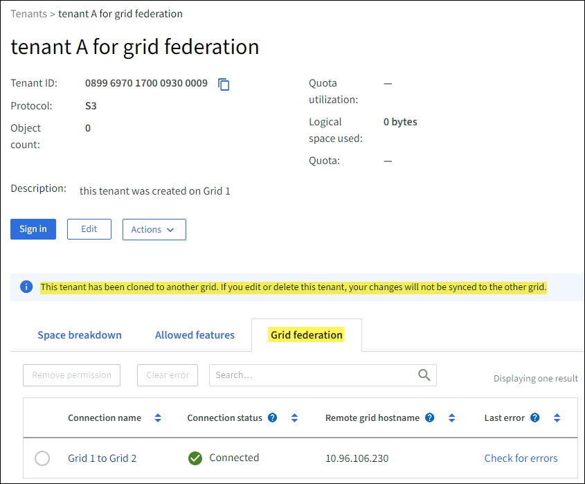

= グリッドフェデレーションの許可されたテナントを管理する
:allow-uri-read: 
:icons: font
:imagesdir: ../media/

[role="lead"]
S3 テナント アカウントが 2 つのStorageGRIDシステム間のグリッド フェデレーション接続を使用できるようにすることができます。テナントに接続の使用が許可されている場合、テナントの詳細を編集したり、テナントの接続使用権限を完全に削除したりするには、特別な手順が必要です。

.開始する前に
* いずれかのグリッドのグリッドマネージャにサインインするには、link:../admin/web-browser-requirements.html["サポートされているウェブブラウザ"] 。
* あなたはlink:admin-group-permissions.html["ルートアクセス権限"]サインインしているグリッドの。
* あなたが持っているlink:grid-federation-create-connection.html["グリッドフェデレーション接続を作成しました"]2つのグリッドの間。
* ワークフローを確認しましたlink:grid-federation-what-is-account-clone.html["アカウントクローン"]そしてlink:grid-federation-what-is-cross-grid-replication.html["クロスグリッドレプリケーション"]。
* 必要に応じて、接続の両方のグリッドに対してシングル サインオン (SSO) または ID フェデレーションがすでに構成されています。見るlink:grid-federation-what-is-account-clone.html["アカウントクローンとは"] 。

== 許可されたテナントを作成する

新規または既存のテナントアカウントがアカウントクローンとクロスグリッドレプリケーションのためにグリッドフェデレーション接続を使用できるようにする場合は、一般的な手順に従ってください。link:creating-tenant-account.html["新しいS3テナントを作成する"]またはlink:editing-tenant-account.html["テナントアカウントを編集する"]次の点に注意してください。

* 接続内のどちらのグリッドからでもテナントを作成できます。テナントが作成されるグリッドは、_テナントのソース グリッド_ です。
* 接続のステータスは「接続済み」である必要があります。
* テナントが作成または編集され、「グリッド フェデレーション接続の使用」権限が有効になって最初のグリッドに保存されると、同一のテナントが他のグリッドに自動的に複製されます。テナントが複製されるグリッドは、_テナントの宛先グリッド_ です。
* 両方のグリッドのテナントには、同じ 20 桁のアカウント ID、名前、説明、クォータ、および権限が与えられます。オプションで、*説明* フィールドを使用して、ソース テナントと宛先テナントを識別することができます。たとえば、グリッド 1 で作成されたテナントのこの説明は、グリッド 2 に複製されたテナントにも表示されます:「このテナントはグリッド 1 で作成されました。」
* セキュリティ上の理由から、ローカル ルート ユーザーのパスワードは宛先グリッドにコピーされません。
+

TIP: ローカルルートユーザーが宛先グリッド上の複製されたテナントにサインインする前に、そのグリッドのグリッド管理者はlink:changing-password-for-tenant-local-root-user.html["ローカルルートユーザーのパスワードを変更する"]。

* 新しいテナントまたは編集されたテナントが両方のグリッドで使用可能になると、テナント ユーザーは次の操作を実行できます。
+
** テナントのソース グリッドからグループとローカル ユーザーを作成します。これらはテナントの宛先グリッドに自動的に複製されます。見るlink:../tenant/grid-federation-account-clone.html["テナントグループとユーザーの複製"] 。
** オプションでテナントの宛先グリッドに複製できる新しい S3 アクセス キーを作成します。見るlink:../tenant/grid-federation-clone-keys-with-api.html["API を使用して S3 アクセスキーを複製する"] 。
** 接続の両方のグリッドに同一のバケットを作成し、一方向または双方向のグリッド間レプリケーションを有効にします。見るlink:../tenant/grid-federation-manage-cross-grid-replication.html["クロスグリッドレプリケーションを管理する"] 。

== 許可されたテナントを表示する

グリッド フェデレーション接続の使用が許可されているテナントの詳細を表示できます。

.手順
. *TENANTS*を選択します。
. 「テナント」ページでテナント名を選択し、テナントの詳細ページを表示します。
+
これがテナントのソース グリッドである場合 (つまり、テナントがこのグリッド上に作成された場合)、テナントが別のグリッドに複製されたことを通知するバナーが表示されます。このテナントを編集または削除すると、変更内容は他のグリッドに同期されません。

+

. オプションで*グリッドフェデレーション*タブを選択してlink:../monitor/grid-federation-monitor-connections.html["グリッドフェデレーション接続を監視する"]。

== 許可されたテナントを編集する

*グリッドフェデレーション接続を使用する*権限を持つテナントを編集する必要がある場合は、以下の一般的な手順に従ってください。link:editing-tenant-account.html["テナントアカウントの編集"]次の点に注意してください。

* テナントに *グリッド フェデレーション接続の使用* 権限がある場合は、接続内のどちらのグリッドからでもテナントの詳細を編集できます。ただし、変更内容は他のグリッドにコピーされません。グリッド間でテナントの詳細を同期させたい場合は、両方のグリッドで同じ編集を行う必要があります。
* テナントを編集しているときに、*グリッド フェデレーション接続の使用* 権限をクリアすることはできません。
* テナントを編集しているときに、別のグリッド フェデレーション接続を選択することはできません。

== 許可されたテナントを削除する

*グリッドフェデレーション接続を使用する*権限を持つテナントを削除する必要がある場合は、以下の一般的な手順に従ってください。link:deleting-tenant-account.html["テナントアカウントの削除"]次の点に注意してください。

* ソース グリッド上の元のテナントを削除する前に、ソース グリッド上のアカウントのすべてのバケットを削除する必要があります。
* 宛先グリッド上のクローンされたテナントを削除する前に、宛先グリッド上のアカウントのすべてのバケットを削除する必要があります。
* 元のテナントまたはクローンされたテナントのいずれかを削除すると、アカウントはクロスグリッド レプリケーションに使用できなくなります。
* ソース グリッド上の元のテナントを削除する場合、宛先グリッドに複製されたテナント グループ、ユーザー、またはキーは影響を受けません。クローンされたテナントを削除するか、独自のグループ、ユーザー、アクセス キー、バケットを管理できるようにすることができます。
* 宛先グリッド上の複製されたテナントを削除する場合、元のテナントに新しいグループまたはユーザーが追加されると、複製エラーが発生します。
+
これらのエラーを回避するには、このグリッドからテナントを削除する前に、テナントのグリッド フェデレーション接続を使用する権限を削除します。

== [[remove-grid-federation-connection-permission]]グリッドフェデレーション接続の使用権限を削除します

テナントがグリッド フェデレーション接続を使用できないようにするには、*グリッド フェデレーション接続の使用* 権限を削除する必要があります。

image::../media/grid-federation-remove-permission.png[グリッドフェデレーション接続を削除する手順]

グリッド フェデレーション接続を使用するテナントの権限を削除する前に、次の点に注意してください。

* テナントのバケットのいずれかでクロスグリッドレプリケーションが有効になっている場合は、*グリッドフェデレーション接続を使用する*権限を削除することはできません。テナント アカウントは、まずすべてのバケットのクロス グリッド レプリケーションを無効にする必要があります。
* *グリッド フェデレーション接続の使用* 権限を削除しても、グリッド間で既に複製されているアイテムは削除されません。たとえば、テナントの権限が削除されても、両方のグリッドに存在するテナント ユーザー、グループ、およびオブジェクトはどちらのグリッドからも削除されません。これらの項目を削除する場合は、両方のグリッドから手動で削除する必要があります。
* 同じグリッド フェデレーション接続でこの権限を再度有効にする場合は、まず宛先グリッドでこのテナントを削除します。そうしないと、この権限を再度有効にするとエラーが発生します。

NOTE: *グリッド フェデレーション接続の使用* 権限を再度有効にすると、ローカル グリッドがソース グリッドになり、選択したグリッド フェデレーション接続で指定されたリモート グリッドへのクローン作成がトリガーされます。リモート グリッドにテナント アカウントがすでに存在する場合、複製を行うと競合エラーが発生します。

.開始する前に
* 使用していますlink:../admin/web-browser-requirements.html["サポートされているウェブブラウザ"]。
* あなたはlink:admin-group-permissions.html["ルートアクセス権限"]両方のグリッドに対して。

=== テナントバケットのレプリケーションを無効にする

最初のステップとして、すべてのテナント バケットのクロス グリッド レプリケーションを無効にします。

.手順
. どちらのグリッドから開始しても、プライマリ管理ノードからグリッド マネージャーにサインインします。
. *構成* > *システム* > *グリッド フェデレーション* を選択します。
. 接続名を選択すると、その詳細が表示されます。
. *許可されたテナント*タブで、テナントが接続を使用しているかどうかを確認します。
. 入居者がリストに載っている場合は、link:../tenant/grid-federation-manage-cross-grid-replication.html["クロスグリッドレプリケーションを無効にする"]接続内の両方のグリッド上のすべてのバケットに対して。
+

TIP: いずれかのテナント バケットでクロス グリッド レプリケーションが有効になっている場合は、*グリッド フェデレーション接続の使用* 権限を削除することはできません。テナントは、両方のグリッド上のバケットのグリッド間レプリケーションを無効にする必要があります。

=== テナントの権限を削除する

テナント バケットのクロス グリッド レプリケーションを無効にした後、グリッド フェデレーション接続を使用するテナントの権限を削除できます。

.手順
. プライマリ管理ノードからグリッド マネージャーにSign in。
. グリッド フェデレーション ページまたはテナント ページから権限を削除します。
+
[role="tabbed-block"]
====
.グリッドフェデレーションページ
--
.. *構成* > *システム* > *グリッド フェデレーション* を選択します。
.. 接続名を選択すると、詳細ページが表示されます。
.. *許可されたテナント*タブで、テナントのラジオボタンを選択します。
.. *権限を削除*を選択します。

--
.テナントページ
--
.. *TENANTS*を選択します。
.. テナントの名前を選択すると、詳細ページが表示されます。
.. *グリッド フェデレーション* タブで、接続のラジオ ボタンを選択します。
.. *権限を削除*を選択します。

--
====
. 確認ダイアログボックスの警告を確認し、[削除] を選択します。
+
** 権限を削除できる場合は、詳細ページに戻り、成功メッセージが表示されます。このテナントはグリッド フェデレーション接続を使用できなくなりました。
** 1 つ以上のテナント バケットでグリッド間レプリケーションがまだ有効になっている場合は、エラーが表示されます。
+
image::../media/grid-federation-remove-permission-error.png[テナントがバケットに対して cgr を有効にしている場合に表示されるエラー メッセージ]

+
次のいずれかを実行できます。

+
*** （推奨。）テナント マネージャーにSign in、各テナントのバケットのレプリケーションを無効にします。見るlink:../tenant/grid-federation-manage-cross-grid-replication.html["クロスグリッドレプリケーションを管理する"] 。次に、手順を繰り返して、「*グリッド接続を使用する*」権限を削除します。
*** 権限を強制的に削除します。次のセクションを参照してください。

. 他のグリッドに移動し、これらの手順を繰り返して、他のグリッド上の同じテナントの権限を削除します。

== [[force_remove_permission]]権限を強制的に削除する

必要に応じて、テナント バケットでクロス グリッド レプリケーションが有効になっている場合でも、グリッド フェデレーション接続を使用するテナントの権限を強制的に削除できます。

強制的に入居者の許可を取り消す前に、以下の一般的な考慮事項に注意してください。<<remove-grid-federation-connection-permission,権限を削除する>>さらに、次の点も考慮する必要があります。

* *グリッド フェデレーション接続の使用* 権限を強制的に削除すると、他のグリッドへのレプリケーションが保留中のオブジェクト (取り込まれたがまだレプリケーションされていないオブジェクト) は引き続きレプリケーションされます。これらの処理中のオブジェクトが宛先バケットに到達しないようにするには、他のグリッド上のテナントの権限も削除する必要があります。
* *グリッド フェデレーション接続の使用* 権限を削除した後にソース バケットに取り込まれたオブジェクトは、宛先バケットに複製されることはありません。

.手順
. プライマリ管理ノードからグリッド マネージャーにSign in。
. *構成* > *システム* > *グリッド フェデレーション* を選択します。
. 接続名を選択すると、詳細ページが表示されます。
. *許可されたテナント*タブで、テナントのラジオボタンを選択します。
. *権限を削除*を選択します。
. 確認ダイアログボックスの警告を確認し、「強制削除」を選択します。
+
成功メッセージが表示されます。このテナントはグリッド フェデレーション接続を使用できなくなりました。

. 必要に応じて、他のグリッドに移動してこれらの手順を繰り返し、他のグリッド上の同じテナント アカウントの権限を強制的に削除します。たとえば、処理中のオブジェクトが宛先バケットに到達しないようにするには、他のグリッドでこれらの手順を繰り返す必要があります。

