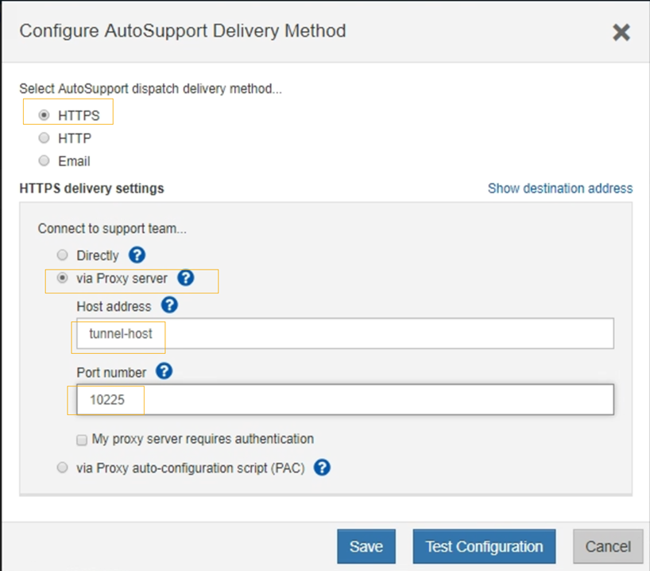

= EシリーズAutoSupportパッケージをStorageGRID経由で送信する
:allow-uri-read: 
:icons: font
:imagesdir: ../media/

[role="lead"]
E シリーズSANtricity System Manager AutoSupportパッケージは、ストレージ アプライアンス管理ポートではなく、 StorageGRID管理ノードを介してテクニカル サポートに送信できます。

見る https://docs.netapp.com/us-en/e-series-santricity/sm-support/autosupport-feature-overview.html["EシリーズハードウェアAutoSupport"^]E シリーズ アプライアンスでAutoSupportを使用する方法の詳細については、こちらをご覧ください。

.開始する前に
* グリッドマネージャにサインインするには、link:../admin/web-browser-requirements.html["サポートされているウェブブラウザ"] 。
* あなたはlink:admin-group-permissions.html["ストレージアプライアンス管理者またはルートアクセス権限"]。
* SANtricity AutoSupportを設定しました:
+
** SG6000およびSG5700アプライアンスの場合、 https://docs.netapp.com/us-en/storagegrid-appliances/installconfig/accessing-and-configuring-santricity-system-manager.html["SANtricity System ManagerでAutoSupportを構成する"^]

NOTE: Grid Manager を使用してSANtricity System Manager にアクセスするには、 SANtricityファームウェア 8.70 以上が必要です。

.タスク概要
E シリーズのAutoSupportパッケージには、ストレージ ハードウェアの詳細が含まれており、 StorageGRIDシステムから送信される他のA​​AutoSupportパッケージよりも具体的です。

SANtricity System Manager で特別なプロキシ サーバ アドレスを設定すると、アプライアンスの管理ポートを使用せずに、 StorageGRID管理ノードを介してAutoSupportパッケージを転送できます。この方法で送信されるAutoSupportパッケージは、link:../primer/what-admin-node-is.html["優先送信者管理ノード"] 、そして彼らはどんなlink:../admin/configuring-admin-proxy-settings.html["管理者プロキシ設定"]グリッド マネージャーで構成されているもの。

NOTE: この手順は、E シリーズAutoSupportパッケージ用のStorageGRIDプロキシ サーバを構成するためだけのものです。  EシリーズのAutoSupport設定の詳細については、 https://docs.netapp.com/us-en/e-series-family/index.html["NetApp EシリーズおよびSANtricityのドキュメント"^] 。

.手順
. グリッド マネージャーで、*NODES* を選択します。
. 左側のノード リストから、構成するストレージ アプライアンス ノードを選択します。
. * SANtricity System Manager* を選択します。
+
SANtricity System Manager のホームページが表示されます。

+
image::../media/autosupport_santricity_home_page.png[AutoSupport SANtricityホームページ]

. *サポート* > *サポート センター* > * AutoSupport*を選択します。
+
AutoSupport操作ページが表示されます。

+
image::../media/autosupport_santricity_operations.png[AutoSupport SANtricity AutoSupport操作]

. * AutoSupport配信方法の設定*を選択します。
+
AutoSupport配信方法の設定ページが表示されます。

+

. 配信方法として*HTTPS*を選択します。
+

NOTE: HTTPS を有効にする証明書が事前にインストールされています。

. *プロキシサーバー経由*を選択します。
. 入力 `tunnel-host`*ホストアドレス* です。
+
`tunnel-host`管理ノードを使用して E シリーズAutoSupportパッケージを送信するための特別なアドレスです。

. 入力 `10225`*ポート番号* です。
+
`10225`アプライアンス内の E シリーズ コントローラからAutoSupportパッケージを受信するStorageGRIDプロキシ サーバ上のポート番号です。

. AutoSupportプロキシ サーバーのルーティングと構成をテストするには、「*構成のテスト*」を選択します。
+
正しい場合は、緑色のバナーに「 AutoSupport構成が検証されました。」というメッセージが表示されます。

+
テストが失敗すると、赤いバナーにエラー メッセージが表示されます。  StorageGRIDのDNS設定とネットワークを確認し、link:../primer/what-admin-node-is.html["優先送信者管理ノード"] NetAppサポート サイトに接続して、再度テストを実行できます。

. *保存*を選択します。
+
設定が保存され、「AutoSupport配信方法が設定されました」という確認メッセージが表示されます。

