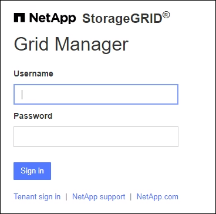

= グリッドマネージャーにSign in
:allow-uri-read: 
:icons: font
:imagesdir: ../media/

[role="lead"]
Grid Manager サインイン ページにアクセスするには、サポートされている Web ブラウザのアドレス バーに管理ノードの完全修飾ドメイン名 (FQDN) または IP アドレスを入力します。

各StorageGRIDシステムには、1 つのプライマリ管理ノードと任意の数の非プライマリ管理ノードが含まれます。任意の管理ノードの Grid Manager にサインインして、 StorageGRIDシステムを管理できます。ただし、一部のメンテナンス手順はプライマリ管理ノードからのみ実行できます。

=== HAグループに接続する

管理ノードが高可用性 (HA) グループに含まれている場合は、HA グループの仮想 IP アドレスまたは仮想 IP アドレスにマップされる完全修飾ドメイン名を使用して接続します。プライマリ管理ノードをグループのプライマリ インターフェイスとして選択する必要があります。これにより、プライマリ管理ノードが使用できない場合を除き、グリッド マネージャにアクセスするときにプライマリ管理ノードからアクセスできるようになります。見るlink:managing-high-availability-groups.html["高可用性グループの管理"] 。

=== SSO を使用

サインインの手順は、以下の場合、若干異なります。link:configuring-sso.html["シングルサインオン（SSO）が設定されています"] 。

== 最初の管理ノードでグリッド マネージャーにSign in

.開始する前に
* ログイン資格情報をお持ちです。
* 使用していますlink:../admin/web-browser-requirements.html["サポートされているウェブブラウザ"]。
* Web ブラウザで Cookie が有効になっています。
* 少なくとも 1 つの権限を持つユーザー グループに属しています。
* グリッド マネージャーの URL は次のとおりです。
+
`https://_FQDN_or_Admin_Node_IP_/`

+
完全修飾ドメイン名、管理ノードの IP アドレス、または管理ノードの HA グループの仮想 IP アドレスを使用できます。

+
HTTPS のデフォルト ポート (443) 以外のポートで Grid Manager にアクセスするには、URL にポート番号を含めます。

+
`https://_FQDN_or_Admin_Node_IP:port_/`

+

NOTE: 制限された Grid Manager ポートでは SSO は使用できません。ポート443を使用する必要があります。

.手順
. サポートされている Web ブラウザを起動します。
. ブラウザのアドレスバーに、グリッド マネージャーの URL を入力します。
. セキュリティ警告が表示された場合は、ブラウザのインストール ウィザードを使用して証明書をインストールします。見るlink:using-storagegrid-security-certificates.html["セキュリティ証明書を管理する"] 。
. グリッド マネージャーにSign in。
+
表示されるサインイン画面は、 StorageGRIDに対してシングル サインオン (SSO) が設定されているかどうかによって異なります。

+
[role="tabbed-block"]
====
.SSOを使用していない
--
.. グリッド マネージャーのユーザー名とパスワードを入力します。
.. *サインイン*を選択します。
+

--
.SSOの使用
--
** StorageGRIDが SSO を使用しており、このブラウザで URL にアクセスするのは初めての場合:
+
... *Sign in*を選択します。アカウント フィールドには 0 を残しておけます。
+
image::../media/sso_sign_in_first_time.png[SSO が有効で Cookie がない場合のSign in画面]

... 組織の SSO サインイン ページで標準の SSO 資格情報を入力します。例えば：
+
image::../media/sso_organization_page.gif[SSO の組織サインイン ページの例]

** StorageGRIDが SSO を使用しており、以前に Grid Manager またはテナント アカウントにアクセスしたことがある場合:
+
... *0* (グリッド マネージャーのアカウント ID) を入力するか、最近のアカウントのリストに *グリッド マネージャー* が表示されている場合はそれを選択します。
+
image::../media/sign_in_grid_manager_sso.png[SSO が有効になっている場合は、最近のアカウント リストから Grid Manager を選択します。]

... *Sign in*を選択します。
... 組織の SSO サインイン ページで標準の SSO 資格情報を使用してSign in。

--
====

サインインすると、ダッシュボードを含むグリッド マネージャーのホームページが表示されます。提供される情報については、link:../monitor/viewing-dashboard.html["ダッシュボードの表示と管理"] 。

image::../media/grid_manager_dashboard.png[ダッシュボード]

== 別の管理ノードにサインインする

別の管理ノードにサインインするには、次の手順に従います。

[role="tabbed-block"]
====
.SSOを使用していない
--
.手順
. ブラウザのアドレス バーに、他の管理ノードの完全修飾ドメイン名または IP アドレスを入力します。必要に応じてポート番号を含めます。
. グリッド マネージャーのユーザー名とパスワードを入力します。
. *サインイン*を選択します。

--
.SSOの使用
--
StorageGRIDが SSO を使用しており、1 つの管理ノードにサインインしている場合は、再度サインインしなくても他の管理ノードにアクセスできます。

.手順
. ブラウザのアドレス バーに、他の管理ノードの完全修飾ドメイン名または IP アドレスを入力します。
. SSO セッションの有効期限が切れている場合は、資格情報を再度入力してください。

--
====