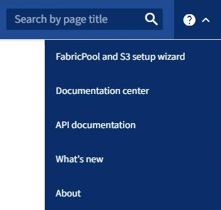

= S3 セットアップウィザードにアクセスして完了する
:allow-uri-read: 
:icons: font
:imagesdir: ../media/

[role="lead"]
S3 セットアップ ウィザードを使用して、 StorageGRID をS3 アプリケーションで使用するように構成できます。セットアップ ウィザードは、アプリケーションがStorageGRIDバケットにアクセスしてオブジェクトを保存するために必要な値を提供します。

.開始する前に
* あなたはlink:admin-group-permissions.html["ルートアクセス権限"]。
* あなたは、link:use-s3-setup-wizard.html["考慮事項と要件"]ウィザードを使用するためのものです。

== ウィザードにアクセスする

.手順
. グリッドマネージャーにSign inには、link:web-browser-requirements.html["サポートされているウェブブラウザ"] 。
. ダッシュボードに * FabricPoolおよび S3 セットアップ ウィザード* バナーが表示された場合は、バナー内のリンクを選択します。バナーが表示されなくなった場合は、グリッド マネージャーのヘッダー バーからヘルプ アイコンを選択し、* FabricPoolおよび S3 セットアップ ウィザード* を選択します。
+

. FabricPoolおよび S3 セットアップ ウィザード ページの S3 アプリケーション セクションで、[今すぐ構成] を選択します。

== ステップ 1/6: HA グループを構成する

HA グループは、それぞれにStorageGRID Load Balancer サービスが含まれるノードの集合です。  HA グループには、ゲートウェイ ノード、管理ノード、またはその両方を含めることができます。

HA グループを使用すると、S3 データ接続を利用可能な状態に保つことができます。  HA グループ内のアクティブ インターフェイスに障害が発生した場合、バックアップ インターフェイスが S3 操作にほとんど影響を与えずにワークロードを管理できます。

このタスクの詳細については、link:managing-high-availability-groups.html["高可用性グループの管理"] 。

.手順
. 外部ロードバランサーを使用する予定の場合は、HA グループを作成する必要はありません。  *この手順をスキップ*を選択して、<<ステップ 2/6: ロードバランサーのエンドポイントを構成する>> 。
. StorageGRIDロード バランサを使用するには、新しい HA グループを作成するか、既存の HA グループを使用することができます。
+
[role="tabbed-block"]
====
.HAグループを作成する
--
.. 新しい HA グループを作成するには、*HA グループの作成*を選択します。
.. *詳細を入力*手順では、次のフィールドに入力します。
+
[cols="1a,2a"]
|===
| フィールド | 説明 

 a| 
HAグループ名
 a| 
この HA グループの一意の表示名。

 a| 
説明（オプション）
 a| 
この HA グループの説明。

|===
.. *インターフェースの追加*手順では、この HA グループで使用するノード インターフェースを選択します。
+
列ヘッダーを使用して行を並べ替えるか、検索語を入力してインターフェイスをより速く見つけます。

+
1 つ以上のノードを選択できますが、各ノードに対して選択できるインターフェースは 1 つだけです。

.. *インターフェースの優先順位付け*手順では、この HA グループのプライマリ インターフェースとバックアップ インターフェースを決定します。
+
行をドラッグして、「優先順位」列の値を変更します。

+
リストの最初のインターフェースはプライマリ インターフェースです。障害が発生しない限り、プライマリ インターフェイスはアクティブ インターフェイスになります。

+
HA グループに複数のインターフェイスが含まれており、アクティブ インターフェイスに障害が発生した場合、仮想 IP (VIP) アドレスは優先順位の最初のバックアップ インターフェイスに移動します。そのインターフェースに障害が発生した場合、VIP アドレスは次のバックアップ インターフェースに移動し、これが繰り返されます。障害が解決されると、VIP アドレスは利用可能な最も優先度の高いインターフェースに戻ります。

.. *IP アドレスを入力* の手順では、次のフィールドに入力します。
+
[cols="1a,2a"]
|===
| フィールド | 説明 

 a| 
サブネットCIDR
 a| 
CIDR 表記の VIP サブネットのアドレス (IPv4 アドレスの後にスラッシュとサブネットの長さ (0 ～ 32) が続きます)。

ネットワーク アドレスにはホスト ビットを設定しないでください。例：  `192.16.0.0/22` 。

 a| 
ゲートウェイIPアドレス（オプション）
 a| 
StorageGRID へのアクセスに使用される S3 IP アドレスがStorageGRID VIP アドレスと同じサブネット上にない場合は、 StorageGRID VIP ローカル ゲートウェイ IP アドレスを入力します。ローカル ゲートウェイ IP アドレスは VIP サブネット内にある必要があります。

 a| 
仮想IPアドレス
 a| 
HA グループ内のアクティブ インターフェイスに、少なくとも 1 個、最大 10 個の VIP アドレスを入力します。すべての VIP アドレスは VIP サブネット内にある必要があります。

少なくとも 1 つのアドレスは IPv4 である必要があります。必要に応じて、追加の IPv4 および IPv6 アドレスを指定できます。

|===
.. *HA グループの作成* を選択し、*完了* を選択して S3 セットアップ ウィザードに戻ります。
.. *続行*を選択して、ロードバランサーのステップに進みます。

--
.既存のHAグループを使用する
--
.. 既存の HA グループを使用するには、「*HA グループの選択*」から HA グループ名を選択します。
.. *続行*を選択して、ロードバランサーのステップに進みます。

--
====

== ステップ 2/6: ロードバランサーのエンドポイントを構成する

StorageGRID はロード バランサを使用してクライアント アプリケーションからのワークロードを管理します。負荷分散により、複数のストレージ ノード間の速度と接続容量が最大化されます。

すべてのゲートウェイおよび管理ノードに存在するStorageGRIDロード バランサ サービスを使用することも、外部 (サードパーティ) ロード バランサに接続することもできます。  StorageGRIDロード バランサの使用をお勧めします。

このタスクの詳細については、link:managing-load-balancing.html["負荷分散に関する考慮事項"] 。

StorageGRIDロード バランサ サービスを使用するには、* StorageGRIDロード バランサ* タブを選択し、使用するロード バランサ エンドポイントを作成または選択します。外部ロード バランサを使用するには、[*外部ロード バランサ*] タブを選択し、すでに構成したシステムの詳細を入力します。

[role="tabbed-block"]
====
.エンドポイントを作成する
--
.手順
. ロード バランサー エンドポイントを作成するには、[エンドポイントの作成] を選択します。
. *エンドポイントの詳細を入力* ステップで、次のフィールドに入力します。
+
[cols="1a,2a"]
|===
| フィールド | 説明 

 a| 
Name
 a| 
エンドポイントの説明的な名前。

 a| 
ポート
 a| 
負荷分散に使用するStorageGRIDポート。このフィールドは、最初に作成するエンドポイントに対してデフォルトで 10433 に設定されますが、未使用の外部ポートを入力できます。  80 または 443 を入力すると、これらのポートは管理ノードで予約されているため、エンドポイントはゲートウェイ ノードでのみ構成されます。

*注意:* 他のグリッド サービスで使用されるポートは許可されません。参照link:../network/network-port-reference.html["ネットワークポートリファレンス"]。

 a| 
クライアントタイプ
 a| 
*S3* である必要があります。

 a| 
ネットワークプロトコル
 a| 
「HTTPS」を選択します。

*注*: TLS 暗号化なしでのStorageGRIDとの通信はサポートされていますが、推奨されません。

|===
. *バインディング モードの選択* ステップで、バインディング モードを指定します。バインディング モードは、任意の IP アドレスまたは特定の IP アドレスとネットワーク インターフェイスを使用してエンドポイントにアクセスする方法を制御します。
+
[cols="1a,3a"]
|===
| モード | 説明 

 a| 
グローバル（デフォルト）
 a| 
クライアントは、任意のゲートウェイ ノードまたは管理ノードの IP アドレス、任意のネットワーク上の任意の HA グループの仮想 IP (VIP) アドレス、または対応する FQDN を使用してエンドポイントにアクセスできます。

このエンドポイントのアクセシビリティを制限する必要がない限り、*グローバル*設定 (デフォルト) を使用します。

 a| 
HAグループの仮想IP
 a| 
クライアントはこのエンドポイントにアクセスするために、HA グループの仮想 IP アドレス (または対応する FQDN) を使用する必要があります。

このバインディング モードのエンドポイントは、エンドポイントに選択した HA グループが重複していない限り、すべて同じポート番号を使用できます。

 a| 
ノードインターフェース
 a| 
クライアントは、このエンドポイントにアクセスするために、選択したノード インターフェイスの IP アドレス (または対応する FQDN) を使用する必要があります。

 a| 
ノード タイプ
 a| 
選択したノードのタイプに基づいて、クライアントは、このエンドポイントにアクセスするために、任意の管理ノードの IP アドレス (または対応する FQDN) または任意のゲートウェイ ノードの IP アドレス (または対応する FQDN) を使用する必要があります。

|===
. テナント アクセス ステップでは、次のいずれかを選択します。
+
[cols="1a,2a"]
|===
| フィールド | 説明 

 a| 
すべてのテナントを許可する（デフォルト）
 a| 
すべてのテナント アカウントは、このエンドポイントを使用してバケットにアクセスできます。

 a| 
選択したテナントを許可する
 a| 
選択されたテナント アカウントのみがこのエンドポイントを使用してバケットにアクセスできます。

 a| 
選択したテナントをブロック
 a| 
選択されたテナント アカウントは、このエンドポイントを使用してバケットにアクセスできません。他のすべてのテナントはこのエンドポイントを使用できます。

|===
. *証明書の添付*ステップでは、次のいずれかを選択します。
+
[cols="1a,2a"]
|===
| フィールド | 説明 

 a| 
証明書をアップロードする（推奨）
 a| 
このオプションを使用して、CA 署名付きサーバー証明書、証明書の秘密キー、およびオプションの CA バンドルをアップロードします。

 a| 
証明書を生成する
 a| 
このオプションを使用して、自己署名証明書を生成します。見るlink:configuring-load-balancer-endpoints.html["ロードバランサのエンドポイントを構成する"]入力内容の詳細については、こちらをご覧ください。

 a| 
StorageGRID S3証明書を使用する
 a| 
このオプションは、 StorageGRIDグローバル証明書のカスタム バージョンをすでにアップロードまたは生成している場合にのみ使用してください。見るlink:configuring-custom-server-certificate-for-storage-node.html["S3 API証明書を設定する"]詳細については。

|===
. *完了*を選択して、S3 セットアップ ウィザードに戻ります。
. *続行*を選択して、テナントとバケットのステップに進みます。

NOTE: エンドポイント証明書の変更がすべてのノードに適用されるまでに最大 15 分かかる場合があります。

--
.既存のロードバランサエンドポイントを使用する
--
.手順
. 既存のエンドポイントを使用するには、「*ロードバランサー エンドポイントの選択*」からその名前を選択します。
. *続行*を選択して、テナントとバケットのステップに進みます。

--
.外部ロードバランサを使用する
--
.手順
. 外部ロードバランサーを使用するには、次のフィールドに入力します。
+
[cols="1a,2a"]
|===
| フィールド | 説明 

 a| 
FQDN
 a| 
外部ロード バランサーの完全修飾ドメイン名 (FQDN)。

 a| 
ポート
 a| 
S3 アプリケーションが外部ロードバランサーに接続するために使用するポート番号。

 a| 
Certificate
 a| 
外部ロードバランサーのサーバー証明書をコピーして、このフィールドに貼り付けます。

|===
. *続行*を選択して、テナントとバケットのステップに進みます。

--
====

== ステップ3/6: テナントとバケットを作成する

テナントは、S3 アプリケーションを使用してStorageGRIDにオブジェクトを保存および取得できるエンティティです。各テナントには、独自のユーザー、アクセス キー、バケット、オブジェクト、および特定の機能セットがあります。

バケットは、テナントのオブジェクトとオブジェクト メタデータを保存するために使用されるコンテナです。テナントには多くのバケットが存在する可能性がありますが、ウィザードを使用すると、テナントとバケットを最も迅速かつ簡単に作成できます。後でバケットを追加したりオプションを設定したりする必要がある場合は、テナント マネージャーを使用できます。

このタスクの詳細については、link:creating-tenant-account.html["テナントアカウントを作成する"]そしてlink:../tenant/creating-s3-bucket.html["S3バケットを作成する"]。

.手順
. テナント アカウントの名前を入力します。
+
テナント名は一意である必要はありません。テナント アカウントが作成されると、一意の数値アカウント ID が割り当てられます。

. StorageGRIDシステムが使用するかどうかに基づいて、テナントアカウントのルートアクセスを定義します。link:using-identity-federation.html["アイデンティティフェデレーション"] 、link:configuring-sso.html["シングルサインオン（SSO）"] 、またはその両方。
+
[cols="1a,2a"]
|===
| オプション | これをする 

 a| 
アイデンティティ連携が有効になっていない場合
 a| 
ローカル ルート ユーザーとしてテナントにサインインするときに使用するパスワードを指定します。

 a| 
アイデンティティ連携が有効になっている場合
 a| 
.. 既存のフェデレーショングループを選択してlink:../tenant/tenant-management-permissions.html["ルートアクセス権限"]テナントのために。
.. 必要に応じて、ローカル ルート ユーザーとしてテナントにサインインするときに使用するパスワードを指定します。

 a| 
ID連携とシングルサインオン（SSO）の両方が有効になっている場合
 a| 
既存のフェデレーショングループを選択してlink:../tenant/tenant-management-permissions.html["ルートアクセス権限"]テナントのために。ローカル ユーザーはサインインできません。

|===
. ウィザードでルート ユーザーのアクセス キー ID とシークレット アクセス キーを作成する場合は、[ルート ユーザーの S3 アクセス キーを自動的に作成する] を選択します。
+
テナントの唯一のユーザーがルート ユーザーである場合は、このオプションを選択します。他のユーザーがこのテナントを使用する場合、link:../tenant/index.html["テナントマネージャーを使用する"]キーと権限を設定します。

. 今すぐこのテナントのバケットを作成する場合は、「*このテナントのバケットを作成*」を選択します。
+

TIP: グリッドに対して S3 オブジェクト ロックが有効になっている場合、この手順で作成されたバケットでは S3 オブジェクト ロックは有効になりません。この S3 アプリケーションに S3 オブジェクトロック バケットを使用する必要がある場合は、今すぐバケットの作成を選択しないでください。代わりに、テナントマネージャーを使用してlink:../tenant/creating-s3-bucket.html["バケットを作成する"]後で。

+
.. S3 アプリケーションが使用するバケットの名前を入力します。例：  `s3-bucket` 。
+
バケットを作成した後は、バケット名を変更することはできません。

.. このバケットの*リージョン*を選択します。
+
デフォルトの地域を使用する(`us-east-1`) 将来的に ILM を使用してバケットのリージョンに基づいてオブジェクトをフィルタリングする予定がない限り、このポリシーは適用されません。

. *作成して続行*を選択します。

== [[download-data]]ステップ4/6: データのダウンロード

データのダウンロード手順では、1 つまたは 2 つのファイルをダウンロードして、構成した内容の詳細を保存できます。

.手順
. *ルートユーザーの S3 アクセス キーを自動的に作成する* を選択した場合は、次のいずれかまたは両方を実行します。
+
** *アクセスキーをダウンロード*を選択してダウンロードします `.csv`テナント アカウント名、アクセス キー ID、シークレット アクセス キーを含むファイル。
** コピーアイコン（image:../media/icon_tenant_copy_url.png["コピーアイコン"] ) をクリックして、アクセス キー ID とシークレット アクセス キーをクリップボードにコピーします。

. *設定値をダウンロード*を選択してダウンロードします `.txt`ロードバランサのエンドポイント、テナント、バケット、およびルートユーザーの設定を含むファイル。
. この情報を安全な場所に保存してください。
+

CAUTION: 両方のアクセス キーをコピーするまでこのページを閉じないでください。このページを閉じると、キーは使用できなくなります。この情報はStorageGRIDシステムからデータを取得するために使用される可能性があるため、必ず安全な場所に保存してください。

. プロンプトが表示されたら、チェックボックスを選択して、キーをダウンロードまたはコピーしたことを確認します。
. *続行*を選択して、ILM ルールとポリシーのステップに進みます。

== ステップ 5/6: S3 の ILM ルールと ILM ポリシーを確認する

情報ライフサイクル管理 (ILM) ルールは、 StorageGRIDシステム内のすべてのオブジェクトの配置、期間、および取り込み動作を制御します。 StorageGRIDに含まれる ILM ポリシーは、すべてのオブジェクトの複製コピーを 2 つ作成します。このポリシーは、少なくとも 1 つの新しいポリシーをアクティブ化するまで有効です。

.手順
. ページに記載されている情報を確認します。
. 新しいテナントまたはバケットに属するオブジェクトに特定の指示を追加する場合は、新しいルールと新しいポリシーを作成します。見るlink:../ilm/access-create-ilm-rule-wizard.html["ILMルールを作成する"]そしてlink:../ilm/ilm-policy-overview.html["ILMポリシーを使用する"]。
. *これらの手順を確認し、実行する必要があることを理解しました*を選択します。
. 次に何をすべきかを理解していることを示すために、チェックボックスを選択します。
. *続行*を選択して*概要*に進みます。

== ステップ6/6: レビューの概要

.手順
. 概要を確認します。
. 次の手順では、S3 クライアントに接続する前に必要になる可能性のある追加の構成について説明しているので、詳細をメモしておいてください。たとえば、「* root としてSign in*」を選択すると、テナント マネージャに移動し、テナント ユーザーを追加したり、追加のバケットを作成したり、バケット設定を更新したりできます。
. *完了*を選択します。
. StorageGRIDからダウンロードしたファイルまたは手動で取得した値を使用してアプリケーションを構成します。

