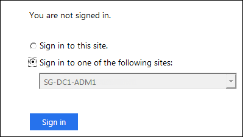
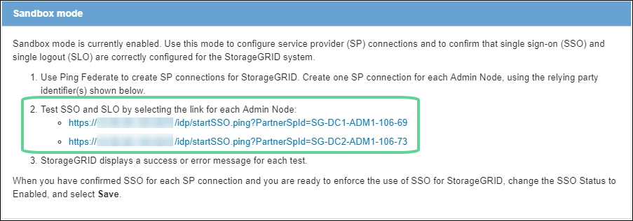

= サンドボックスモードを使用する
:allow-uri-read: 
:icons: font
:imagesdir: ../media/

[role="lead"]
すべてのStorageGRIDユーザーに対してシングル サインオン (SSO) を有効にする前に、サンドボックス モードを使用してシングル サインオン (SSO) を構成してテストすることができます。  SSO を有効にした後は、構成を変更または再テストする必要があるときはいつでもサンドボックス モードに戻ることができます。

.開始する前に
* グリッドマネージャにサインインするには、link:../admin/web-browser-requirements.html["サポートされているウェブブラウザ"] 。
* あなたはlink:admin-group-permissions.html["ルートアクセス権限"]。
* StorageGRIDシステムの ID フェデレーションを構成しました。
* ID フェデレーションの *LDAP サービス タイプ* では、使用する予定の SSO ID プロバイダーに基づいて、Active Directory または Azure のいずれかを選択しました。
+
[cols="1a,1a"]
|===
| 構成されたLDAPサービスタイプ | SSO ID プロバイダーのオプション 

 a| 
Active Directory
 a| 
** Active Directory
** Azure
** PingFederate

 a| 
Azure
 a| 
Azure

|===

.タスク概要
SSO が有効になっていて、ユーザーが管理ノードにサインインしようとすると、 StorageGRID はSSO ID プロバイダーに認証要求を送信します。次に、SSO ID プロバイダーは、認証要求が成功したかどうかを示す認証応答をStorageGRIDに返します。リクエストが成功した場合:

* Active Directory または PingFederate からの応答には、ユーザーのユニバーサル一意識別子 (UUID) が含まれます。
* Azure からの応答には、ユーザー プリンシパル名 (UPN) が含まれます。

StorageGRID (サービス プロバイダー) と SSO ID プロバイダーがユーザー認証要求について安全に通信できるようにするには、 StorageGRIDで特定の設定を構成する必要があります。次に、SSO ID プロバイダーのソフトウェアを使用して、各管理ノードに対して証明書利用者信頼 (AD FS)、エンタープライズ アプリケーション (Azure)、またはサービス プロバイダー (PingFederate) を作成する必要があります。最後に、 StorageGRIDに戻って SSO を有効にする必要があります。

サンドボックス モードを使用すると、この双方向の構成を簡単に実行でき、SSO を有効にする前にすべての設定をテストできます。サンドボックス モードを使用している場合、ユーザーは SSO を使用してサインインできません。

== サンドボックスモードにアクセスする

.手順
. *構成* > *アクセス制御* > *シングル サインオン* を選択します。
+
*無効*オプションが選択された状態で、シングル サインオン ページが表示されます。

+
image::../media/sso_status_disabled.png[SSO ステータスが無効になっているシングル サインオン ページ]

+

NOTE: SSO ステータス オプションが表示されない場合は、ID プロバイダーをフェデレーション ID ソースとして構成していることを確認してください。見るlink:requirements-for-sso.html["シングルサインオンの要件と考慮事項"] 。

. *サンドボックスモード*を選択します。
+
アイデンティティプロバイダーセクションが表示されます。

== IDプロバイダーの詳細を入力してください

.手順
. ドロップダウンリストから*SSO タイプ*を選択します。
. 選択した SSO タイプに基づいて、アイデンティティ プロバイダー セクションのフィールドに入力します。
+
[role="tabbed-block"]
====
.Active Directory
--
.. Active Directory フェデレーション サービス (AD FS) に表示されるとおりに、ID プロバイダーの *フェデレーション サービス名* を入力します。
+

NOTE: フェデレーション サービス名を見つけるには、Windows Server Manager に移動します。  *ツール* > *AD FS 管理* を選択します。 [アクション] メニューから、[フェデレーション サービスのプロパティの編集] を選択します。フェデレーション サービス名は 2 番目のフィールドに表示されます。

.. アイデンティティ プロバイダーがStorageGRID要求に応答して SSO 構成情報を送信するときに、接続を保護するために使用する TLS 証明書を指定します。
+
*** *オペレーティング システムの CA 証明書を使用する*: オペレーティング システムにインストールされているデフォルトの CA 証明書を使用して接続を保護します。
*** *カスタム CA 証明書を使用する*: カスタム CA 証明書を使用して接続を保護します。
+
この設定を選択した場合は、カスタム証明書のテキストをコピーし、「*CA 証明書*」テキスト ボックスに貼り付けます。

*** *TLS を使用しない*: 接続を保護するために TLS 証明書を使用しません。
+

CAUTION: CA証明書を変更する場合は、直ちにlink:../maintain/starting-or-restarting-service.html["管理ノードで mgmt-api サービスを再起動します。"]グリッド マネージャーへの SSO が成功するかどうかをテストします。

.. 証明書利用者セクションで、 StorageGRIDの *証明書利用者 ID* を指定します。この値は、AD FS 内の各証明書利用者信頼に使用する名前を制御します。
+
*** たとえば、グリッドに管理ノードが1つしかなく、将来的に管理ノードを追加する予定がない場合は、次のように入力します。 `SG`または `StorageGRID`。
*** グリッドに複数の管理ノードが含まれている場合は、文字列 `[HOSTNAME]`識別子内。例：  `SG-[HOSTNAME]` 。これにより、ノードのホスト名に基づいて、システム内の各管理ノードの依存パーティ識別子を示すテーブルが生成されます。
+
image::../media/sso_status_sandbox_mode_active_directory.png[シングルサインオン,Sandbox mode enabled,Relying party identifiers shown for several Admin Nodes]

+

NOTE: StorageGRIDシステム内の各管理ノードに対して、証明書利用者信頼を作成する必要があります。各管理ノードに証明書利用者信頼を設定することで、ユーザーはどの管理ノードに対しても安全にサインインおよびサインアウトできるようになります。

.. *保存*を選択します。
+
*保存*ボタンに緑色のチェックマークが数秒間表示されます。

+
image::../media/save_button_green_checkmark.gif[緑のチェックマークが付いた保存ボタン]

--
.Azure
--
.. アイデンティティ プロバイダーがStorageGRID要求に応答して SSO 構成情報を送信するときに、接続を保護するために使用する TLS 証明書を指定します。
+
*** *オペレーティング システムの CA 証明書を使用する*: オペレーティング システムにインストールされているデフォルトの CA 証明書を使用して接続を保護します。
*** *カスタム CA 証明書を使用する*: カスタム CA 証明書を使用して接続を保護します。
+
この設定を選択した場合は、カスタム証明書のテキストをコピーし、「*CA 証明書*」テキスト ボックスに貼り付けます。

*** *TLS を使用しない*: 接続を保護するために TLS 証明書を使用しません。
+

CAUTION: CA証明書を変更する場合は、直ちにlink:../maintain/starting-or-restarting-service.html["管理ノードで mgmt-api サービスを再起動します。"]グリッド マネージャーへの SSO が成功するかどうかをテストします。

.. エンタープライズ アプリケーション セクションで、 StorageGRIDの *エンタープライズ アプリケーション名* を指定します。この値は、Azure AD 内の各エンタープライズ アプリケーションに使用する名前を制御します。
+
*** たとえば、グリッドに管理ノードが1つしかなく、将来的に管理ノードを追加する予定がない場合は、次のように入力します。 `SG`または `StorageGRID`。
*** グリッドに複数の管理ノードが含まれている場合は、文字列 `[HOSTNAME]`識別子内。例：  `SG-[HOSTNAME]` 。これにより、ノードのホスト名に基づいて、システム内の各管理ノードのエンタープライズ アプリケーション名を表示するテーブルが生成されます。
+
image::../media/sso_status_sandbox_mode_azure.png[シングルサインオン,Sandbox mode enabled,Relying party identifiers shown for several Admin Nodes]

+

NOTE: StorageGRIDシステム内の各管理ノードに対してエンタープライズ アプリケーションを作成する必要があります。各管理ノードにエンタープライズ アプリケーションを用意することで、ユーザーはどの管理ノードにも安全にサインインおよびサインアウトできるようになります。

.. 以下の手順に従ってくださいlink:../admin/creating-enterprise-application-azure.html["Azure AD でエンタープライズ アプリケーションを作成する"]表にリストされている各管理ノードに対してエンタープライズ アプリケーションを作成します。
.. Azure AD から、各エンタープライズ アプリケーションのフェデレーション メタデータ URL をコピーします。次に、この URL をStorageGRIDの対応する *Federation metadata URL* フィールドに貼り付けます。
.. すべての管理ノードのフェデレーション メタデータ URL をコピーして貼り付けたら、[*保存*] を選択します。
+
*保存*ボタンに緑色のチェックマークが数秒間表示されます。

+
image::../media/save_button_green_checkmark.gif[緑のチェックマークが付いた保存ボタン]

--
.PingFederate
--
.. アイデンティティ プロバイダーがStorageGRID要求に応答して SSO 構成情報を送信するときに、接続を保護するために使用する TLS 証明書を指定します。
+
*** *オペレーティング システムの CA 証明書を使用する*: オペレーティング システムにインストールされているデフォルトの CA 証明書を使用して接続を保護します。
*** *カスタム CA 証明書を使用する*: カスタム CA 証明書を使用して接続を保護します。
+
この設定を選択した場合は、カスタム証明書のテキストをコピーし、「*CA 証明書*」テキスト ボックスに貼り付けます。

*** *TLS を使用しない*: 接続を保護するために TLS 証明書を使用しません。
+

CAUTION: CA証明書を変更する場合は、直ちにlink:../maintain/starting-or-restarting-service.html["管理ノードで mgmt-api サービスを再起動します。"]グリッド マネージャーへの SSO が成功するかどうかをテストします。

.. サービス プロバイダー (SP ) セクションで、 StorageGRIDの * SP接続 ID* を指定します。この値は、PingFederate 内の各SP接続に使用する名前を制御します。
+
*** たとえば、グリッドに管理ノードが1つしかなく、将来的に管理ノードを追加する予定がない場合は、次のように入力します。 `SG`または `StorageGRID`。
*** グリッドに複数の管理ノードが含まれている場合は、文字列 `[HOSTNAME]`識別子内。例：  `SG-[HOSTNAME]` 。これにより、ノードのホスト名に基づいて、システム内の各管理ノードのSP接続 ID を示すテーブルが生成されます。
+
image::../media/sso_status_sandbox_mode_ping_federated.png[シングルサインオン,Sandbox mode enabled,Relying party identifiers shown for several Admin Nodes]

+

NOTE: StorageGRIDシステム内の各管理ノードに対してSP接続を作成する必要があります。各管理ノードにSP接続があると、ユーザーはどの管理ノードにも安全にサインインおよびサインアウトできるようになります。

.. *フェデレーション メタデータ URL* フィールドに各管理ノードのフェデレーション メタデータ URL を指定します。
+
次の形式を使用してください。

+
[listing]
----
https://<Federation Service Name>:<port>/pf/federation_metadata.ping?PartnerSpId=<SP Connection ID>
----
.. *保存*を選択します。
+
*保存*ボタンに緑色のチェックマークが数秒間表示されます。

+
image::../media/save_button_green_checkmark.gif[緑のチェックマークが付いた保存ボタン]

--
====

== 証明書利用者信頼、エンタープライズ アプリケーション、またはSP接続を構成する

設定が保存されると、サンドボックス モードの確認通知が表示されます。この通知は、サンドボックス モードが有効になったことを確認し、概要の手順を示します。

StorageGRID は、必要な限りサンドボックス モードのままにすることができます。ただし、シングル サインオン ページで *サンドボックス モード* が選択されている場合、すべてのStorageGRIDユーザーに対して SSO が無効になります。ローカルユーザーのみがサインインできます。

証明書利用者信頼 (Active Directory) を構成する、エンタープライズ アプリケーション (Azure) を完了する、またはSP接続 (PingFederate) を構成するには、次の手順に従います。

[role="tabbed-block"]
====
.Active Directory
--
.手順
. Active Directory フェデレーション サービス (AD FS) に移動します。
. StorageGRIDシングル サインオン ページの表に示されている各証明書利用者 ID を使用して、 StorageGRIDに対して 1 つ以上の証明書利用者信頼を作成します。
+
表に示されている管理ノードごとに 1 つの信頼を作成する必要があります。

+
手順については、link:../admin/creating-relying-party-trusts-in-ad-fs.html["AD FS で証明書利用者信頼を作成する"] 。

--
.Azure
--
.手順
. 現在サインインしている管理ノードのシングル サインオン ページで、SAML メタデータをダウンロードして保存するためのボタンを選択します。
. 次に、グリッド内の他の管理ノードに対して、次の手順を繰り返します。
+
.. ノードにSign in。
.. *構成* > *アクセス制御* > *シングル サインオン* を選択します。
.. そのノードの SAML メタデータをダウンロードして保存します。

. Azure ポータルに移動します。
. 以下の手順に従ってくださいlink:../admin/creating-enterprise-application-azure.html["Azure AD でエンタープライズ アプリケーションを作成する"]各管理ノードの SAML メタデータ ファイルを対応する Azure エンタープライズ アプリケーションにアップロードします。

--
.PingFederate
--
.手順
. 現在サインインしている管理ノードのシングル サインオン ページで、SAML メタデータをダウンロードして保存するためのボタンを選択します。
. 次に、グリッド内の他の管理ノードに対して、次の手順を繰り返します。
+
.. ノードにSign in。
.. *構成* > *アクセス制御* > *シングル サインオン* を選択します。
.. そのノードの SAML メタデータをダウンロードして保存します。

. PingFederate にアクセスします。
. link:../admin/creating-sp-connection-ping.html["StorageGRIDの 1 つ以上のサービス プロバイダー ( SP ) 接続を作成します。"] 。各管理ノードのSP接続 ID ( StorageGRIDシングル サインオン ページの表に表示) と、その管理ノード用にダウンロードした SAML メタデータを使用します。
+
表に示されている管理ノードごとに 1 つのSP接続を作成する必要があります。

--
====

== SSO接続をテストする

StorageGRIDシステム全体にシングル サインオンの使用を強制する前に、各管理ノードに対してシングル サインオンとシングル ログアウトが正しく設定されていることを確認する必要があります。

[role="tabbed-block"]
====
.Active Directory
--
.手順
. StorageGRIDシングル サインオン ページで、サンドボックス モード メッセージ内のリンクを見つけます。
+
URL は、「*フェデレーション サービス名*」フィールドに入力した値から派生します。

+
image::../media/sso_sandbox_mode_url.gif[ID プロバイダーのサインオン ページの URL]

. リンクを選択するか、URL をコピーしてブラウザに貼り付け、ID プロバイダーのサインオン ページにアクセスします。
. SSO を使用してStorageGRIDにサインインできることを確認するには、* 次のいずれかのサイトにSign in* を選択し、プライマリ管理ノードの証明書利用者 ID を選択して、*Sign in* を選択します。
+

. フェデレーションユーザー名とパスワードを入力します。
+
** SSO サインインおよびログアウト操作が成功すると、成功メッセージが表示されます。
+
image::../media/sso_sandbox_mode_sign_in_success.gif[SSO認証とログアウトテストの成功メッセージ]

** SSO 操作が失敗した場合、エラー メッセージが表示されます。問題を修正し、ブラウザの Cookie をクリアして、もう一度お試しください。

. これらの手順を繰り返して、グリッド内の各管理ノードの SSO 接続を確認します。

--
.Azure
--
.手順
. Azure ポータルのシングル サインオン ページに移動します。
. *このアプリケーションをテスト*を選択します。
. フェデレーション ユーザーの資格情報を入力します。
+
** SSO サインインおよびログアウト操作が成功すると、成功メッセージが表示されます。
+
image::../media/sso_sandbox_mode_sign_in_success.gif[SSO認証とログアウトテストの成功メッセージ]

** SSO 操作が失敗した場合、エラー メッセージが表示されます。問題を修正し、ブラウザの Cookie をクリアして、もう一度お試しください。

. これらの手順を繰り返して、グリッド内の各管理ノードの SSO 接続を確認します。

--
.PingFederate
--
.手順
. StorageGRIDシングル サインオン ページで、サンドボックス モード メッセージの最初のリンクを選択します。
+
一度に 1 つのリンクを選択してテストします。

+

. フェデレーション ユーザーの資格情報を入力します。
+
** SSO サインインおよびログアウト操作が成功すると、成功メッセージが表示されます。
+
image::../media/sso_sandbox_mode_sign_in_success.gif[SSO認証とログアウトテストの成功メッセージ]

** SSO 操作が失敗した場合、エラー メッセージが表示されます。問題を修正し、ブラウザの Cookie をクリアして、もう一度お試しください。

. 次のリンクを選択して、グリッド内の各管理ノードの SSO 接続を確認します。
+
「ページの有効期限が切れました」というメッセージが表示された場合は、ブラウザの「戻る」ボタンを選択し、資格情報を再送信してください。

--
====

== シングルサインオンを有効にする

SSO を使用して各管理ノードにサインインできることを確認したら、 StorageGRIDシステム全体に対して SSO を有効にできます。

TIP: SSO が有効になっている場合、すべてのユーザーは Grid Manager、Tenant Manager、Grid Management API、および Tenant Management API にアクセスするために SSO を使用する必要があります。ローカル ユーザーはStorageGRIDにアクセスできなくなります。

.手順
. *構成* > *アクセス制御* > *シングル サインオン* を選択します。
. SSO ステータスを *有効* に変更します。
. *保存*を選択します。
. 警告メッセージを確認し、[*OK*] を選択します。
+
シングル サインオンが有効になりました。

TIP: Azure ポータルを使用しており、Azure にアクセスするために使用するのと同じコンピューターからStorageGRIDにアクセスする場合は、Azure ポータル ユーザーが承認されたStorageGRIDユーザー ( StorageGRIDにインポートされたフェデレーション グループ内のユーザー) であることを確認するか、 StorageGRIDにサインインする前に Azure ポータルからログアウトしてください。
