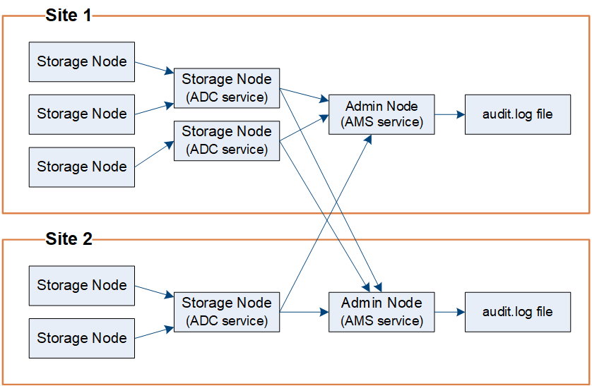

= 監査メッセージフローと保持
:allow-uri-read: 
:icons: font
:imagesdir: ../media/

[role="lead"]
すべてのStorageGRIDサービスは、通常のシステム操作中に監査メッセージを生成します。これらの監査メッセージがStorageGRIDシステムを経由してどのように移動するかを理解する必要があります。 `audit.log`ファイル。

== 監査メッセージフロー

監査メッセージは、管理ノードと、管理ドメイン コントローラ (ADC) サービスを持つストレージ ノードによって処理されます。

監査メッセージ フロー図に示されているように、各StorageGRIDノードは、データ センター サイトの ADC サービスの 1 つに監査メッセージを送信します。  ADC サービスは、各サイトにインストールされた最初の 3 つのストレージ ノードに対して自動的に有効になります。

次に、各 ADC サービスはリレーとして機能し、監査メッセージのコレクションをStorageGRIDシステム内のすべての管理ノードに送信します。これにより、各管理ノードにシステム アクティビティの完全な記録が提供されます。

各管理ノードは監査メッセージをテキストログファイルに保存します。アクティブなログファイルの名前は `audit.log`。

=== 監査メッセージの保持

StorageGRID はコピーおよび削除のプロセスを使用して、監査メッセージが監査ログに書き込まれる前に失われないようにします。

ノードが監査メッセージを生成または中継すると、そのメッセージはグリッド ノードのシステム ディスク上の監査メッセージ キューに格納されます。メッセージのコピーは、管理ノードの監査ログファイルにメッセージが書き込まれるまで、常に監査メッセージキューに保持されます。 `/var/local/log`ディレクトリ。これにより、転送中に監査メッセージが失われるのを防ぐことができます。

image::../media/audit_message_retention.gif[AMSでの監査メッセージの受信をまとめた図]

ネットワーク接続の問題や監査容量の不足により、監査メッセージ キューが一時的に増加する場合があります。キューが増加すると、各ノードの利用可能なスペースをより多く消費するようになります。 `/var/local/`ディレクトリ。問題が解決せず、ノードの監査メッセージ ディレクトリがいっぱいになると、個々のノードはバックログの処理を優先し、一時的に新しいメッセージを処理できなくなります。

具体的には、次のような動作が見られる場合があります。

* もし `/var/local/log`管理ノードが使用するディレクトリがいっぱいになると、ディレクトリがいっぱいでなくなるまで、管理ノードは新しい監査メッセージに使用できないというフラグが付けられます。S3 クライアント要求は影響を受けません。監査リポジトリに到達できない場合、XAMS (到達不能監査リポジトリ) アラームがトリガーされます。
* もし `/var/local/`ADC サービスを使用するストレージ ノードによって使用されるディレクトリが 92% いっぱいになると、ディレクトリが 87% いっぱいになるまで、ノードは監査メッセージに使用できないというフラグが付けられます。他のノードへの S3 クライアント要求は影響を受けません。監査リレーに到達できない場合、NRLY (使用可能な監査リレー) アラームがトリガーされます。
+

NOTE: ADCサービスに利用可能なストレージノードがない場合、ストレージノードは監査メッセージをローカルに保存します。 `/var/local/log/localaudit.log`ファイル。

* もし `/var/local/`ストレージノードが使用するディレクトリが85%いっぱいになると、ノードはS3クライアントのリクエストを拒否し始めます。 `503 Service Unavailable` 。

次の種類の問題により、監査メッセージ キューが非常に大きくなる可能性があります。

* ADC サービスを備えた管理ノードまたはストレージ ノードの停止。システムのノードの 1 つがダウンすると、残りのノードがバックログになる可能性があります。
* システムの監査能力を超える持続的なアクティビティ レート。
* その `/var/local/`監査メッセージとは関係のない理由で、ADC ストレージ ノードのスペースがいっぱいになります。このような状況が発生すると、ノードは新しい監査メッセージの受け入れを停止し、現在のバックログを優先するため、他のノードでバックログが発生する可能性があります。

=== 大規模な監査キューアラートと監査メッセージキュー（AMQS）アラーム

監査メッセージ キューのサイズを長期にわたって監視できるように、ストレージ ノード キューまたは管理ノード キュー内のメッセージ数が特定のしきい値に達すると、*Large audit queue* アラートと従来の AMQS アラームがトリガーされます。

*大きな監査キュー* アラートまたは従来の AMQS アラームがトリガーされた場合は、まずシステムの負荷を確認します。最近大量のトランザクションが発生している場合は、アラートとアラームは時間の経過とともに解決されるため、無視できます。

アラートまたはアラームが継続して発生し、重大度が増す場合は、キュー サイズのグラフを表示します。数時間または数日にわたってその数が着実に増加している場合は、監査負荷がシステムの監査能力を超えている可能性があります。クライアント書き込みとクライアント読み取りの監査レベルをエラーまたはオフに変更して、クライアント操作率を下げるか、ログに記録される監査メッセージの数を減らします。見るlink:../monitor/configure-audit-messages.html["監査メッセージとログの保存先を構成する"] 。

=== 重複メッセージ

StorageGRIDシステムは、ネットワークまたはノードの障害が発生した場合に保守的なアプローチを採用します。このため、監査ログに重複したメッセージが存在する可能性があります。
