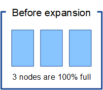

= 消失訂正符号化データの再バランスに関する考慮事項
:allow-uri-read: 
:icons: font
:imagesdir: ../media/

[role="lead"]
ストレージ ノードを追加するために拡張を実行し、ILM ルールを使用してデータを消去コーディングする場合、使用している消去コーディング スキームに対して十分なストレージ ノードを追加できないときは、消去コーディング (EC) の再バランス手順を実行する必要があります。

これらの考慮事項を確認した後、拡張を実行し、link:rebalancing-erasure-coded-data-after-adding-storage-nodes.html["ストレージノードを追加した後、消失訂正符号化データを再バランスする"]手順を実行します。

== EC リバランスとは何ですか?

EC 再バランス調整は、ストレージ ノードの拡張後に必要になる可能性があるStorageGRID手順です。この手順は、プライマリ管理ノードからコマンドライン スクリプトとして実行されます。  EC 再バランス手順を実行すると、 StorageGRID は、サイト内の既存のストレージ ノードと新しく追加されたストレージ ノード間で、消去コード化されたフラグメントを再配布します。

EC 再バランス手順:

* 消去コード化されたオブジェクト データのみを移動します。複製されたオブジェクト データは移動しません。
* サイト内のデータを再配布します。サイト間でデータを移動しません。
* サイト内のすべてのストレージ ノード間でデータを再配布します。ストレージ ボリューム内でデータは再配布されません。
* 消去コード化されたデータを移動する場所を決定する際に、各ストレージ ノード上の複製されたデータの使用状況を考慮しません。
* 各ノードの相対的な容量を考慮せずに、消去コード化されたデータをストレージ ノード間で均等に再配布します。
* 使用率が 80% を超えるストレージ ノードには、消去コード化されたデータは配布されません。
* 実行時に ILM 操作と S3 クライアント操作のパフォーマンスが低下する可能性があります。消失訂正コーディング フラグメントを再配布するには追加のリソースが必要です。

EC 再バランス手順が完了すると、次のようになります。

* 消去コード化されたデータは、使用可能なスペースが少ないストレージ ノードから、使用可能なスペースが多いストレージ ノードに移動されます。
* 消去コード化されたオブジェクトのデータ保護は変更されません。
* 使用率 (%) の値は、次の 2 つの理由により、ストレージ ノード間で異なる場合があります。
+
** レプリケートされたオブジェクトのコピーは既存のノード上のスペースを消費し続けます。EC 再バランス手順ではレプリケートされたデータは移動されません。
** すべてのノードがほぼ同じ量の消去コード化データを持つことになりますが、容量の大きいノードは、容量の小さいノードよりも比較的いっぱいになりません。
+
たとえば、3 つの 200 TB ノードがそれぞれ 80% 使用されているとします (200 &#215; 0.8 = 各ノードで 160 TB、サイト全体では 480 TB)。 400 TB のノードを追加して再バランス手順を実行すると、すべてのノードにほぼ同じ量の消去コード データが含まれるようになります (480/4 = 120 TB)。ただし、大きいノードの使用率 (%) は、小さいノードの使用率 (%) よりも少なくなります。

+
image::../media/used_space_with_larger_node.png[拡張前の使用スペース]

== 消失訂正符号化データのバランス調整を行うタイミング

ここでは、次のシナリオについて考えてみます。

* StorageGRID は、3 つのストレージ ノードを含む単一のサイトで実行されています。
* ILM ポリシーでは、1.0 MB を超えるすべてのオブジェクトに対して 2+1 消去コーディング ルールを使用し、それより小さいオブジェクトに対して 2 コピーのレプリケーション ルールを使用します。
* すべてのストレージ ノードが完全にいっぱいになりました。  *オブジェクト ストレージ不足* アラートが主要な重大度レベルでトリガーされました。
+

=== 十分なノードを追加すれば、リバランスは不要です

EC の再バランス調整が不要な場合を理解するために、3 つ (またはそれ以上) の新しいストレージ ノードを追加したとします。この場合、EC リバランスを実行する必要はありません。元のストレージ ノードはいっぱいのままですが、新しいオブジェクトは 2+1 消去コーディングのために 3 つの新しいノードを使用するようになります。2 つのデータ フラグメントと 1 つのパリティ フラグメントはそれぞれ別のノードに保存できます。

image::../media/used_space_after_3_node_expansion.png[3ノード拡張後の使用済みスペース]

CAUTION: この場合、EC 再バランス手順を実行できますが、既存の消去コード化されたデータを移動すると、グリッドのパフォーマンスが一時的に低下し、クライアントの操作に影響する可能性があります。

=== 十分なノードを追加できない場合は、再バランス調整が必要です。

EC の再バランス調整がいつ必要になるかを理解するために、ストレージ ノードを 3 つではなく 2 つしか追加できない場合を考えてみましょう。  2+1 方式では、少なくとも 3 つのストレージ ノードに使用可能なスペースが必要なので、空のノードは新しい消去コード化データには使用できません。

image::../media/used_space_after_2_node_expansion.png[2ノード拡張後の使用済みスペース]

新しいストレージ ノードを利用するには、EC 再バランス手順を実行する必要があります。この手順を実行すると、 StorageGRID は、サイト内のすべてのストレージ ノード間で既存の消去コード化データとパリティ フラグメントを再配布します。この例では、EC 再バランス手順が完了すると、5 つのノードすべてが 60% のみ使用状態になり、オブジェクトは引き続きすべてのストレージ ノードの 2+1 消去コーディング スキームに取り込まれます。

image::../media/used_space_after_ec_rebalance.png[使用済みスペース aEC再調整後]

== ECのバランス調整に関する勧告

NetApp、次のすべての条件に該当する場合、EC の再バランス調整が必要です。

* オブジェクト データには消去コーディングを使用します。
* サイトの 1 つ以上のストレージ ノードに対して *オブジェクト ストレージ不足* アラートがトリガーされ、ノードが 80% 以上使用されていることが示されています。
* 使用中の消去コーディング スキームに十分な数の新しいストレージ ノードを追加できません。見るlink:adding-storage-capacity-for-erasure-coded-objects.html["消失訂正コード付きオブジェクト用のストレージ容量を追加する"] 。
* EC 再バランス手順の実行中、S3 クライアントは書き込みおよび読み取り操作のパフォーマンスの低下を許容できます。

ストレージノードを同様のレベルに満たすことを希望し、EC 再バランス手順の実行中に S3 クライアントの書き込みおよび読み取り操作のパフォーマンスが低下することを許容できる場合は、オプションで EC 再バランス手順を実行できます。

== EC 再バランス手順が他のメンテナンスタスクとどのように相互作用するか

EC 再バランス手順を実行しているときに、特定のメンテナンス手順を同時に実行することはできません。

[cols="1a,2a"]
|===
| 手順 | EC 再バランス手順中に許可されますか? 

 a| 
追加のECリバランス手続き
 a| 
デスティネーション

一度に実行できる EC 再バランス手順は 1 つだけです。

 a| 
廃止手続き

ECデータ修復ジョブ
 a| 
デスティネーション

* EC 再バランス手順の実行中は、廃止手順または EC データ修復を開始することはできません。
* ストレージ ノードの廃止手順または EC データ修復の実行中は、EC 再バランス手順を開始できません。

 a| 
拡張手順
 a| 
デスティネーション

拡張時に新しいストレージ ノードを追加する必要がある場合は、すべての新しいノードを追加した後に EC 再バランス手順を実行します。

 a| 
アップグレード手順
 a| 
デスティネーション

StorageGRIDソフトウェアをアップグレードする必要がある場合は、EC 再バランス手順を実行する前または実行した後にアップグレード手順を実行します。必要に応じて、EC 再バランス手順を終了してソフトウェア アップグレードを実行できます。

 a| 
アプライアンスノードのクローン手順
 a| 
デスティネーション

アプライアンス ストレージ ノードのクローンを作成する必要がある場合は、新しいノードを追加した後に EC 再バランス手順を実行します。

 a| 
修正プログラムの手順
 a| 
○

EC 再バランス手順の実行中に、 StorageGRIDホットフィックスを適用できます。

 a| 
その他のメンテナンス手順
 a| 
デスティネーション

他のメンテナンス手順を実行する前に、EC 再バランス手順を終了する必要があります。

|===

== ECリバランス手順とILMの相互作用

EC 再バランス手順の実行中は、既存の消去コード化オブジェクトの場所を変更する可能性がある ILM 変更を行わないようにしてください。たとえば、異なる消去コーディング プロファイルを持つ ILM ルールの使用を開始しないでください。このような ILM 変更を行う必要がある場合は、EC 再バランス手順を終了する必要があります。
