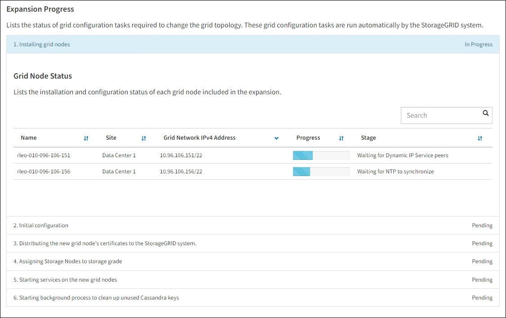

= 拡張を実行する
:allow-uri-read: 
:icons: font
:imagesdir: ../media/

[role="lead"]
拡張を実行すると、新しいグリッド ノードが既存のStorageGRIDデプロイメントに追加されます。

.開始する前に
* グリッドマネージャにサインインするには、link:../admin/web-browser-requirements.html["サポートされているウェブブラウザ"] 。
* プロビジョニング パスフレーズを持っています。
* この拡張で追加されるグリッド ノードをすべてデプロイしました。
* あなたはlink:../admin/admin-group-permissions.html["メンテナンスまたはルートアクセス権限"]。
* ストレージ ノードを追加する場合は、リカバリの一環として実行されたすべてのデータ修復操作が完了していることを確認します。見るlink:../maintain/checking-data-repair-jobs.html["データ修復ジョブを確認する"] 。
* ストレージノードを追加し、それらのノードにカスタムストレージグレードを割り当てる場合は、すでにlink:../ilm/creating-and-assigning-storage-grades.html["カスタムストレージグレードを作成しました"]。また、ルート アクセス権限、またはメンテナンス権限と ILM 権限の両方も持っています。
* 新しいサイトを追加する場合は、ILM ルールを確認して更新しておきます。拡張が完了するまで、オブジェクトのコピーが新しいサイトに保存されないようにする必要があります。たとえば、ルールがデフォルトのストレージプール（*すべてのストレージノード*）を使用する場合、link:../ilm/creating-storage-pool.html["新しいストレージプールを作成する"]既存のストレージノードのみを含み、link:../ilm/working-with-ilm-rules-and-ilm-policies.html["ILMルールを更新する"]そして、その新しいストレージ プールを使用するための ILM ポリシーを作成します。それ以外の場合、そのサイトの最初のノードがアクティブになるとすぐに、オブジェクトは新しいサイトにコピーされます。

.タスク概要
拡張の実行には、次の主なユーザー タスクが含まれます。

. 拡張を設定します。
. 拡張を開始します。
. 新しいリカバリ パッケージ ファイルをダウンロードします。
. すべての新しいノードがインストールおよび構成され、すべてのサービスが開始するまで、拡張の手順と段階を監視します。
+

CAUTION: 一部の拡張ステップとステージは、大規模なグリッド上で実行するとかなりの時間がかかる場合があります。たとえば、Cassandra データベースが空の場合、Cassandra を新しいストレージ ノードにストリーミングするには数分しかかからないことがあります。ただし、Cassandra データベースに大量のオブジェクト メタデータが含まれている場合、この段階には数時間以上かかることがあります。  「Cassandra クラスターの拡張」または「Cassandra の起動とデータのストリーミング」の段階では、ストレージ ノードを再起動しないでください。

.手順
. *メンテナンス* > *タスク* > *拡張*を選択します。
+
グリッド拡張ページが表示されます。  「保留中のノード」セクションには、追加の準備ができているノードが一覧表示されます。

+
image::../media/grid_expansion_page.png[グリッド拡張ページを示すスクリーンショット]

. *拡張の設定*を選択します。
+
サイトの選択ダイアログ ボックスが表示されます。

. 開始する拡張の種類を選択します:
+
** 新しいサイトを追加する場合は、[*新規*] を選択し、新しいサイトの名前を入力します。
** 既存のサイトに 1 つ以上のノードを追加する場合は、「*既存*」を選択します。

. *保存*を選択します。
. *保留中のノード* リストを確認し、デプロイしたグリッド ノードがすべて表示されていることを確認します。
+
必要に応じて、ノードの *グリッド ネットワーク MAC アドレス* の上にカーソルを置くと、そのノードの詳細が表示されます。

+
image::../media/grid_node_details.png[グリッドノードの詳細のスクリーンショット]

+

NOTE: ノードが見つからない場合、正常にデプロイされたことを確認します。

. 保留中のノードのリストから、この拡張に追加するノードを承認します。
+
.. 承認する最初の保留中のグリッド ノードの横にあるラジオ ボタンを選択します。
.. *承認*を選択します。
+
グリッド ノード構成フォームが表示されます。

.. 必要に応じて、一般設定を変更します。
+
[cols="1a,2a"]
|===
| フィールド | 説明 

 a| 
サイト
 a| 
グリッド ノードが関連付けられるサイトの名前。複数のノードを追加する場合は、各ノードに対して正しいサイトを選択してください。新しいサイトを追加する場合、すべてのノードが新しいサイトに追加されます。

 a| 
Name
 a| 
ノードのシステム名。システム名は内部StorageGRID操作に必要であり、変更できません。

 a| 
ストレージタイプ（ストレージノードのみ）
 a| 
*** *データとメタデータ*（「結合」）: オブジェクトデータとメタデータのストレージノード
*** *データのみ*: オブジェクト データのみ (メタデータなし) を含むストレージ ノード
*** *メタデータのみ*: メタデータのみ（オブジェクトデータは含まない）を含むストレージノード

 a| 
NTP ロール
 a| 
グリッド ノードのネットワーク タイム プロトコル (NTP) の役割:

*** *自動* (デフォルト) を選択すると、ノードに NTP ロールが自動的に割り当てられます。プライマリ ロールは、管理ノード、ADC サービスを備えたストレージ ノード、ゲートウェイ ノード、および非静的 IP アドレスを持つグリッド ノードに割り当てられます。クライアント ロールは他のすべてのグリッド ノードに割り当てられます。
*** プライマリ NTP ロールをノードに手動で割り当てるには、「*プライマリ*」を選択します。外部タイミング ソースへの冗長システム アクセスを提供するには、各サイトの少なくとも 2 つのノードにプライマリ ロールが必要です。
*** *クライアント* を選択して、ノードにクライアント NTP ロールを手動で割り当てます。

 a| 
ADC サービス (複合またはメタデータのみのストレージノード)
 a| 
このストレージ ノードが管理ドメイン コントローラ (ADC) サービスを実行するかどうか。ADC サービスは、グリッド サービスの場所と可用性を追跡します。各サイトの少なくとも 3 つのストレージ ノードに ADC サービスが含まれている必要があります。ADC サービスをデプロイ後にノードに追加することはできません。

*** 交換するストレージ ノードに ADC サービスが含まれている場合は、[*はい*] を選択します。残っている ADC サービスが少なすぎる場合はストレージ ノードを廃止することはできないため、これにより、古いサービスが削除される前に新しい ADC サービスが利用可能になります。
*** *自動* を選択すると、このノードに ADC サービスが必要かどうかがシステムに判断されます。

について学ぶlink:../maintain/understanding-adc-service-quorum.html["ADCクォーラム"]。

 a| 
ストレージ グレード (複合またはデータのみのストレージ ノード)
 a| 
*デフォルト* ストレージ グレードを使用するか、この新しいノードに割り当てるカスタム ストレージ グレードを選択します。

ストレージ グレードは ILM ストレージ プールによって使用されるため、選択内容によってストレージ ノードに配置されるオブジェクトが影響を受ける可能性があります。

|===
.. 必要に応じて、グリッド ネットワーク、管理ネットワーク、およびクライアント ネットワークの設定を変更します。
+
*** *IPv4 アドレス (CIDR)*: ネットワーク インターフェイスの CIDR ネットワーク アドレス。例: 172.16.10.100/24
+

NOTE: ノードを承認しているときに、グリッド ネットワーク上のノードに重複した IP アドレスがあることがわかった場合は、拡張をキャンセルし、重複していない IP を使用して仮想マシンまたはアプライアンスを再デプロイし、拡張を再開する必要があります。

*** *ゲートウェイ*: グリッド ノードのデフォルト ゲートウェイ。例: 172.16.10.1
*** *サブネット (CIDR)*: 管理ネットワークの 1 つ以上のサブネットワーク。

.. *保存*を選択します。
+
承認されたグリッド ノードは、承認済みノード リストに移動します。

+
*** 承認されたグリッド ノードのプロパティを変更するには、ラジオ ボタンを選択し、[編集] を選択します。
*** 承認されたグリッド ノードを保留中のノード リストに戻すには、ラジオ ボタンを選択し、[リセット] を選択します。
*** 承認されたグリッド ノードを完全に削除するには、ノードの電源をオフにします。次に、ラジオ ボタンを選択し、[削除] を選択します。

.. 承認する保留中のグリッド ノードごとにこれらの手順を繰り返します。
+

NOTE: 可能であれば、保留中のグリッド ノートをすべて承認し、単一の拡張を実行する必要があります。小さな拡張を複数回実行すると、さらに時間がかかります。

. すべてのグリッド ノードを承認したら、*プロビジョニング パスフレーズ*を入力し、*展開*を選択します。
+
数分後、このページが更新され、拡張手順のステータスが表示されます。個々のグリッド ノードに影響するタスクが進行中の場合、[グリッド ノード ステータス] セクションに各グリッド ノードの現在のステータスが一覧表示されます。

+

NOTE: 新しいアプライアンスの「グリッド ノードのインストール」手順中に、 StorageGRIDアプライアンス インストーラーは、インストールがステージ 3 からステージ 4 (インストールの完了) に移行していることを表示します。ステージ 4 が完了すると、コントローラーが再起動されます。

+

+

NOTE: サイト拡張には、新しいサイト用に Cassandra を構成するための追加タスクが含まれます。

. *リカバリ パッケージのダウンロード* リンクが表示されたらすぐに、リカバリ パッケージ ファイルをダウンロードします。
+
StorageGRIDシステムのグリッド トポロジを変更した後は、できるだけ早くリカバリ パッケージ ファイルの更新されたコピーをダウンロードする必要があります。リカバリ パッケージ ファイルを使用すると、障害が発生した場合にシステムを復元できます。

+
.. ダウンロードリンクを選択します。
.. プロビジョニング パスフレーズを入力し、[ダウンロードの開始] を選択します。
.. ダウンロードが完了したら、 `.zip`ファイルの内容にアクセスできることを確認してください。 `Passwords.txt`ファイル。
.. ダウンロードしたリカバリパッケージファイルをコピーします(`.zip`) を 2 つの安全でセキュリティ保護された別の場所に保管します。
+

CAUTION: リカバリ パッケージ ファイルには、 StorageGRIDシステムからデータを取得するために使用できる暗号化キーとパスワードが含まれているため、セキュリティ保護する必要があります。

. 既存のサイトにストレージ ノードを追加する場合、またはサイトを追加する場合は、新しいグリッド ノードでサービスが開始されたときに発生する Cassandra ステージを監視します。
+

CAUTION: 「Cassandra クラスターの拡張」または「Cassandra の起動とデータのストリーミング」のどちらの段階でも、ストレージ ノードを再起動しないでください。特に既存のストレージ ノードに大量のオブジェクト メタデータが含まれている場合、これらのステージは新しいストレージ ノードごとに完了するのに数時間かかることがあります。

+
[role="tabbed-block"]
====
.ストレージノードの追加
--
既存のサイトにストレージ ノードを追加する場合は、「Cassandra を開始し、データをストリーミングしています」というステータス メッセージに表示されるパーセンテージを確認します。

image::../media/grid_expansion_starting_cassandra.png[グリッド拡張 > Cassandraの起動とデータのストリーミング]

このパーセンテージは、使用可能な Cassandra データの合計量と新しいノードにすでに書き込まれている量に基づいて、Cassandra ストリーミング操作がどの程度完了したかを推定します。

--
.サイトを追加
--
新しいサイトを追加する場合は、 `nodetool status` Cassandra ストリーミングの進行状況を監視し、「Cassandra クラスターの拡張」段階で新しいサイトにコピーされたメタデータの量を確認します。新しいサイトの合計データ負荷は、現在のサイトの合計の約 20% 以内である必要があります。

--
====
. すべてのタスクが完了し、[拡張の構成] ボタンが再び表示されるまで、拡張の監視を続けます。

.終了後の操作
追加したグリッド ノードの種類に応じて、追加の統合および構成手順を実行します。見るlink:configuring-expanded-storagegrid-system.html["拡張後の設定手順"] 。
