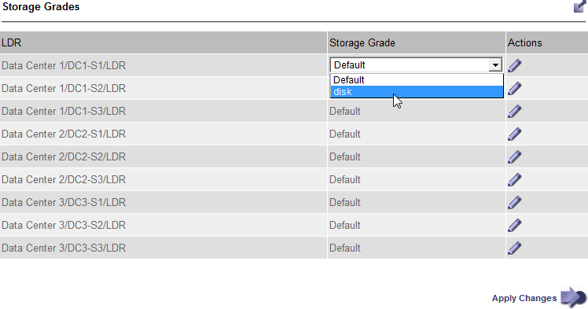

= ストレージグレードの作成と割り当て
:allow-uri-read: 
:icons: font
:imagesdir: ../media/

[role="lead"]
ストレージ グレードは、ストレージ ノードで使用されるストレージの種類を識別します。  ILM ルールを使用して特定のオブジェクトを特定のストレージ ノードに配置する場合は、ストレージ グレードを作成できます。

.開始する前に
* グリッドマネージャにサインインするには、link:../admin/web-browser-requirements.html["サポートされているウェブブラウザ"] 。
* あなたが持っているlink:../admin/admin-group-permissions.html["特定のアクセス権限"]。

.タスク概要
StorageGRID を初めてインストールすると、システム内のすべてのストレージ ノードに *Default* ストレージ グレードが自動的に割り当てられます。必要に応じて、カスタム ストレージ グレードを定義し、異なるストレージ ノードに割り当てることもできます。

カスタム ストレージ グレードを使用すると、特定のタイプのストレージ ノードのみを含む ILM ストレージ プールを作成できます。たとえば、特定のオブジェクトを、 StorageGRIDオールフラッシュ ストレージ アプライアンスなどの最も高速なストレージ ノードに保存したい場合があります。

NOTE: ストレージ ノードは、インストール時に、オブジェクト データではなくオブジェクト メタデータのみが含まれるように構成できます。メタデータのみのストレージ ノードにはストレージ グレードを割り当てることができません。詳細については、以下を参照してください。 link:../primer/what-storage-node-is.html#types-of-storage-nodes["ストレージノードの種類"] 。

ストレージグレードが問題にならない場合（例えば、すべてのストレージノードが同一である場合）、この手順をスキップして、ストレージグレードに*すべてのストレージグレードを含める*オプションを使用できます。link:creating-storage-pool.html["ストレージプールを作成する"] 。この選択を使用すると、ストレージ グレードに関係なく、サイト内のすべてのストレージ ノードがストレージ プールに含まれるようになります。

NOTE: 必要以上にストレージ グレードを作成しないでください。たとえば、ストレージ ノードごとにストレージ グレードを作成しないでください。代わりに、各ストレージ グレードを 2 つ以上のノードに割り当てます。ストレージ グレードが 1 つのノードにのみ割り当てられていると、そのノードが使用できなくなった場合に ILM バックログが発生する可能性があります。

.手順
. *ILM* > *ストレージ グレード* を選択します。
. カスタム ストレージ グレードを定義します。
+
.. 追加したいカスタムストレージグレードごとに*挿入*を選択します。image:../media/icon_nms_insert.gif["挿入アイコン"]行を追加します。
.. 説明的なラベルを入力します。
+
image::../media/editing_storage_grades.gif[保管グレードページ]

.. *変更を適用*を選択します。
.. 保存したラベルを変更する必要がある場合は、オプションで「編集」を選択します。image:../media/icon_nms_edit.gif["編集アイコン"] *変更を適用*を選択します。
+

NOTE: ストレージグレードを削除することはできません。

. ストレージ ノードに新しいストレージ グレードを割り当てます。
+
.. LDRリストでストレージノードを見つけて、*編集*アイコンを選択します。image:../media/icon_nms_edit.gif["編集アイコン"] 。
.. リストから適切な保管グレードを選択します。
+

+

NOTE: 特定のストレージ ノードにストレージ グレードを 1 回だけ割り当てます。障害から回復したストレージ ノードは、以前に割り当てられたストレージ グレードを維持します。 ILM ポリシーがアクティブ化された後は、この割り当てを変更しないでください。割り当てが変更されると、データは新しいストレージ グレードに基づいて保存されます。

.. *変更を適用*を選択します。

