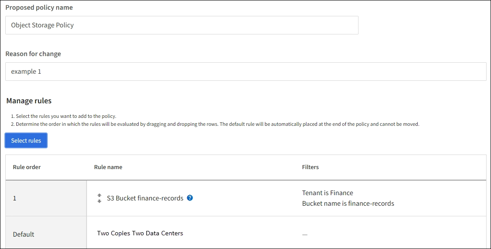

= 例1: オブジェクトストレージのILMルールとポリシー
:allow-uri-read: 
:icons: font
:imagesdir: ../media/

[role="lead"]
オブジェクトの保護と保持の要件を満たす ILM ポリシーを定義するときは、次のサンプル ルールとポリシーを開始点として使用できます。

CAUTION: 次の ILM ルールとポリシーは例にすぎません。 ILM ルールを構成する方法は多数あります。新しいポリシーを有効にする前に、ポリシーをシミュレートして、コンテンツの損失を防ぐためにポリシーが意図したとおりに機能することを確認します。

== 例1のILMルール1: オブジェクトデータを2つのサイトにコピーする

この例の ILM ルールは、オブジェクト データを 2 つのサイトのストレージ プールにコピーします。

[cols="1a,2a"]
|===
| ルールの定義 | 値の例 

 a| 
ワンサイトストレージプール
 a| 
それぞれ Site 1 と Site 2 という名前の異なるサイトを含む 2 つのストレージ プール。

 a| 
ルール名
 a| 
2つのコピー、2つのサイト

 a| 
基準時間
 a| 
取り込み時間

 a| 
配置
 a| 
0 日目から永久的に、複製されたコピーをサイト 1 に 1 つ、複製されたコピーをサイト 2 に 1 つ保存します。

|===
保持図のルール分析セクションには次のように記載されています。

* このルールの期間中、 StorageGRIDサイト損失保護が適用されます。
* このルールによって処理されるオブジェクトは ILM によって削除されません。

image::../media/ilm_rule_two_copies_two_data_centers.png[例1のILMルール1: オブジェクトデータを2つのサイトにコピーする]

== 例1のILMルール2: バケットマッチングによる消失訂正プロファイル

この ILM ルールの例では、消去コーディング プロファイルと S3 バケットを使用して、オブジェクトが保存される場所と期間を決定します。

[cols="1a,2a"]
|===
| ルールの定義 | 値の例 

 a| 
複数のサイトを持つストレージプール
 a| 
* 3 つのサイト (サイト 1、2、3) にわたる 1 つのストレージ プール
* 6+3消去符号化方式を使用する

 a| 
ルール名
 a| 
S3バケット財務レコード

 a| 
基準時間
 a| 
取り込み時間

 a| 
配置
 a| 
finance-records という名前の S3 バケット内のオブジェクトについては、消去コーディング プロファイルで指定されたプールに消去コーディングされたコピーを 1 つ作成します。このコピーは永久に保管してください。

|===
image::../media/ilm_rule_ec_for_s3_bucket_finance_records.png[例1のILMルール2: バケットマッチングによる消失訂正プロファイル]

== 例1のILMポリシー

実際には、 StorageGRIDシステムでは高度で複雑な ILM ポリシーを設計できますが、ほとんどの ILM ポリシーは単純です。

マルチサイト グリッドの一般的な ILM ポリシーには、次のような ILM ルールが含まれます。

* 取り込み時に、S3バケットに属するすべてのオブジェクトを次の名前で保存します。 `finance-records` 3 つのサイトを含むストレージ プール内。  6+3 消失訂正符号を使用します。
* オブジェクトが最初の ILM ルールに一致しない場合は、ポリシーのデフォルトの ILM ルール (2 つのコピー、2 つのデータ センター) を使用して、そのオブジェクトのコピーをサイト 1 に 1 つ、サイト 2 に 1 つ保存します。
+

.関連情報
* link:ilm-policy-overview.html["ILMポリシーを使用する"]
* link:creating-ilm-policy.html["ILMポリシーを作成する"]

