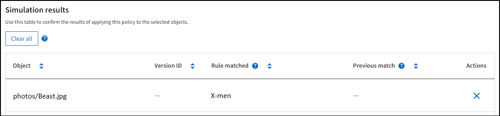

= ILMポリシーシミュレーションの例
:allow-uri-read: 
:icons: font
:imagesdir: ../media/

[role="lead"]
ILM ポリシー シミュレーションの例は、環境に合わせてシミュレーションを構築および変更するためのガイドラインを提供します。

== 例1: ILMポリシーをシミュレートする際のルールの検証

この例では、ポリシーをシミュレートするときにルールを検証する方法について説明します。

この例では、*サンプル ILM ポリシー* が 2 つのバケットに取り込まれたオブジェクトに対してシミュレートされています。このポリシーには次の 3 つのルールが含まれます。

* 最初のルール「*バケット a に 2 つのコピー、2 年間*」は、バケット a 内のオブジェクトにのみ適用されます。
* 2 番目のルール「*EC オブジェクト > 1 MB*」はすべてのバケットに適用されますが、1 MB を超えるオブジェクトはフィルターされます。
* 3 番目のルール「2 つのコピー、2 つのデータ センター」はデフォルトのルールです。フィルターは含まれず、非現在の参照時間は使用されません。

ポリシーをシミュレートした後、各オブジェクトが正しいルールと一致していることを確認します。

image::../media/simulate_policy_screen.png[ポリシー結果をシミュレートする]

この例では、

* `bucket-a/bucket-a object.pdf`最初のルールに正しく一致しました。これは、 `bucket-a` 。
* `bucket-b/test object greater than 1 MB.pdf`は `bucket-b`なので、最初のルールには一致しませんでした。代わりに、1 MB を超えるオブジェクトをフィルタリングする 2 番目のルールによって正しく一致しました。
* `bucket-b/test object less than 1 MB.pdf`最初の 2 つのルールのフィルターに一致しなかったため、フィルターを含まないデフォルトのルールによって配置されます。

== 例2: ILMポリシーをシミュレートするときにルールを並べ替える

この例では、ポリシーをシミュレートするときにルールの順序を変更して結果を変更する方法を示します。

この例では、*Demo* ポリシーがシミュレートされています。このポリシーは、series=x-men ユーザー メタデータを持つオブジェクトを見つけることを目的としており、次の 3 つのルールが含まれています。

* 最初のルール「*PNGs*」は、 `.png` 。
* 2番目のルール「X-men」はテナントAのオブジェクトにのみ適用され、 `series=x-men`ユーザーメタデータ。
* 最後のルール「*2 つのデータ センターをコピーします*」はデフォルトのルールで、最初の 2 つのルールに一致しないすべてのオブジェクトに一致します。

.手順
. ルールを追加してポリシーを保存したら、[シミュレート] を選択します。
. *オブジェクト* フィールドに、テスト オブジェクトの S3 バケット/オブジェクト キーを入力し、*シミュレート* を選択します。
+
シミュレーション結果が表示され、 `Havok.png`オブジェクトは *PNGs* ルールに一致しました。

+
image::../media/simulate_reorder_rules_pngs_result.png[例2: ILMポリシーをシミュレートする際のルールの並べ替え]

+
しかし、 `Havok.png` *X-メン*ルールをテストすることを目的としていました。

. この問題を解決するには、ルールの順序を変更します。
+
.. *完了* を選択して、ILM ポリシーのシミュレート ウィンドウを閉じます。
.. ポリシーを編集するには、[*編集*] を選択します。
.. *X-men* ルールをリストの一番上にドラッグします。
.. *保存*を選択します。

. *シミュレート*を選択します。
+
以前にテストしたオブジェクトは更新されたポリシーに対して再評価され、新しいシミュレーション結果が表示されます。この例では、「ルール一致」列には、 `Havok.png`オブジェクトは、期待どおりに X-men メタデータ ルールと一致するようになりました。  [前回の一致] 列には、PNG ルールが前回のシミュレーションでオブジェクトと一致したことが示されます。

+
image::../media/simulate_reorder_rules_correct_result.png[例2: ILMポリシーをシミュレートする際のルールの並べ替え]

== 例3: ILMポリシーをシミュレートするときにルールを修正する

この例では、ポリシーをシミュレートし、ポリシー内のルールを修正して、シミュレーションを続行する方法を示します。

この例では、*Demo* ポリシーがシミュレートされています。このポリシーは、 `series=x-men`ユーザーメタデータ。しかし、この政策をシミュレーションすると、予期せぬ結果が生じた。 `Beast.jpg`物体。オブジェクトは、X-men メタデータ ルールに一致する代わりに、デフォルトのルール「Two は 2 つのデータ センターをコピーします」に一致しました。

image::../media/simulate_results_for_object_wrong_metadata.png[例3: ILMポリシーをシミュレートする際のルールの修正]

テスト オブジェクトがポリシー内の想定されるルールと一致しない場合は、ポリシー内の各ルールを調べてエラーを修正する必要があります。

.手順
. *完了*を選択して、ポリシーのシミュレート ダイアログを閉じます。ポリシーの詳細ページで、*保持図*を選択します。次に、必要に応じて、各ルールに対して *すべて展開* または *詳細を表示* を選択します。
. ルールのテナント アカウント、参照時間、フィルタリング基準を確認します。
+
たとえば、X-men ルールのメタデータが「x-men」ではなく「x-men01」と入力されたとします。

. エラーを解決するには、次のようにルールを修正します。
+
** ルールがポリシーの一部である場合は、ルールを複製するか、ポリシーからルールを削除してから編集することができます。
** ルールがアクティブなポリシーの一部である場合は、ルールを複製する必要があります。アクティブなポリシーからルールを編集または削除することはできません。

. シミュレーションを再度実行します。
+
この例では、修正されたX-menルールは、 `Beast.jpg`オブジェクトに基づく `series=x-men`予想どおり、ユーザー メタデータ。

+

