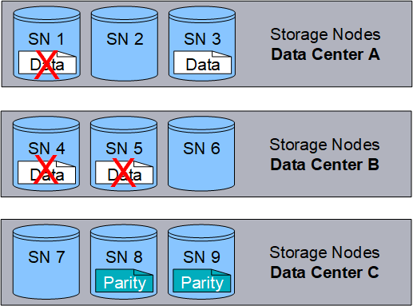

= 消失訂正符号とは何ですか?
:allow-uri-read: 
:icons: font
:imagesdir: ../media/

[role="lead"]
イレージャー コーディングは、 StorageGRID がオブジェクト データを保存するために使用する 2 つの方法のうちの 1 つです (もう 1 つの方法はレプリケーションです)。オブジェクトが、消失訂正符号を使用する ILM ルールに一致すると、それらのオブジェクトはデータ フラグメントに分割され、追加のパリティ フラグメントが計算され、各フラグメントは異なるストレージ ノードに保存されます。

オブジェクトがアクセスされた場合、格納されたフラグメントを使用してそのオブジェクトが再アセンブルされます。データまたはパリティ フラグメントが破損または失われた場合、消失訂正符号化アルゴリズムにより、残りのデータおよびパリティ フラグメントのサブセットを使用してそのフラグメントを再作成できます。

ILM ルールを作成すると、 StorageGRIDそれらのルールをサポートする消去コーディング プロファイルが作成されます。消去コーディングプロファイルのリストを表示できます。link:manage-erasure-coding-profiles.html#rename-an-erasure-coding-profile["消去符号化プロファイルの名前を変更する"] 、 またはlink:manage-erasure-coding-profiles.html#deactivate-an-erasure-coding-profile["現在どのILMルールでも使用されていない場合は、消去符号化プロファイルを非アクティブ化します。"]。

次の例は、オブジェクトのデータに対する消去符号化アルゴリズムの使用を示しています。この例では、ILM ルールは 4+2 消去符号化方式を使用します。各オブジェクトは 4 つの等しいデータ フラグメントに分割され、オブジェクト データから 2 つのパリティ フラグメントが計算されます。  6 つのフラグメントはそれぞれ、3 つのデータ センター サイトにまたがる異なるノードに保存され、ノード障害やサイト損失に対するデータ保護を提供します。

image::../media/ec_three_sites_4_plus_2.png[消失訂正符号 3サイト 4プラス2]

4+2 消失訂正符号化方式はさまざまな方法で構成できます。たとえば、6 つのストレージ ノードを含む単一サイトのストレージ プールを構成できます。のためにlink:using-multiple-storage-pools-for-cross-site-replication.html["サイト損失保護"]各サイトに 3 つのストレージ ノードがある 3 つのサイトを含むストレージ プールを使用できます。 6 つのフラグメント (データまたはパリティ) のうち 4 つが使用可能である限り、オブジェクトを取得できます。オブジェクト データが失われることなく、最大 2 つのフラグメントが失われる場合があります。サイト全体が失われた場合でも、他のすべてのフラグメントにアクセスできる限り、オブジェクトを取得または修復できます。

image::../media/ec_recoverable_4_plus_2.png[消失訂正符号回復可能4プラス2]

2 つ以上のストレージ ノードが失われた場合、オブジェクトを取得することはできません。

.関連情報
* link:what-replication-is.html["レプリケーションとは何か"]
* link:what-storage-pool-is.html["ストレージプールとは"]
* link:what-erasure-coding-schemes-are.html["消失訂正符号化方式とは何か"]
* link:manage-erasure-coding-profiles.html#rename-an-erasure-coding-profile["消去コーディングプロファイルの名前を変更する"]
* link:manage-erasure-coding-profiles.html#deactivate-an-erasure-coding-profile["消去コーディングプロファイルを非アクティブ化する"]

