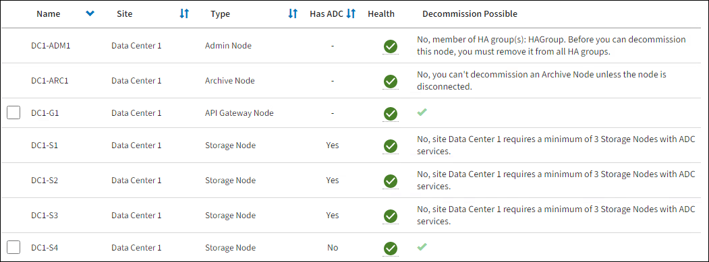

= 廃止ノードページにアクセスする
:allow-uri-read: 
:icons: font
:imagesdir: ../media/

[role="lead"]
グリッド マネージャーの「廃止ノード」ページにアクセスすると、廃止できるノードが一目でわかります。

.開始する前に
* グリッドマネージャにサインインするには、link:../admin/web-browser-requirements.html["サポートされているウェブブラウザ"] 。
* あなたはlink:../admin/admin-group-permissions.html["メンテナンスまたはルートアクセス権限"]。

CAUTION: ソフトウェア ベースのメタデータのみのノードを含むグリッド内のストレージ ノードを廃止する場合は注意してください。オブジェクトとメタデータの両方を保存するように構成されたすべてのノードを廃止すると、オブジェクトを保存する機能がグリッドから削除されます。見るlink:../primer/what-storage-node-is.html#types-of-storage-nodes["ストレージノードの種類"]メタデータのみのストレージ ノードの詳細については、こちらをご覧ください。

.手順
. *メンテナンス* > *タスク* > *廃止*を選択します。
. *ノードの廃止*を選択します。
+
「ノードの廃止」ページが表示されます。このページから、次のことができます。

+
** 現在廃止できるグリッド ノードを決定します。
** すべてのグリッドノードの健全性を確認する
** *名前*、*サイト*、*タイプ*、または*ADC あり*で、リストを昇順または降順に並べ替えます。
** 特定のノードをすばやく見つけるには、検索語を入力します。
+
この例では、「廃止可能」列は、ゲートウェイ ノードと 4 つのストレージ ノードのうちの 1 つを廃止できることを示しています。

+

. 廃止する各ノードの *廃止可能* 列を確認します。
+
グリッド ノードを廃止できる場合、この列には緑色のチェック マークが含まれ、左側の列にはチェック ボックスが含まれます。ノードを廃止できない場合は、この列に問題の説明が表示されます。ノードを廃止できない理由が複数ある場合は、最も重要な理由が表示されます。

+
[cols="1a,1a,1a"]
|===
| 廃止の考えられる理由 | 説明 | 解決手順 

 a| 
いいえ、_ノード タイプ_ の廃止はサポートされていません。
 a| 
プライマリ管理ノードを廃止することはできません。
 a| 
なし。

 a| 
いいえ、少なくとも 1 つのグリッド ノードが切断されています。

*注意:* このメッセージは、接続されたグリッド ノードに対してのみ表示されます。
 a| 
いずれかのグリッド ノードが切断されている場合、接続されているグリッド ノードを廃止することはできません。

*ヘルス* 列には、切断されたグリッド ノードを表す次のいずれかのアイコンが表示されます。

** image:../media/icon_alarm_gray_administratively_down.png["灰色の疑問符アイコン"]（グレー）：管理上ダウン
** image:../media/icon_alarm_blue_unknown.png["青い疑問符アイコン"]（青）：不明

 a| 
切断されたノードをすべてオンラインに戻すか、link:decommissioning-disconnected-grid-nodes.html["切断されたすべてのノードを廃止する"]接続されたノードを削除する前に。

*注意*: グリッドに切断された複数のノードが含まれている場合、ソフトウェアではそれらをすべて同時に廃止する必要があり、予期しない結果が発生する可能性が高くなります。

 a| 
いいえ、1 つ以上の必要なノードが現在切断されており、回復する必要があります。

*注意:* このメッセージは、切断されたグリッド ノードに対してのみ表示されます。
 a| 
1 つ以上の必要なノードも切断されている場合 (たとえば、ADC クォーラムに必要なストレージ ノードなど)、切断されたグリッド ノードを廃止することはできません。
 a| 
.. 切断されたすべてのノードの廃止の可能性に関するメッセージを確認します。
.. 必須であるため廃止できないノードを特定します。
+
*** 必要なノードのヘルスが管理上ダウンしている場合は、ノードをオンラインに戻します。
*** 必要なノードのヘルスが不明な場合は、ノード回復手順を実行して必要なノードを回復します。

 a| 
いいえ、HA グループのメンバー: _グループ名_。このノードを廃止する前に、すべての HA グループから削除する必要があります。
 a| 
ノード インターフェイスが高可用性 (HA) グループに属している場合は、管理ノードまたはゲートウェイ ノードを廃止することはできません。
 a| 
HA グループを編集して、ノードのインターフェースを削除するか、HA グループ全体を削除します。見るlink:../admin/configure-high-availability-group.html["高可用性グループを構成する"] 。

 a| 
いいえ、サイト _x_ には ADC サービスを備えたストレージ ノードが少なくとも _n_ 個必要です。
 a| 
*ストレージ ノードのみ。*ADC クォーラム要件をサポートするためにサイトに残っているノードが不十分な場合は、ストレージ ノードを廃止することはできません。
 a| 
拡張を実行します。新しいストレージ ノードをサイトに追加し、ADC サービスが必要であることを指定します。に関する情報を見るlink:understanding-adc-service-quorum.html["ADCクォーラム"]。

 a| 
いいえ、1 つ以上の消去コーディング プロファイルには少なくとも _n_ 個のストレージ ノードが必要です。プロファイルが ILM ルールで使用されていない場合は、非アクティブ化できます。
 a| 
*ストレージ ノードのみ。*既存の消去コーディング プロファイルに十分なノードが残っていない限り、ストレージ ノードを廃止することはできません。

たとえば、4+2 イレージャ コーディングのイレージャ コーディング プロファイルが存在する場合、少なくとも 6 つのストレージ ノードが残っている必要があります。
 a| 
影響を受ける消去コーディング プロファイルごとに、プロファイルの使用方法に基づいて、次のいずれかの手順を実行します。

** *アクティブな ILM ポリシーで使用*: 拡張を実行します。消失訂正符号化を続行できるように、十分な数の新しいストレージ ノードを追加します。説明書をご覧くださいlink:../expand/index.html["グリッドを拡張する"]。
** *ILM ルールで使用されているが、アクティブな ILM ポリシーでは使用されていない*: ルールを編集または削除してから、消去コーディング プロファイルを非アクティブ化します。
** *どの ILM ルールでも使用されません*: 消去コーディング プロファイルを非アクティブ化します。

*注意:* イレージャーコーディング プロファイルを非アクティブ化しようとしたときに、オブジェクト データがまだプロファイルに関連付けられている場合は、エラー メッセージが表示されます。非アクティブ化のプロセスを再度試す前に、数週間待つ必要がある場合があります。

学ぶlink:../ilm/manage-erasure-coding-profiles.html["消去符号化プロファイルの無効化"]。

 a| 
いいえ、ノードが切断されない限り、アーカイブ ノードを廃止することはできません。
 a| 
アーカイブ ノードがまだ接続されている場合は、削除できません。
 a| 
*注*: アーカイブ ノードのサポートは削除されました。アーカイブノードを廃止する必要がある場合は、 https://docs.netapp.com/us-en/storagegrid-118/maintain/grid-node-decommissioning.html["グリッドノードの廃止（StorageGRID 11.8 ドキュメントサイト）"^]

|===

