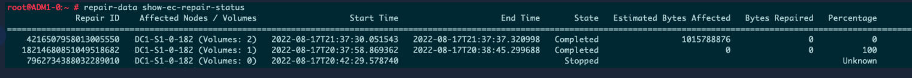

= データ修復ジョブを確認する
:allow-uri-read: 
:icons: font
:imagesdir: ../media/

[role="lead"]
グリッド ノードを廃止する前に、アクティブなデータ修復ジョブがないことを確認する必要があります。修復に失敗した場合は、修復を再起動して完了させてから廃止手順を実行する必要があります。

.タスク概要
切断されたストレージ ノードを廃止する必要がある場合は、廃止手順の完了後にこれらの手順も実行して、データ修復ジョブが正常に完了したことを確認します。削除されたノードにあった消去コード化されたフラグメントが正常に復元されていることを確認する必要があります。

これらの手順は、消去コード化されたオブジェクトを持つシステムにのみ適用されます。

.手順
. プライマリ管理ノードにログインします。
+
.. 次のコマンドを入力します。 `ssh admin@_grid_node_IP_`
.. 記載されているパスワードを入力してください `Passwords.txt`ファイル。
.. ルートに切り替えるには、次のコマンドを入力します。 `su -`
.. 記載されているパスワードを入力してください `Passwords.txt`ファイル。
+
ルートとしてログインすると、プロンプトは `$`に `#`。

. 実行中の修復を確認します。 `repair-data show-ec-repair-status`
+
** データ修復ジョブを一度も実行したことがない場合は、出力は次のようになります。 `No job found` 。修復ジョブを再開する必要はありません。
** データ修復ジョブが以前に実行されたか、現在実行中の場合、出力には修復に関する情報がリストされます。各修理には固有の修理 ID があります。
+

+

TIP: オプションで、グリッド マネージャーを使用して進行中の復元プロセスを監視し、復元履歴を表示できます。見るlink:../maintain/restoring-volume.html["グリッド マネージャーを使用してオブジェクト データを復元する"] 。

. 州がすべての修理を負担する場合 `Completed`修復ジョブを再開する必要はありません。
. 州が修理を依頼する場合 `Stopped`修復を再開する必要があります。
+
.. 出力から失敗した修復の修復 ID を取得します。
.. 実行 `repair-data start-ec-node-repair`指示。
+
使用 `--repair-id`修復 ID を指定するオプション。たとえば、修復 ID 949292 の修復を再試行する場合は、次のコマンドを実行します。 `repair-data start-ec-node-repair --repair-id 949292`

.. すべての修復の状態が判明するまで、ECデータ修復の状況を引き続き追跡します。 `Completed` 。

