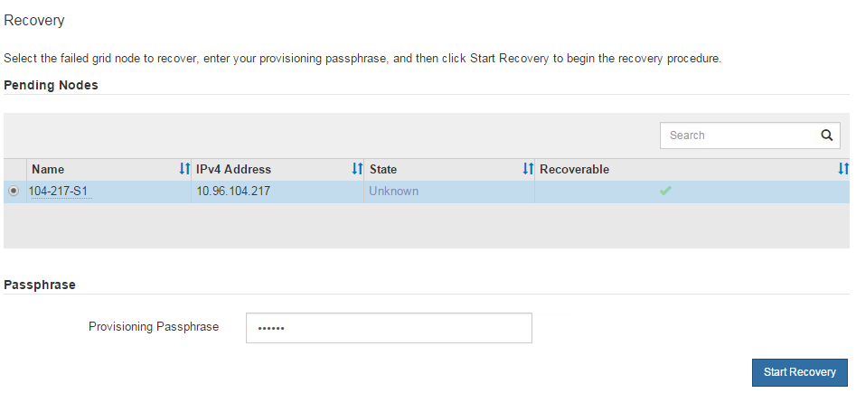

= 非プライマリ管理ノードを構成するには、「リカバリの開始」を選択します
:allow-uri-read: 
:icons: font
:imagesdir: ../media/

[role="lead"]
プライマリ以外の管理ノードを交換した後、グリッド マネージャで [リカバリの開始] を選択し、障害が発生したノードの代わりとして新しいノードを構成する必要があります。

.開始する前に
* グリッドマネージャにサインインするには、link:../admin/web-browser-requirements.html["サポートされているウェブブラウザ"] 。
* あなたはlink:../admin/admin-group-permissions.html["メンテナンスまたはルートアクセス権限"]。
* プロビジョニング パスフレーズを持っています。
* 交換ノードをデプロイして構成しました。

.手順
. グリッド マネージャーから、*メンテナンス* > *タスク* > *リカバリ* を選択します。
. 保留中のノード リストで、回復するグリッド ノードを選択します。
+
ノードは障害が発生した後にリストに表示されますが、再インストールされて回復の準備ができるまでノードを選択することはできません。

. *プロビジョニング パスフレーズ* を入力します。
. *回復の開始*をクリックします。
+

. リカバリの進行状況を「リカバリ中のグリッド ノード」テーブルで監視します。
+

NOTE: 回復手順の実行中に、[リセット] をクリックして新しい回復を開始できます。手順をリセットするとノードが不確定な状態になることを示すダイアログ ボックスが表示されます。

+
image::../media/recovery_reset_warning.gif[リセット回復警告ダイアログボックスを示すスクリーンショット]

+
手順をリセットした後にリカバリを再試行する場合は、次のようにしてノードを事前インストールされた状態に復元する必要があります。

+
** *VMware*: デプロイされた仮想グリッド ノードを削除します。その後、リカバリを再開する準備ができたら、ノードを再デプロイします。
** *Linux*: Linux ホストで次のコマンドを実行してノードを再起動します。 `storagegrid node force-recovery _node-name_`
** *アプライアンス*: 手順をリセットした後にリカバリを再試行する場合は、次のコマンドを実行してアプライアンスノードをプリインストール状態に復元する必要があります。 `sgareinstall`ノード上。見るlink:preparing-appliance-for-reinstallation-platform-replacement-only.html["アプライアンスの再インストールの準備（プラットフォームの交換のみ）"] 。

. StorageGRIDシステムでシングル サインオン (SSO) が有効になっていて、回復した管理ノードの証明書利用者信頼がデフォルトの管理インターフェイス証明書を使用するように設定されている場合、Active Directory フェデレーション サービス (AD FS) でノードの証明書利用者信頼を更新 (または削除して再作成) します。管理ノードの回復プロセス中に生成された新しいデフォルトのサーバー証明書を使用します。
+

NOTE: 証明書利用者信頼を構成するには、link:../admin/configuring-sso.html["シングルサインオンを構成する"] 。デフォルトのサーバー証明書にアクセスするには、管理ノードのコマンド シェルにログインします。に行く `/var/local/mgmt-api`ディレクトリを選択し、 `server.crt`ファイル。

