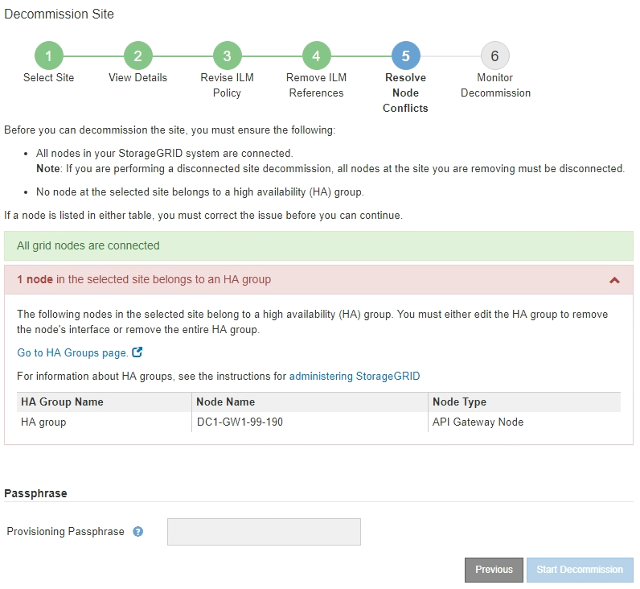
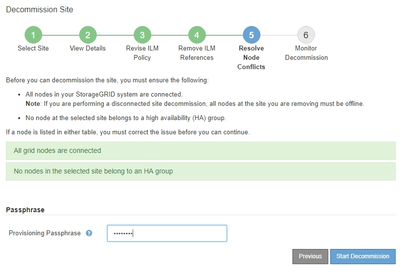

= ステップ5: ノードの競合を解決する（そして廃止を開始する）
:allow-uri-read: 
:icons: font
:imagesdir: ../media/

[role="lead"]
サイトの廃止ウィザードのステップ 5 (ノードの競合の解決) では、 StorageGRIDシステム内の切断されたノードがあるかどうか、または選択したサイトのノードが高可用性 (HA) グループに属しているかどうかを確認できます。ノードの競合が解決されたら、このページから廃止手順を開始します。

.開始する前に
次のように、 StorageGRIDシステム内のすべてのノードが正しい状態であることを確認する必要があります。

* StorageGRIDシステム内のすべてのノードが接続されている必要があります（image:../media/icon_alert_green_checkmark.png["アイコンアラート緑のチェックマーク"] ）。
+

NOTE: 切断されたサイトの廃止を実行する場合は、削除するサイトのすべてのノードを切断し、他のすべてのサイトのすべてのノードを接続する必要があります。

+

NOTE: 1 つ以上のボリュームがオフライン (マウント解除) の場合、またはオンライン (マウント) であってもエラー状態の場合、廃止は開始されません。

+

NOTE: 廃止の進行中に 1 つ以上のボリュームがオフラインになった場合、これらのボリュームがオンラインに戻った後に廃止プロセスが完了します。

* 削除するサイトのノードには、高可用性 (HA) グループに属するインターフェースを含めることはできません。

.タスク概要
ステップ 5 (ノードの競合の解決) にノードがリストされている場合は、廃止を開始する前に問題を修正する必要があります。

このページからサイトの廃止手順を開始する前に、次の考慮事項を確認してください。

* 廃止手順が完了するまで十分な時間を確保する必要があります。
+

NOTE: サイトからオブジェクト データを移動または削除するには、サイトのデータ量、システムの負荷、ネットワークの遅延、必要な ILM 変更の性質に応じて、数日、数週間、または数か月かかる場合があります。

* サイトの廃止手順の実行中:
+
** 廃止されるサイトを参照する ILM ルールを作成することはできません。また、サイトを参照する既存の ILM ルールを編集することもできません。
** 拡張やアップグレードなどのその他のメンテナンス手順を実行することはできません。
+

NOTE: 接続されたサイトの廃止中に別のメンテナンス手順を実行する必要がある場合は、ストレージ ノードの削除中に手順を一時停止できます。  *一時停止*ボタンは、「複製されたデータと消去コード化されたデータの廃止」ステージで有効になります。

** サイトの廃止手順を開始した後にノードを回復する必要がある場合は、サポートに連絡する必要があります。

.手順
. ステップ5（ノードの競合を解決する）の切断されたノードのセクションを確認し、 StorageGRIDシステム内のノードに接続状態が不明（image:../media/icon_alarm_blue_unknown.png["アイコン アラーム 青 不明"] ) または管理上ダウン (image:../media/icon_alarm_gray_administratively_down.png["アイコンアラームグレー管理上ダウン"] ）。
+
image::../media/decommission_site_step_5_disconnected_nodes.png[サイトの廃止手順5 ノードの競合を解決する]

. 切断されたノードがある場合は、オンラインに戻します。
+
参照link:../maintain/grid-node-procedures.html["ノード手順"]。サポートが必要な場合は、テクニカル サポートにお問い合わせください。

. 切断されたすべてのノードがオンラインに戻ったら、手順 5 (ノードの競合の解決) の HA グループ セクションを確認します。
+
このテーブルには、選択したサイトにある高可用性 (HA) グループに属するすべてのノードが一覧表示されます。

+

. ノードがリストされている場合は、次のいずれかを実行します。
+
** 影響を受ける各 HA グループを編集して、ノード インターフェイスを削除します。
** このサイトのノードのみを含む HA グループを削除します。  StorageGRIDの管理手順を参照してください。

+
すべてのノードが接続されており、選択したサイト内のノードが HA グループで使用されていない場合は、*プロビジョニング パスフレーズ* フィールドが有効になります。

. プロビジョニング パスフレーズを入力します。
+
*廃止の開始*ボタンが有効になります。

+

. サイトの廃止手順を開始する準備ができたら、「廃止の開始」を選択します。
+
警告には、削除されるサイトとノードがリストされます。サイトを完全に削除するには、数日、数週間、または数か月かかる場合があることにご注意ください。

+
image::../media/decommission_site_step_5_warning.png[サイトの廃止手順5の警告]

. 警告を確認してください。開始する準備ができたら、[*OK*] を選択します。
+
新しいグリッド構成が生成されるとメッセージが表示されます。このプロセスは、廃止されたグリッド ノードのタイプと数に応じて、時間がかかる場合があります。

+
image::../media/decommission_site_step_5_grid_configuration.png[サイトの廃止手順 5 グリッド構成]

+
新しいグリッド構成が生成されると、ステップ 6 (モニターの廃止) が表示されます。

+

NOTE: *前へ*ボタンは廃止が完了するまで無効のままになります。

