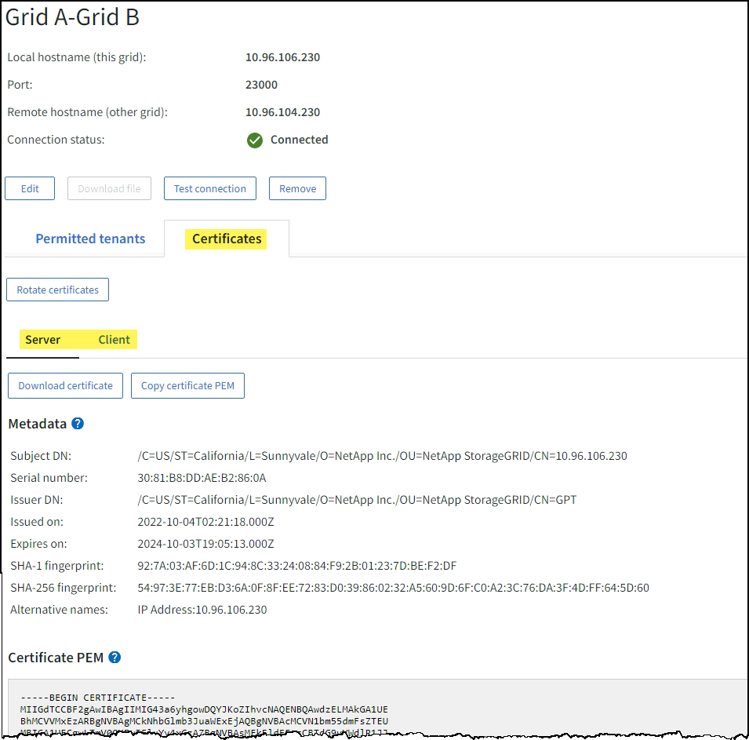

= グリッドフェデレーション接続を監視する
:allow-uri-read: 
:icons: font
:imagesdir: ../media/

[role="lead"]
すべての基本情報を監視できますlink:../admin/grid-federation-overview.html["グリッドフェデレーション接続"]、特定の接続に関する詳細情報、またはクロスグリッドレプリケーション操作に関する Prometheus メトリック。どちらのグリッドからでも接続を監視できます。

.開始する前に
* いずれかのグリッドのグリッドマネージャにサインインするには、link:../admin/web-browser-requirements.html["サポートされているウェブブラウザ"] 。
* あなたはlink:../admin/admin-group-permissions.html["ルートアクセス権限"]サインインしているグリッドの。

== すべての接続を表示

グリッド フェデレーション ページには、すべてのグリッド フェデレーション接続と、グリッド フェデレーション接続の使用が許可されているすべてのテナント アカウントに関する基本情報が表示されます。

.手順
. *構成* > *システム* > *グリッド フェデレーション* を選択します。
+
グリッド フェデレーション ページが表示されます。

. このグリッド上のすべての接続の基本情報を表示するには、[*接続*] タブを選択します。
+
このタブから、次の操作を実行できます。

+
** link:../admin/grid-federation-create-connection.html["新しい接続を作成する"] 。
** 既存の接続を選択してlink:../admin/grid-federation-manage-connection.html["編集またはテスト"]。

+
image::../media/grid-federation-connections-tab.png[グリッドフェデレーション接続タブ]

. このグリッド上で *グリッド フェデレーション接続の使用* 権限を持つすべてのテナント アカウントの基本情報を表示するには、*許可されたテナント* タブを選択します。
+
このタブから、次の操作を実行できます。

+
** link:../monitor/monitoring-tenant-activity.html["許可された各テナントの詳細ページを表示する"] 。
** 各接続の詳細ページを表示します。見る<<view-specific-connection,特定の接続を表示する>> 。
** 許可されたテナントを選択し、link:../admin/grid-federation-manage-tenants.html["権限を削除する"] 。
** グリッド間のレプリケーション エラーを確認し、最後のエラーがあればクリアします。見るlink:../admin/grid-federation-troubleshoot.html["グリッドフェデレーションエラーのトラブルシューティング"] 。
+
image::../media/grid-federation-permitted-tenants-tab.png[グリッドフェデレーション許可テナントタブ]

== [[view-specific-connection]]特定の接続を表示する

特定のグリッド フェデレーション接続の詳細を表示できます。

.手順
. グリッド フェデレーション ページからいずれかのタブを選択し、テーブルから接続名を選択します。
+
接続の詳細ページから、次の操作を実行できます。

+
** ローカルおよびリモートのホスト名、ポート、接続ステータスなど、接続に関する基本的なステータス情報を表示します。
** 接続を選択してlink:../admin/grid-federation-manage-connection.html["編集、テスト、削除"]。

. 特定の接続を表示する場合は、[*許可されたテナント*] タブを選択して、その接続に許可されたテナントの詳細を表示します。
+
このタブから、次の操作を実行できます。

+
** link:../monitor/monitoring-tenant-activity.html["許可された各テナントの詳細ページを表示する"] 。
** link:../admin/grid-federation-manage-tenants.html["テナントの権限を削除する"]接続を使用します。
** グリッド間のレプリケーション エラーを確認し、最後のエラーをクリアします。見るlink:../admin/grid-federation-troubleshoot.html["グリッドフェデレーションエラーのトラブルシューティング"] 。
+
image::../media/grid-federation-permitted-tenants-tab-for-connection.png[グリッドフェデレーション接続許可テナントタブ]

. 特定の接続を表示する場合は、[証明書] タブを選択して、この接続のシステム生成サーバー証明書とクライアント証明書を表示します。
+
このタブから、次の操作を実行できます。

+
** link:../admin/grid-federation-manage-connection.html["接続証明書をローテーションする"] 。
** 関連する証明書を表示またはダウンロードするか、証明書 PEM をコピーするには、「*サーバー*」または「*クライアント*」を選択します。
+

== クロスグリッドレプリケーションメトリックを確認する

Grafana のクロスグリッド レプリケーション ダッシュボードを使用して、グリッド上のクロスグリッド レプリケーション操作に関する Prometheus メトリックを表示できます。

.手順
. グリッド マネージャーから、*サポート* > *ツール* > *メトリック* を選択します。
+

NOTE: メトリクス ページで利用できるツールは、テクニカル サポートが使用することを目的としています。これらのツール内の一部の機能とメニュー項目は意図的に機能せず、変更される可能性があります。リストを見るlink:../monitor/commonly-used-prometheus-metrics.html["よく使われるPrometheusメトリクス"]。

. ページの Grafana セクションで、*Cross Grid Replication* を選択します。
+
詳しい手順については、link:../monitor/reviewing-support-metrics.html["サポート指標を確認する"] 。

. 複製に失敗したオブジェクトの複製を再試行するには、link:../admin/grid-federation-retry-failed-replication.html["失敗したレプリケーション操作を識別して再試行する"] 。

