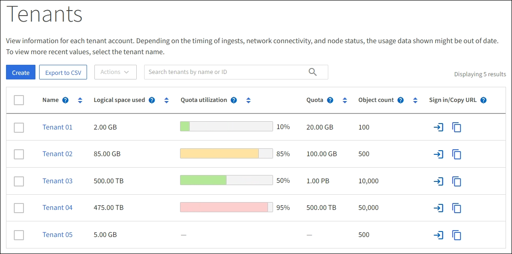
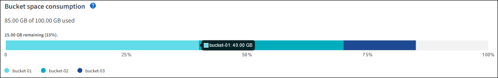

= テナントのアクティビティを監視する
:allow-uri-read: 
:icons: font
:imagesdir: ../media/

[role="lead"]
すべての S3 クライアント アクティビティは、 StorageGRIDテナント アカウントに関連付けられています。グリッド マネージャーを使用すると、すべてのテナントまたは特定のテナントのストレージ使用量やネットワーク トラフィックを監視できます。監査ログまたは Grafana ダッシュボードを使用して、テナントがStorageGRID をどのように使用しているかについてのより詳細な情報を収集できます。

.開始する前に
* グリッドマネージャにサインインするには、link:../admin/web-browser-requirements.html["サポートされているウェブブラウザ"] 。
* あなたはlink:../admin/admin-group-permissions.html["ルートアクセスまたはテナントアカウントの権限"]。

== すべてのテナントを表示

「テナント」ページには、現在のすべてのテナント アカウントの基本情報が表示されます。

.手順
. *TENANTS*を選択します。
. テナント ページに表示される情報を確認します。
+
各テナントの使用済み論理スペース、クォータ使用量、クォータ、およびオブジェクト数がリストされます。テナントにクォータが設定されていない場合、クォータ使用量フィールドとクォータフィールドにダッシュ (&#8212;) が含まれます。

+

NOTE: 使用済みスペースの値は推定値です。これらの見積りは、取り込みのタイミング、ネットワーク接続、およびノードの状態によって影響を受けます。

+

. 必要に応じて、サインインリンクを選択してテナントアカウントにサインインします。image:../media/icon_tenant_sign_in.png["テナントサインインアイコン"] *Sign in/URLをコピー*列に表示されます。
. 必要に応じて、[URL のコピー] リンクを選択して、テナントのサインイン ページの URL をコピーします。image:../media/icon_tenant_copy_url.png["テナントコピーURLアイコン"] *Sign in/URLをコピー*列に表示されます。
. 必要に応じて、*CSVにエクスポート*を選択して、 `.csv`すべてのテナントの使用状況値を含むファイル。
+
開くか保存するかを選択するメッセージが表示されます。 `.csv`ファイル。

+
の内容は `.csv`ファイルは次の例のようになります。

+
image::../media/tenant_accounts_example_csv.png[テナントアカウントの例 .csv]

+
開くことができます `.csv`スプレッドシート アプリケーションでファイルを保存するか、自動化で使用します。

. オブジェクトがリストされていない場合は、オプションで [*アクション*] > [*削除*] を選択して、1 つ以上のテナントを削除します。見るlink:../admin/deleting-tenant-account.html["テナントアカウントを削除する"] 。
+
アカウントにバケットまたはコンテナが含まれている場合、テナント アカウントを削除することはできません。

== 特定のテナントを表示する

特定のテナントの詳細を表示できます。

.手順
. 「テナント」ページからテナント名を選択します。
+
テナントの詳細ページが表示されます。

+
image::../media/tenant_usage_modal.png[テナント使用状況モーダル]

. ページ上部のテナントの概要を確認します。
+
詳細ページのこのセクションでは、テナントのオブジェクト数、クォータ使用量、使用されている論理スペース、クォータ設定など、テナントの概要情報が提供されます。

. *スペースの内訳*タブから、*スペース消費量*グラフを確認します。
+
このグラフには、テナントのすべての S3 バケットの合計スペース消費量が表示されます。

+
このテナントにクォータが設定されている場合は、使用済みおよび残りのクォータの量がテキストで表示されます（例： `85.00 GB of 100 GB used` ）。クォータが設定されていない場合、テナントのクォータは無制限となり、テキストには使用されているスペースの量のみが含まれます（例： `85.00 GB used` ）。棒グラフには、各バケットまたはコンテナの割り当ての割合が表示されます。テナントがストレージ クォータを 1% 以上超過し、少なくとも 1 GB 超過している場合、チャートには合計クォータと超過量が表示されます。

+
棒グラフの上にカーソルを置くと、各バケットまたはコンテナで使用されているストレージが表示されます。空き領域セグメントの上にカーソルを置くと、残っているストレージ クォータの量を確認できます。

+

+

CAUTION: クォータ使用量は内部推定に基づいており、場合によっては超過する可能性があります。たとえば、 StorageGRID は、テナントがオブジェクトのアップロードを開始するとクォータをチェックし、テナントがクォータを超過している場合は新しい取り込みを拒否します。ただし、 StorageGRID は、クォータを超過したかどうかを判断する際に、現在のアップロードのサイズを考慮しません。オブジェクトが削除されると、クォータ使用量が再計算されるまで、テナントは一時的に新しいオブジェクトのアップロードができなくなる可能性があります。クォータ使用量の計算には 10 分以上かかる場合があります。

+

NOTE: テナントのクォータ使用量は、テナントがStorageGRIDにアップロードしたオブジェクト データの合計量 (論理サイズ) を示します。クォータ使用量は、それらのオブジェクトとそのメタデータのコピーを保存するために使用されるスペース (物理サイズ) を表すものではありません。

+

NOTE: *テナント クォータ使用量高* アラート ルールを有効にして、テナントがクォータを消費しているかどうかを判断できます。有効にすると、テナントがクォータの 90% を使用したときにこのアラートがトリガーされます。手順については、link:../monitor/editing-alert-rules.html["アラートルールを編集する"] 。

. *スペースの内訳*タブから、*バケットの詳細*を確認します。
+
この表には、テナントの S3 バケットがリストされます。使用済みスペースは、バケットまたはコンテナ内のオブジェクト データの合計量です。この値は、ILM コピーおよびオブジェクト メタデータに必要なストレージ スペースを表すものではありません。

. 必要に応じて、[CSV にエクスポート] を選択して、各バケットまたはコンテナの使用状況値を含む .csv ファイルを表示およびエクスポートします。
+
個々のS3テナントの `.csv`ファイルは次の例のようになります。

+
image::../media/tenant_bucket_details_csv.png[テナントバケットの詳細 CSV の例]

+
開くことができます `.csv`スプレッドシート アプリケーションでファイルを保存するか、自動化で使用します。

. 必要に応じて、[*許可された機能*] タブを選択して、テナントに対して有効になっている権限と機能のリストを表示します。見るlink:../admin/editing-tenant-account.html["テナントアカウントの編集"]これらの設定を変更する必要がある場合。
. テナントに *グリッド フェデレーション接続の使用* 権限がある場合は、オプションで *グリッド フェデレーション* タブを選択して、接続の詳細を確認します。
+
見るlink:../admin/grid-federation-overview.html["グリッドフェデレーションとは何ですか?"]そしてlink:../admin/grid-federation-manage-tenants.html["グリッドフェデレーションの許可されたテナントを管理する"]。

== ネットワークトラフィックを表示する

テナントにトラフィック分類ポリシーが設定されている場合は、そのテナントのネットワーク トラフィックを確認します。

.手順
. *構成* > *ネットワーク* > *トラフィック分類*を選択します。
+
「トラフィック分類ポリシー」ページが表示され、既存のポリシーが表にリストされます。

. ポリシーのリストを確認し、特定のテナントに適用されるポリシーを特定します。
. ポリシーに関連付けられているメトリックを表示するには、ポリシーの左側にあるラジオ ボタンを選択し、*メトリック* を選択します。
. グラフを分析して、ポリシーがトラフィックを制限している頻度と、ポリシーを調整する必要があるかどうかを判断します。

見るlink:../admin/managing-traffic-classification-policies.html["トラフィック分類ポリシーを管理する"]詳細についてはこちらをご覧ください。

== 監査ログを使用する

オプションで、監査ログを使用して、テナントのアクティビティをより詳細に監視できます。

たとえば、次の種類の情報を監視できます。

* PUT、GET、DELETEなどの特定のクライアント操作
* オブジェクトのサイズ
* オブジェクトに適用されるILMルール
* クライアントリクエストの送信元IP

監査ログはテキスト ファイルに書き込まれ、任意のログ分析ツールを使用して分析できます。これにより、クライアントのアクティビティをより深く理解したり、高度なチャージバックおよび課金モデルを実装したりできるようになります。

見るlink:../audit/index.html["監査ログを確認する"]詳細についてはこちらをご覧ください。

== Prometheusメトリクスを使用する

必要に応じて、Prometheus メトリックを使用してテナントのアクティビティをレポートします。

* グリッド マネージャーで、*サポート* > *ツール* > *メトリック* を選択します。S3 概要などの既存のダッシュボードを使用して、クライアントのアクティビティを確認できます。
+

NOTE: メトリクス ページで利用できるツールは、主にテクニカル サポートが使用することを目的としています。これらのツール内の一部の機能とメニュー項目は意図的に機能しないようになっています。

* グリッド マネージャーの上部から、ヘルプ アイコンを選択し、*API ドキュメント* を選択します。グリッド管理 API のメトリック セクションのメトリックを使用して、テナント アクティビティのカスタム アラート ルールとダッシュボードを作成できます。

見るlink:reviewing-support-metrics.html["サポート指標を確認する"]詳細についてはこちらをご覧ください。
