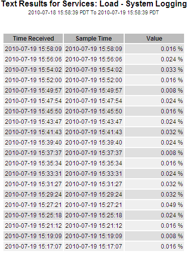

= テキストレポートを使用する
:allow-uri-read: 
:icons: font
:imagesdir: ../media/

[role="lead"]
テキスト レポートには、NMS サービスによって処理された属性データ値のテキスト表現が表示されます。レポートの期間に応じて生成されるレポートには、1 週間未満の期間の場合は生のテキスト レポート、1 週間を超える期間の場合は集計テキスト レポートの 2 種類があります。

== 生のテキストレポート

生のテキスト レポートには、選択した属性の詳細が表示されます。

* 受信時刻: 属性データのサンプル値が NMS サービスによって処理されたローカルの日時。
* サンプル時間: 属性値がソースでサンプリングまたは変更されたローカルの日時。
* 値: サンプル時の属性値。

== 集計テキストレポート

集計テキスト レポートには、生のテキスト レポートよりも長い期間 (通常は 1 週間) にわたるデータが表示されます。各エントリは、NMS サービスによって時間の経過に伴って複数の属性値 (属性値の集計) が集計から導出された平均値、最大値、最小値を含む単一のエントリにまとめられた結果です。

各エントリには次の情報が表示されます。

* 集約時刻: NMS サービスが変更された属性値のセットを集約 (収集) した最後のローカル日時。
* 平均値: 集計された期間にわたる属性の値の平均。
* 最小値: 集計期間における最小値。
* 最大値: 集計期間における最大値。

image::../media/aggregate_text_report.gif[集計テキストレポートを示すスクリーンショット]

== テキストレポートを生成する

テキスト レポートには、NMS サービスによって処理された属性データ値のテキスト表現が表示されます。データ センター サイト、グリッド ノード、コンポーネント、またはサービスについてレポートできます。

.開始する前に
* グリッドマネージャにサインインするには、link:../admin/web-browser-requirements.html["サポートされているウェブブラウザ"] 。
* あなたが持っているlink:../admin/admin-group-permissions.html["特定のアクセス権限"]。

.タスク概要
継続的に変更されると予想される属性データの場合、この属性データは NMS サービス (ソース) によって定期的にサンプリングされます。頻繁に変更されない属性データ (たとえば、状態やステータスの変更などのイベントに基づくデータ) の場合、属性値が変更されると、その値が NMS サービスに送信されます。

表示されるレポートの種類は、設定された期間によって異なります。デフォルトでは、1 週間を超える期間の集計テキスト レポートが生成されます。

灰色のテキストは、サンプリング時にサービスが管理上ダウンしていたことを示します。青いテキストは、サービスが不明な状態であったことを示します。

.手順
. *サポート* > *ツール* > *グリッド トポロジ* を選択します。
. *_grid node_* > *_component or service_* > *レポート* > *テキスト*を選択します。
. *属性*ドロップダウンリストからレポートする属性を選択します。
. *ページあたりの結果数*ドロップダウンリストからページあたりの結果数を選択します。
. 値を小数点以下最大 3 桁に丸めるには (たとえば、パーセンテージとして報告される属性の場合)、[*生データ*] チェックボックスをオフにします。
. *クイック クエリ* ドロップダウン リストからレポートする期間を選択します。
+
特定の時間範囲を選択するには、カスタム クエリ オプションを選択します。

+
しばらくするとレポートが表示されます。長い時間範囲の集計には数分かかります。

. カスタム クエリを選択した場合は、*開始日*と*終了日*を入力して、レポートする期間をカスタマイズする必要があります。
+
フォーマットを使用する `YYYY/MM/DDHH:MM:SS`現地時間で。形式を一致させるには先頭のゼロが必要です。たとえば、2017/4/6 7:30:00 は検証に失敗します。正しい形式は、2017/04/06 07:30:00 です。

. *更新*をクリックします。
+
しばらくするとテキスト レポートが生成されます。長い時間範囲の集計には数分かかります。クエリに設定された時間の長さに応じて、生のテキスト レポートまたは集計テキスト レポートのいずれかが表示されます。

== テキストレポートをエクスポートする

エクスポートされたテキスト レポートでは新しいブラウザー タブが開き、データを選択してコピーできるようになります。

.タスク概要
コピーされたデータは新しいドキュメント (スプレッドシートなど) に保存し、 StorageGRIDシステムのパフォーマンスを分析するために使用できます。

.手順
. *サポート* > *ツール* > *グリッド トポロジ* を選択します。
. テキストレポートを作成します。
. *エクスポート*をクリックしますimage:../media/icon_export.gif["エクスポートアイコン"]。
+
image::../media/export_text_report.gif[周囲のテキストで説明されているスクリーンショット]

+
「テキスト レポートのエクスポート」ウィンドウが開き、レポートが表示されます。

+
image::../media/export_text_report_data.gif[テキストレポートの例を示すスクリーンショット]

. テキスト レポートのエクスポート ウィンドウの内容を選択してコピーします。
+
このデータは、スプレッドシートなどのサードパーティのドキュメントに貼り付けることができます。

