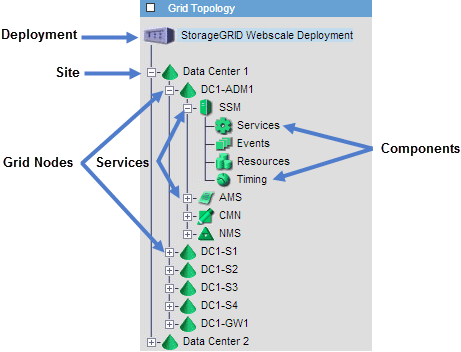

= グリッドトポロジツリーを表示する
:allow-uri-read: 
:icons: font
:imagesdir: ../media/

[role="lead"]
グリッド トポロジ ツリーでは、サイト、グリッド ノード、サービス、コンポーネントなどのStorageGRIDシステム要素に関する詳細情報にアクセスできます。ほとんどの場合、ドキュメントで指示されている場合、またはテクニカル サポートと連携している場合にのみ、グリッド トポロジ ツリーにアクセスする必要があります。

グリッド トポロジ ツリーにアクセスするには、*サポート* > *ツール* > *グリッド トポロジ* を選択します。

グリッドトポロジツリーを展開または折りたたむには、image:../media/nms_tree_expand.gif["プラス記号アイコン"]またはimage:../media/nms_tree_collapse.gif["マイナス記号アイコン"]サイト、ノード、またはサービス レベルで。サイト全体または各ノード内のすべての項目を展開または折りたたむには、*<Ctrl>* キーを押しながらクリックします。

== StorageGRID属性

属性は、 StorageGRIDシステムの多くの機能の値とステータスを報告します。属性値は、各グリッド ノード、各サイト、およびグリッド全体で使用できます。

StorageGRID属性は、グリッド マネージャーのいくつかの場所で使用されます。

* *ノード ページ*: ノード ページに表示される値の多くはStorageGRID属性です。  (Prometheus メトリックはノード ページにも表示されます。)
* *グリッド トポロジ ツリー*: 属性値は、グリッド トポロジ ツリーに表示されます (*サポート* > *ツール* > *グリッド トポロジ*)。
* *イベント*: システム イベントは、特定の属性がネットワーク エラーなどのノードのエラーまたは障害状態を記録したときに発生します。

=== 属性値

属性はベストエフォート方式で報告され、ほぼ正確です。サービスのクラッシュやグリッド ノードの障害と再構築など、状況によっては属性の更新が失われる場合があります。

さらに、伝播の遅延により、属性のレポートが遅くなる可能性があります。ほとんどの属性の更新された値は、一定の間隔でStorageGRIDシステムに送信されます。更新がシステムに表示されるまでには数分かかる場合があり、ほぼ同時に変更された 2 つの属性がわずかに異なる時間に報告されることもあります。
