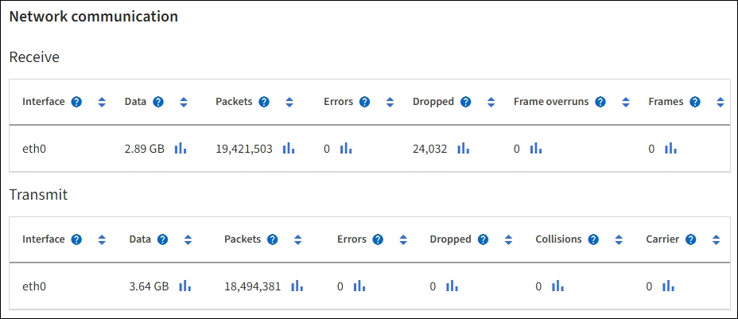
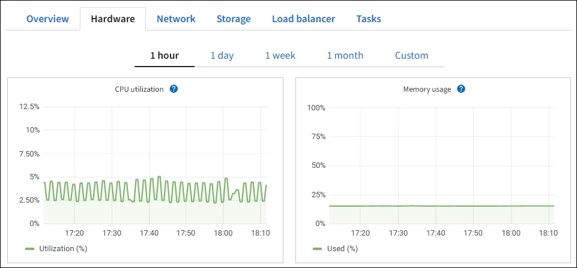

= ハードウェアタブを表示する
:allow-uri-read: 
:icons: font
:imagesdir: ../media/

[role="lead"]
[ハードウェア] タブには、各ノードの CPU 使用率とメモリ使用量、およびアプライアンスに関する追加のハードウェア情報が表示されます。

NOTE: グリッド マネージャーはリリースごとに更新されるため、このページのサンプルのスクリーンショットと一致しない場合があります。

すべてのノードに対してハードウェア タブが表示されます。

image::../media/nodes_page_hardware_tab_graphs.png[ノードページのハードウェアタブ]

異なる時間間隔を表示するには、チャートまたはグラフの上にあるコントロールのいずれかを選択します。 1 時間、1 日、1 週間、1 か月の間隔で情報を表示できます。カスタム間隔を設定して、日付と時刻の範囲を指定することもできます。

CPU 使用率とメモリ使用量の詳細を表示するには、各グラフの上にカーソルを置きます。

image::../media/nodes_page_memory_usage_details.png[ノードページ > ハードウェア > メモリ使用量の詳細]

ノードがアプライアンス ノードの場合、このタブにはアプライアンス ハードウェアに関する詳細情報のセクションも含まれます。

== アプライアンス ストレージ ノードに関する情報を表示する

ノード ページには、各アプライアンス ストレージ ノードのサービス ヘルスとすべてのコンピューティング、ディスク デバイス、およびネットワーク リソースに関する情報が一覧表示されます。メモリ、ストレージ ハードウェア、コントローラー ファームウェア バージョン、ネットワーク リソース、ネットワーク インターフェイス、ネットワーク アドレスを確認したり、データの受信と送信を行ったりすることもできます。

.手順
. 「ノード」ページから、アプライアンス ストレージ ノードを選択します。
. *概要*を選択します。
+
[概要] タブの [ノード情報] セクションには、ノードの名前、タイプ、ID、接続状態など、ノードの概要情報が表示されます。  IP アドレスのリストには、次のように各アドレスのインターフェース名が含まれます。

+
** *eth*: グリッド ネットワーク、管理ネットワーク、またはクライアント ネットワーク。
** *hic*: アプライアンス上の物理的な 10、25、または 100 GbE ポートの 1 つ。これらのポートは結合して、 StorageGRIDグリッド ネットワーク (eth0) およびクライアント ネットワーク (eth2) に接続できます。
** *mtc*: アプライアンス上の物理 1 GbE ポートの 1 つ。 1 つ以上の mtc インターフェイスが結合されて、 StorageGRID管理ネットワーク インターフェイス (eth1) を形成します。他の mtc インターフェイスは、データ センターの技術者が一時的にローカル接続できるように残しておくことができます。
+
image::../media/nodes_page_overview_tab_extended.png[ノードページの概要（拡張）]

+
[概要] タブの [アラート] セクションには、ノードのアクティブなアラートが表示されます。

. アプライアンスの詳細情報を表示するには、「*ハードウェア*」を選択します。
+
.. CPU 使用率とメモリのグラフを表示して、時間の経過に伴う CPU とメモリの使用率の割合を確認します。異なる時間間隔を表示するには、チャートまたはグラフの上にあるコントロールのいずれかを選択します。 1 時間、1 日、1 週間、1 か月の間隔で情報を表示できます。カスタム間隔を設定して、日付と時刻の範囲を指定することもできます。
+
image::../media/nodes_page_hardware_tab_graphs.png[ハードウェアグラフ]

.. 下にスクロールして、アプライアンスのコンポーネント表を表示します。このテーブルには、アプライアンスのモデル名、コントローラ名、シリアル番号、IP アドレス、各コンポーネントのステータスなどの情報が含まれています。
+

NOTE: コンピューティング コントローラーBMC IP やコンピューティング ハードウェアなどの一部のフィールドは、その機能を備えたアプライアンスに対してのみ表示されます。

+
ストレージ シェルフのコンポーネント、およびインストールの一部である場合には拡張シェルフのコンポーネントは、アプライアンス テーブルの下の別のテーブルに表示されます。

+
image::../media/nodes_page_hardware_tab_for_appliance.png[アプライアンスのノードページのハードウェアタブ]

+
[cols="1a,2a"]
|===
| アプライアンステーブルのフィールド | 説明 

 a| 
アプライアンスモデル
 a| 
SANtricity OS に表示されるこのStorageGRIDアプライアンスのモデル番号。

 a| 
ストレージコントローラ名
 a| 
SANtricity OS に表示されるこのStorageGRIDアプライアンスの名前。

 a| 
ストレージコントローラA管理IP
 a| 
ストレージ コントローラ A の管理ポート 1 の IP アドレス。この IP を使用してSANtricity OS にアクセスし、ストレージの問題をトラブルシューティングします。

 a| 
ストレージコントローラB管理IP
 a| 
ストレージ コントローラ B の管理ポート 1 の IP アドレス。この IP を使用してSANtricity OS にアクセスし、ストレージの問題をトラブルシューティングします。

一部のアプライアンス モデルにはストレージ コントローラ B がありません。

 a| 
ストレージコントローラのWWID
 a| 
SANtricity OS に表示されるストレージ コントローラのワールドワイド識別子。

 a| 
ストレージアプライアンスシャーシのシリアル番号
 a| 
アプライアンスのシャーシのシリアル番号。

 a| 
ストレージコントローラのファームウェアバージョン
 a| 
このアプライアンスのストレージ コントローラ上のファームウェアのバージョン。

 a| 
ストレージコントローラSANtricity OSバージョン
 a| 
ストレージ コントローラ A のSANtricity OS バージョン。

 a| 
ストレージコントローラのNVSRAMバージョン
 a| 
SANtricity System Manager によって報告されるストレージ コントローラの NVSRAM バージョン。

SG6060 および SG6160 の場合、2 つのコントローラ間で NVSRAM のバージョンが一致しない場合は、コントローラ A のバージョンが表示されます。コントローラ A がインストールされていないか動作していない場合は、コントローラ B のバージョンが表示されます。

 a| 
ストレージハードウェア
 a| 
ストレージ コントローラ ハードウェアの全体的なステータス。  SANtricity System Manager がストレージ ハードウェアのステータスを「要注意」と報告した場合、 StorageGRIDシステムもこの値を報告します。

ステータスが「注意が必要」の場合は、まずSANtricity OS を使用してストレージ コントローラーを確認します。次に、コンピューティング コントローラーに適用される他のアラートが存在しないことを確認します。

 a| 
ストレージコントローラの障害ドライブ数
 a| 
最適ではないドライブの数。

 a| 
ストレージコントローラA
 a| 
ストレージ コントローラ A のステータス。

 a| 
ストレージコントローラB
 a| 
ストレージ コントローラ B のステータス。一部のアプライアンス モデルにはストレージ コントローラ B がありません。

 a| 
ストレージコントローラ電源A
 a| 
ストレージ コントローラの電源 A のステータス。

 a| 
ストレージコントローラ電源B
 a| 
ストレージ コントローラの電源 B のステータス。

 a| 
ストレージデータドライブの種類
 a| 
アプライアンス内のドライブの種類 (HDD (ハード ドライブ) や SSD (ソリッド ステート ドライブ) など)。

 a| 
ストレージデータドライブのサイズ
 a| 
1 つのデータ ドライブの有効サイズ。

SG6160 の場合、キャッシュ ドライブのサイズも表示されます。

*注*: 拡張シェルフを備えたノードの場合は、<<shelf_data_drive_size,各シェルフのデータドライブサイズ>>その代わり。有効なドライブ サイズはシェルフによって異なる場合があります。

 a| 
ストレージRAIDモード
 a| 
アプライアンスに設定されている RAID モード。

 a| 
ストレージ接続
 a| 
ストレージの接続状態。

 a| 
全体的な電源供給
 a| 
アプライアンスのすべての電源のステータス。

 a| 
コンピューティングコントローラBMC IP
 a| 
コンピューティング コントローラー内のベースボード管理コントローラー (BMC) ポートの IP アドレス。この IP を使用してBMCインターフェイスに接続し、アプライアンスのハードウェアを監視および診断します。

このフィールドは、 BMCが含まれていないアプライアンス モデルでは表示されません。

 a| 
コンピューティングコントローラのシリアル番号
 a| 
コンピューティング コントローラーのシリアル番号。

 a| 
コンピューティングハードウェア
 a| 
コンピューティング コントローラー ハードウェアのステータス。このフィールドは、コンピューティング ハードウェアとストレージ ハードウェアが別々になっていないアプライアンス モデルでは表示されません。

 a| 
コンピューティングコントローラのCPU温度
 a| 
コンピューティング コントローラーの CPU の温度状態。

 a| 
コンピューティングコントローラシャーシの温度
 a| 
コンピューティング コントローラーの温度状態。

|===
+
[cols="1a,2a"]
|===
| 保管棚テーブルの列 | 説明 

 a| 
棚シャーシのシリアル番号
 a| 
ストレージ シェルフ シャーシのシリアル番号。

 a| 
Shelf ID
 a| 
ストレージ シェルフの数値識別子。

*** 99: ストレージコントローラシェルフ
*** 0: 最初の拡張棚
*** 1: 2番目の拡張棚

*注:* 拡張シェルフは SG6060 および SG6160 にのみ適用されます。

 a| 
棚の状態
 a| 
保管棚の全体的な状態。

 a| 
IOMのステータス
 a| 
拡張シェルフ内の入出力モジュール (IOM) のステータス。拡張シェルフでない場合は N/A となります。

 a| 
電源装置ステータス
 a| 
ストレージ シェルフの電源の全体的な状態。

 a| 
引き出しのステータス
 a| 
収納棚の引き出しの状態。棚に引き出しがない場合は N/A となります。

 a| 
ファンのステータス
 a| 
ストレージ シェルフ内の冷却ファンの全体的な状態。

 a| 
ドライブスロット
 a| 
ストレージ シェルフ内のドライブ スロットの合計数。

 a| 
データドライブ
 a| 
ストレージ シェルフ内のデータ ストレージに使用されるドライブの数。

 a| 
[[shelf_data_drive_size]]データドライブのサイズ
 a| 
ストレージ シェルフ内の 1 つのデータ ドライブの有効サイズ。

 a| 
キャッシュドライブ
 a| 
ストレージ シェルフ内でキャッシュとして使用されるドライブの数。

 a| 
キャッシュドライブサイズ
 a| 
ストレージ シェルフ内の最小のキャッシュ ドライブのサイズ。通常、キャッシュ ドライブはすべて同じサイズです。

 a| 
設定ステータス
 a| 
ストレージ シェルフの構成ステータス。

|===
.. すべてのステータスが「正常」であることを確認します。
+
ステータスが「正常」でない場合は、現在のアラートを確認してください。 SANtricity System Manager を使用して、これらのハードウェア値の一部について詳しく知ることもできます。アプライアンスのインストールとメンテナンスの手順を参照してください。

. 各ネットワークの情報を表示するには、「*ネットワーク*」を選択します。
+
ネットワーク トラフィック グラフには、全体的なネットワーク トラフィックの概要が表示されます。

+
image::../media/nodes_page_network_traffic_graph.png[ノードページのネットワークトラフィックグラフ]

+
.. ネットワーク インターフェイス セクションを確認します。
+
image::../media/nodes_page_network_interfaces.png[ノードページ ネットワークインターフェース]

+
次の表とネットワーク インターフェイス テーブルの *速度* 列の値を使用して、アプライアンス上の 10/25 GbE ネットワーク ポートがアクティブ/バックアップ モードまたは LACP モードを使用するように構成されているかどうかを判断します。

+

NOTE: 表に示されている値は、4 つのリンクすべてが使用されていることを前提としています。

+
[cols="1a,1a,1a,1a"]
|===
| リンクモード | ボンドモード | 個々のHICリンク速度（hic1、hic2、hic3、hic4） | 予想されるグリッド/クライアントネットワーク速度 (eth0、eth2) 

 a| 
Aggregate
 a| 
LACP
 a| 
25
 a| 
100

 a| 
固定
 a| 
LACP
 a| 
25
 a| 
50

 a| 
固定
 a| 
アクティブ/バックアップ
 a| 
25
 a| 
25

 a| 
Aggregate
 a| 
LACP
 a| 
10
 a| 
40

 a| 
固定
 a| 
LACP
 a| 
10
 a| 
20

 a| 
固定
 a| 
アクティブ/バックアップ
 a| 
10
 a| 
10

|===
+
見る https://docs.netapp.com/us-en/storagegrid-appliances/installconfig/configuring-network-links.html["ネットワークリンクを構成する"^]10/25 GbE ポートの設定の詳細については、こちらをご覧ください。

.. ネットワーク通信セクションを確認します。
+
受信テーブルと送信テーブルには、各ネットワークで受信および送信されたバイト数とパケット数、およびその他の受信および送信メトリックが表示されます。

+

. *ストレージ* を選択すると、オブジェクト データとオブジェクト メタデータに時間の経過とともに使用されたストレージの割合、およびディスク デバイス、ボリューム、オブジェクト ストアに関する情報を示すグラフが表示されます。
+
image::../media/nodes_page_storage_used_object_data.png[使用済みストレージ - オブジェクトデータ]

+
image::../media/storage_used_object_metadata.png[使用済みストレージ - オブジェクトメタデータ]

+
.. 下にスクロールすると、各ボリュームとオブジェクト ストアで使用可能なストレージの量が表示されます。
+
各ディスクのワールドワイド名は、 SANtricity OS (アプライアンスのストレージ コントローラに接続された管理ソフトウェア) で標準ボリューム プロパティを表示したときに表示されるボリュームのワールドワイド識別子 (WWID) と一致します。

+
ボリューム マウント ポイントに関連するディスクの読み取りおよび書き込みの統計を解釈できるように、ディスク デバイス テーブルの *名前* 列に表示される名前の最初の部分 (つまり、_sdc_、_sdd_、_sde_ など) は、ボリューム テーブルの *デバイス* 列に表示される値と一致します。

+
image::../media/nodes_page_storage_tables.png[ノードページストレージテーブル]

== アプライアンスの管理ノードとゲートウェイノードに関する情報を表示します

[ノード] ページには、管理ノードまたはゲートウェイ ノードとして使用される各サービス アプライアンスのサービス ヘルスとすべてのコンピューティング リソース、ディスク デバイス リソース、およびネットワーク リソースに関する情報が一覧表示されます。メモリ、ストレージ ハードウェア、ネットワーク リソース、ネットワーク インターフェイス、ネットワーク アドレスを確認したり、データの受信と送信を行ったりすることもできます。

.手順
. 「ノード」ページで、アプライアンス管理ノードまたはアプライアンス ゲートウェイ ノードを選択します。
. *概要*を選択します。
+
[概要] タブの [ノード情報] セクションには、ノードの名前、タイプ、ID、接続状態など、ノードの概要情報が表示されます。  IP アドレスのリストには、次のように各アドレスのインターフェース名が含まれます。

+
** *adllb* および *adlli*: 管理ネットワークインターフェースにアクティブ/バックアップボンディングが使用されている場合に表示されます。
** *eth*: グリッド ネットワーク、管理ネットワーク、またはクライアント ネットワーク。
** *hic*: アプライアンス上の物理的な 10、25、または 100 GbE ポートの 1 つ。これらのポートは結合して、 StorageGRIDグリッド ネットワーク (eth0) およびクライアント ネットワーク (eth2) に接続できます。
** *mtc*: アプライアンス上の物理 1 GbE ポートの 1 つ。 1 つ以上の mtc インターフェイスが結合されて、管理ネットワーク インターフェイス (eth1) を形成します。他の mtc インターフェイスは、データ センターの技術者が一時的にローカル接続できるように残しておくことができます。
+
image::../media/nodes_page_overview_tab_services_appliance.png[サービスアプライアンスのノードページの概要タブ]

+
[概要] タブの [アラート] セクションには、ノードのアクティブなアラートが表示されます。

. アプライアンスの詳細情報を表示するには、「*ハードウェア*」を選択します。
+
.. CPU 使用率とメモリのグラフを表示して、時間の経過に伴う CPU とメモリの使用率の割合を確認します。異なる時間間隔を表示するには、チャートまたはグラフの上にあるコントロールのいずれかを選択します。 1 時間、1 日、1 週間、1 か月の間隔で情報を表示できます。カスタム間隔を設定して、日付と時刻の範囲を指定することもできます。
+

.. 下にスクロールして、アプライアンスのコンポーネント表を表示します。このテーブルには、モデル名、シリアル番号、コントローラーのファームウェア バージョン、各コンポーネントのステータスなどの情報が含まれています。
+
image::../media/nodes_page_hardware_tab_services_appliance.png[サービスアプライアンスのノードページのハードウェアタブ]

+
[cols="1a,2a"]
|===
| アプライアンステーブルのフィールド | 説明 

 a| 
アプライアンスモデル
 a| 
このStorageGRIDアプライアンスのモデル番号。

 a| 
ストレージコントローラの障害ドライブ数
 a| 
最適ではないドライブの数。

 a| 
ストレージデータドライブの種類
 a| 
アプライアンス内のドライブの種類 (HDD (ハード ドライブ) や SSD (ソリッド ステート ドライブ) など)。

 a| 
ストレージデータドライブのサイズ
 a| 
1 つのデータ ドライブの有効サイズ。

 a| 
ストレージRAIDモード
 a| 
アプライアンスの RAID モード。

 a| 
全体的な電源供給
 a| 
アプライアンス内のすべての電源のステータス。

 a| 
コンピューティングコントローラBMC IP
 a| 
コンピューティング コントローラー内のベースボード管理コントローラー (BMC) ポートの IP アドレス。この IP を使用してBMCインターフェイスに接続し、アプライアンスのハードウェアを監視および診断できます。

このフィールドは、 BMCが含まれていないアプライアンス モデルでは表示されません。

 a| 
コンピューティングコントローラのシリアル番号
 a| 
コンピューティング コントローラーのシリアル番号。

 a| 
コンピューティングハードウェア
 a| 
コンピューティング コントローラー ハードウェアのステータス。

 a| 
コンピューティングコントローラのCPU温度
 a| 
コンピューティング コントローラーの CPU の温度状態。

 a| 
コンピューティングコントローラシャーシの温度
 a| 
コンピューティング コントローラーの温度状態。

|===
.. すべてのステータスが「正常」であることを確認します。
+
ステータスが「正常」でない場合は、現在のアラートを確認してください。

. 各ネットワークの情報を表示するには、「*ネットワーク*」を選択します。
+
ネットワーク トラフィック グラフには、全体的なネットワーク トラフィックの概要が表示されます。

+
image::../media/nodes_page_network_traffic_graph.png[ノードページのネットワークトラフィックグラフ]

+
.. ネットワーク インターフェイス セクションを確認します。
+
image::../media/nodes_page_hardware_tab_network_services_appliance.png[ノードページのハードウェアタブネットワークサービスアプライアンス]

+
次の表とネットワーク インターフェイス テーブルの *速度* 列の値を使用して、アプライアンス上の 4 つの 40/100 GbE ネットワーク ポートがアクティブ/バックアップ モードと LACP モードのどちらを使用するように構成されているかを確認します。

+

NOTE: 表に示されている値は、4 つのリンクすべてが使用されていることを前提としています。

+
[cols="1a,1a,1a,1a"]
|===
| リンクモード | ボンドモード | 個々のHICリンク速度（hic1、hic2、hic3、hic4） | 予想されるグリッド/クライアントネットワーク速度 (eth0、eth2) 

 a| 
Aggregate
 a| 
LACP
 a| 
100
 a| 
400

 a| 
固定
 a| 
LACP
 a| 
100
 a| 
200

 a| 
固定
 a| 
アクティブ/バックアップ
 a| 
100
 a| 
100

 a| 
Aggregate
 a| 
LACP
 a| 
40
 a| 
160

 a| 
固定
 a| 
LACP
 a| 
40
 a| 
80

 a| 
固定
 a| 
アクティブ/バックアップ
 a| 
40
 a| 
40

|===
.. ネットワーク通信セクションを確認します。
+
受信テーブルと送信テーブルには、各ネットワークで受信および送信されたバイト数とパケット数、およびその他の受信および送信メトリックが表示されます。

+

. サービス アプライアンス上のディスク デバイスとボリュームに関する情報を表示するには、[*ストレージ*] を選択します。
+
image::../media/nodes_page_storage_tab_services_appliance.png[ノードページストレージタブサービスアプライアンス]

