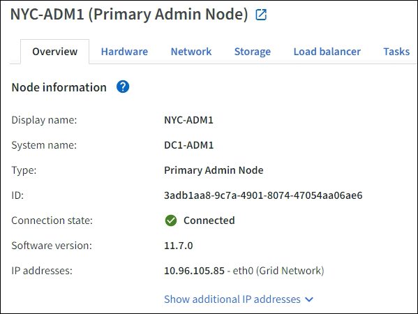

= 概要タブを表示する
:allow-uri-read: 
:icons: font
:imagesdir: ../media/

[role="lead"]
「概要」タブには、各ノードに関する基本情報が表示されます。また、現在ノードに影響を与えているアラートも表示されます。

すべてのノードに対して概要タブが表示されます。

== ノード情報

[概要] タブの [ノード情報] セクションには、ノードに関する基本情報が一覧表示されます。

ノードの概要情報には次のものが含まれます。

* *表示名* (ノードの名前が変更された場合にのみ表示されます): ノードの現在の表示名。使用link:../maintain/rename-grid-site-node-overview.html["グリッド、サイト、ノードの名前を変更する"]この値を更新する手順。
* *システム名*: インストール時にノードに入力した名前。システム名はStorageGRID の内部操作に使用され、変更できません。
* *タイプ*: ノードのタイプ (管理ノード、プライマリ管理ノード、ストレージ ノード、またはゲートウェイ ノード)。
* *ID*: ノードの一意の識別子。UUID とも呼ばれます。
* *接続状態*: 3 つの状態のうちの 1 つ。最も深刻な状態のアイコンが表示されます。
+
** *未知*image:../media/icon_alarm_blue_unknown.png["青い疑問符アイコン"] : 不明な理由により、ノードがグリッドに接続されていないか、1 つ以上のサービスが予期せず停止しています。たとえば、ノード間のネットワーク接続が失われたり、電源が落ちたり、サービスが停止したりした場合などです。 *ノードと通信できません* というアラートもトリガーされる可能性があります。他のアラートもアクティブになっている可能性があります。この状況には即時の対処が必要です。
+

NOTE: 管理されたシャットダウン操作中に、ノードが「不明」として表示される場合があります。このような場合には、不明状態を無視できます。

** *管理上ダウン*image:../media/icon_alarm_gray_administratively_down.png["灰色の疑問符アイコン"] : 予期された理由により、ノードはグリッドに接続されていません。たとえば、ノードまたはノード上のサービスが正常にシャットダウンされた、ノードが再起動中、またはソフトウェアがアップグレード中などです。  1 つ以上のアラートがアクティブになっている可能性もあります。
** *接続済み*image:../media/icon_alert_green_checkmark.png["アイコンアラート緑のチェックマーク"] : ノードはグリッドに接続されています。

* *使用ストレージ*: ストレージノードのみ。
+
** *オブジェクト データ*: ストレージ ノードで使用されているオブジェクト データの合計使用可能スペースの割合。
** *オブジェクト メタデータ*: ストレージ ノードで使用されているオブジェクト メタデータに許可されている合計スペースの割合。

* *ソフトウェア バージョン*: ノードにインストールされているStorageGRIDのバージョン。
* *HA グループ*: 管理ノードとゲートウェイ ノードのみ。ノード上のネットワーク インターフェイスが高可用性グループに含まれているかどうか、およびそのインターフェイスがプライマリ インターフェイスであるかどうかが表示されます。
* *IP アドレス*: ノードの IP アドレス。ノードの IPv4 および IPv6 アドレスとインターフェース マッピングを表示するには、[*追加の IP アドレスを表示*] をクリックします。

== アラート

「概要」タブの「アラート」セクションには、link:monitoring-system-health.html#view-current-and-resolved-alerts["現在このノードに影響を与えているが、サイレント化されていないアラート"] 。アラート名を選択すると、追加の詳細と推奨されるアクションが表示されます。

image::../media/nodes_page_alerts_table.png[ノードページのアラートテーブル]

アラートには以下も含まれていますlink:monitoring-system-health.html#monitor-node-connection-states["ノード接続状態"]。
