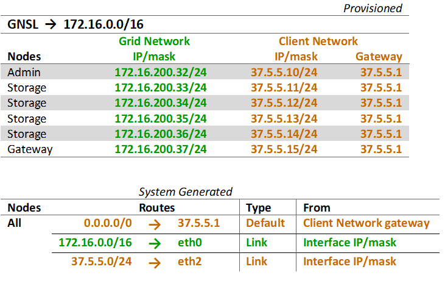

= クライアントネットワークトポロジ
:allow-uri-read: 
:icons: font
:imagesdir: ../media/

[role="lead"]
クライアント ネットワークを持つことはオプションです。クライアント ネットワークを使用すると、クライアント ネットワーク トラフィック (S3 など) をグリッド内部トラフィックから分離できるため、グリッド ネットワークのセキュリティが強化されます。管理ネットワークが構成されていない場合、管理トラフィックはクライアント ネットワークまたはグリッド ネットワークのいずれかで処理できます。

クライアント ネットワークを構成するときは、構成されたノードの eth2 インターフェイスのホスト IP アドレス、サブネット マスク、およびゲートウェイ IP アドレスを確立します。各ノードのクライアント ネットワークは、他のノードのクライアント ネットワークから独立できます。

インストール中にノードのクライアント ネットワークを構成すると、インストールが完了すると、ノードのデフォルト ゲートウェイがグリッド ネットワーク ゲートウェイからクライアント ネットワーク ゲートウェイに切り替わります。後でクライアント ネットワークが追加されると、ノードのデフォルト ゲートウェイも同様に切り替わります。

この例では、クライアント ネットワークは S3 クライアント要求と管理機能に使用され、グリッド ネットワークは内部オブジェクト管理操作専用になります。

image::../media/grid_client_networks.png[グリッドクライアントネットワーク]

.関連情報
link:../maintain/changing-nodes-network-configuration.html["ノードネットワーク構成を変更する"]
