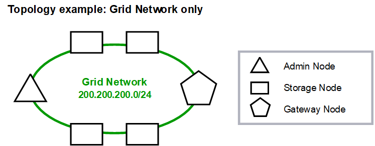

= グリッドネットワークトポロジ
:allow-uri-read: 
:icons: font
:imagesdir: ../media/

[role="lead"]
最も単純なネットワーク トポロジは、グリッド ネットワークのみを構成することによって作成されます。

グリッド ネットワークを構成するときは、各グリッド ノードの eth0 インターフェイスのホスト IP アドレス、サブネット マスク、およびゲートウェイ IP アドレスを確立します。

構成中に、すべてのグリッド ネットワーク サブネットをグリッド ネットワーク サブネット リスト (GNSL) に追加する必要があります。このリストにはすべてのサイトのすべてのサブネットが含まれており、NTP、DNS、LDAP などの重要なサービスへのアクセスを提供する外部サブネットも含まれる場合があります。

インストール時に、グリッド ネットワーク インターフェイスは GNSL 内のすべてのサブネットに静的ルートを適用し、ノードのデフォルト ルートをグリッド ネットワーク ゲートウェイに設定します (構成されている場合)。クライアント ネットワークが存在せず、グリッド ネットワーク ゲートウェイがノードのデフォルト ルートである場合、GNSL は必要ありません。グリッド内の他のすべてのノードへのホスト ルートも生成されます。

この例では、S3 クライアント要求や管理およびメンテナンス機能に関連するトラフィックを含め、すべてのトラフィックが同じネットワークを共有します。

NOTE: このトポロジは、外部から利用できない単一サイトの展開、概念実証またはテストの展開、またはサードパーティのロード バランサーがクライアント アクセス境界として機能する場合に適しています。可能な場合は、グリッド ネットワークを内部トラフィック専用に使用する必要があります。管理ネットワークとクライアント ネットワークの両方に、内部サービスへの外部トラフィックをブロックする追加のファイアウォール制限があります。外部クライアント トラフィックにグリッド ネットワークを使用することはサポートされていますが、この使用方法では保護層が少なくなります。

image::../media/grid_network_ips.png[グリッドネットワークIP]
