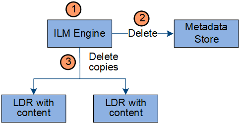

= データフローを削除
:allow-uri-read: 
:icons: font
:imagesdir: ../media/

[role="lead"]
クライアントが削除操作を実行するか、オブジェクトの有効期間が終了して自動削除がトリガーされると、すべてのオブジェクト コピーがStorageGRIDシステムから削除されます。オブジェクトの削除には定義されたデータ フローがあります。

== 削除階層

StorageGRID は、オブジェクトを保持または削除するタイミングを制御するためのいくつかの方法を提供します。オブジェクトはクライアントの要求によって、または自動的に削除できます。  StorageGRID は常に、クライアントの削除リクエストよりも S3 オブジェクト ロック設定を優先します。クライアントの削除リクエストは、S3 バケットのライフサイクルと ILM 配置指示よりも優先されます。

* *S3 オブジェクト ロック*: グリッドに対してグローバル S3 オブジェクト ロック設定が有効になっている場合、S3 クライアントは S3 オブジェクト ロックが有効になっているバケットを作成し、S3 REST API を使用して、そのバケットに追加された各オブジェクト バージョンに対して保持期限と法的保留設定を指定できます。
+
** 法的保留中のオブジェクト バージョンは、どのような方法でも削除できません。
** オブジェクト バージョンの保持期限に達するまで、そのバージョンはどの方法でも削除できません。
** S3 オブジェクト ロックが有効になっているバケット内のオブジェクトは、ILM によって「永久に」保持されます。ただし、保持期限に達した後は、クライアントのリクエストまたはバケットのライフサイクルの有効期限によってオブジェクト バージョンが削除される可能性があります。
** S3 クライアントがバケットにデフォルトの retain-until-date を適用する場合、オブジェクトごとに retain-until-date を指定する必要はありません。

* *クライアント削除リクエスト*: S3 クライアントはオブジェクトの削除リクエストを発行できます。クライアントがオブジェクトを削除すると、そのオブジェクトのすべてのコピーがStorageGRIDシステムから削除されます。
* *バケット内のオブジェクトを削除*: Tenant Manager ユーザーはこのオプションを使用して、選択したバケット内のオブジェクトとオブジェクト バージョンのすべてのコピーをStorageGRIDシステムから完全に削除できます。
* *S3 バケットのライフサイクル*: S3 クライアントは、有効期限アクションを指定するライフサイクル設定をバケットに追加できます。バケットのライフサイクルが存在する場合、クライアントが最初にオブジェクトを削除しない限り、有効期限アクションで指定された日付または日数が経過すると、 StorageGRID はオブジェクトのすべてのコピーを自動的に削除します。
* *ILM 配置手順*: バケットで S3 オブジェクト ロックが有効になっておらず、バケットのライフサイクルも存在しないと仮定すると、ILM ルールの最後の期間が終了し、オブジェクトにそれ以上の配置が指定されていない場合、 StorageGRID はオブジェクトを自動的に削除します。
+

NOTE: S3 バケットのライフサイクルが設定されている場合、ライフサイクル フィルターに一致するオブジェクトの ILM ポリシーは、ライフサイクル有効期限アクションによって上書きされます。その結果、オブジェクトを配置するための ILM 指示が失効した後でも、オブジェクトがグリッド上に保持される可能性があります。

見るlink:../ilm/how-objects-are-deleted.html["オブジェクトの削除方法"]詳細についてはこちらをご覧ください。

== クライアント削除のデータフロー

image::../media/delete_data_flow.png[クライアント削除データフロー]

. LDR サービスは、クライアント アプリケーションから削除要求を受信します。
. LDR サービスはメタデータ ストアを更新し、クライアントの要求に対してオブジェクトが削除されたように見せ、ILM エンジンにオブジェクト データのすべてのコピーを削除するように指示します。
. オブジェクトはシステムから削除されます。メタデータ ストアが更新され、オブジェクト メタデータが削除されます。

== ILM削除のデータフロー

. ILM エンジンは、オブジェクトを削除する必要があると判断します。
. ILM エンジンはメタデータ ストアに通知します。メタデータ ストアはオブジェクト メタデータを更新し、クライアント要求に対してオブジェクトが削除されたように見えるようにします。
. ILM エンジンはオブジェクトのすべてのコピーを削除します。メタデータ ストアが更新され、オブジェクト メタデータが削除されます。

