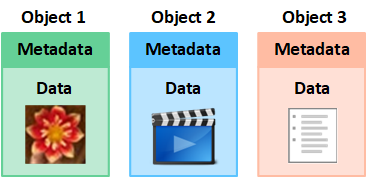

= オブジェクトとは何か
:allow-uri-read: 
:icons: font
:imagesdir: ../media/

[role="lead"]
オブジェクト ストレージでは、ストレージの単位はファイルやブロックではなくオブジェクトです。ファイル システムやブロック ストレージのツリーのような階層とは異なり、オブジェクト ストレージはデータをフラットで構造化されていないレイアウトで整理します。

オブジェクト ストレージは、データの物理的な場所と、そのデータを保存および取得するために使用される方法を切り離します。

オブジェクトベースのストレージ システム内の各オブジェクトには、オブジェクト データとオブジェクト メタデータの 2 つの部分があります。

== オブジェクトデータとは何ですか?

オブジェクト データは、写真、映画、医療記録など、何でもかまいません。

== オブジェクト メタデータとは何ですか?

オブジェクト メタデータは、オブジェクトを説明する情報です。  StorageGRID はオブジェクト メタデータを使用して、グリッド全体のすべてのオブジェクトの場所を追跡し、各オブジェクトのライフサイクルを長期にわたって管理します。

オブジェクト メタデータには次のような情報が含まれます。

* システム メタデータには、各オブジェクトの一意の ID (UUID)、オブジェクト名、S3 バケットまたは Swift コンテナの名前、テナント アカウント名または ID、オブジェクトの論理サイズ、オブジェクトが最初に作成された日時、オブジェクトが最後に変更された日時が含まれます。
* 各オブジェクト コピーまたは消失訂正符号化フラグメントの現在の保存場所。
* オブジェクトに関連付けられたすべてのユーザー メタデータ。

オブジェクト メタデータはカスタマイズおよび拡張可能なので、アプリケーションで柔軟に使用できます。

StorageGRIDがオブジェクトメタデータを保存する方法と場所の詳細については、link:../admin/managing-object-metadata-storage.html["オブジェクトメタデータストレージの管理"] 。

== オブジェクトデータはどのように保護されますか?

StorageGRIDシステムは、オブジェクト データを損失から保護するために、レプリケーションと消去コーディングという 2 つのメカニズムを提供します。

=== レプリケーション

StorageGRID は、複製されたコピーを作成するように設定された情報ライフサイクル管理 (ILM) ルールにオブジェクトを照合すると、オブジェクト データの正確なコピーを作成し、それをストレージ ノードまたはクラウド ストレージ プールに保存します。 ILM ルールは、作成されるコピーの数、それらのコピーが保存される場所、およびシステムによって保持される期間を指定します。たとえば、ストレージ ノードの損失の結果としてコピーが失われた場合でも、そのオブジェクトのコピーがStorageGRIDシステム内の他の場所に存在する場合は、そのオブジェクトは引き続き使用できます。

次の例では、「2 つのコピーを作成」ルールは、各オブジェクトの複製された 2 つのコピーを、3 つのストレージ ノードを含むストレージ プールに配置するように指定します。

image::../media/ilm_replication_make_2_copies.png[2つのコピーを作成するルール]

=== イレイジャー コーディング

StorageGRID は、消去コード化されたコピーを作成するように設定された ILM ルールにオブジェクトを一致させると、オブジェクト データをデータ フラグメントに分割し、追加のパリティ フラグメントを計算し、各フラグメントを異なるストレージ ノードに保存します。オブジェクトがアクセスされた場合、格納されたフラグメントを使用してそのオブジェクトが再アセンブルされます。データまたはパリティ フラグメントが破損または失われた場合、消失訂正符号化アルゴリズムにより、残りのデータおよびパリティ フラグメントのサブセットを使用してそのフラグメントを再作成できます。  ILM ルールと消去コーディング プロファイルによって、使用される消去コーディング スキームが決まります。

次の例は、オブジェクトのデータに対する消去コーディングの使用を示しています。この例では、ILM ルールは 4+2 消去符号化方式を使用します。各オブジェクトは 4 つの等しいデータ フラグメントに分割され、オブジェクト データから 2 つのパリティ フラグメントが計算されます。  6 つのフラグメントはそれぞれ、3 つのデータ センターにわたる異なるストレージ ノードに保存され、ノード障害やサイト損失に対するデータ保護を提供します。

image::../media/ec_three_sites_4_plus_2.png[消失訂正符号化3サイト4プラス2]

.関連情報
* link:../ilm/index.html["ILMでオブジェクトを管理する"]
* link:using-information-lifecycle-management.html["情報ライフサイクル管理を使用する"]

