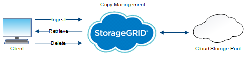

= 物体の寿命
:allow-uri-read: 
:icons: font
:imagesdir: ../media/

[role="lead"]
物体の寿命はさまざまな段階から成ります。各ステージは、オブジェクトで発生する操作を表します。

オブジェクトの存続期間には、取り込み、コピー管理、取得、削除の操作が含まれます。

* *Ingest*: S3 クライアント アプリケーションが HTTP 経由でオブジェクトをStorageGRIDシステムに保存するプロセス。この段階で、 StorageGRIDシステムはオブジェクトの管理を開始します。
* *コピー管理*: アクティブな ILM ポリシーの ILM ルールに従って、 StorageGRIDで複製および消去コード化されたコピーを管理するプロセス。コピー管理段階では、 StorageGRID は、ストレージ ノードまたはクラウド ストレージ プールに指定された数と種類のオブジェクト コピーを作成および維持することで、オブジェクト データの損失を防ぎます。
* *取得*: StorageGRIDシステムによって保存されたオブジェクトにクライアント アプリケーションがアクセスするプロセス。クライアントは、ストレージ ノードまたはクラウド ストレージ プールから取得されたオブジェクトを読み取ります。
* *削除*: グリッドからすべてのオブジェクトのコピーを削除するプロセス。オブジェクトは、クライアント アプリケーションがStorageGRIDシステムに削除要求を送信した結果として、またはオブジェクトの有効期限が切れたときにStorageGRIDが実行する自動プロセスの結果として削除されることがあります。

.関連情報
* link:../ilm/index.html["ILMでオブジェクトを管理する"]
* link:using-information-lifecycle-management.html["情報ライフサイクル管理を使用する"]

