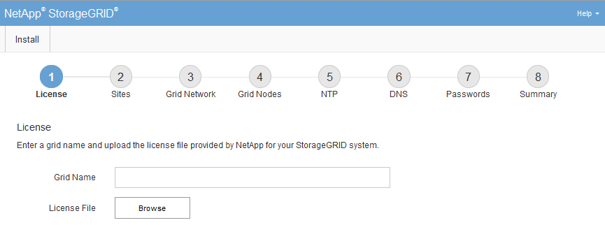

= グリッドマネージャーに移動する
:allow-uri-read: 
:icons: font
:imagesdir: ../media/

[role="lead"]
Grid Manager を使用して、 StorageGRIDシステムを構成するために必要なすべての情報を定義します。

.開始する前に
プライマリ管理ノードがデプロイされ、初期起動シーケンスが完了している必要があります。

.手順
. Web ブラウザを開き、次の場所に移動します。
+
`https://_primary_admin_node_ip_`

+
あるいは、ポート 8443 で Grid Manager にアクセスすることもできます。

+
`https://_primary_admin_node_ip_:8443`

+
ネットワーク構成に応じて、グリッド ネットワークまたは管理ネットワーク上のプライマリ管理ノード IP の IP アドレスを使用できます。

. 必要に応じて一時的なインストーラー パスワードを管理します。
+
** これらのいずれかの方法ですでにパスワードが設定されている場合は、パスワードを入力して続行します。
+
*** ユーザーが以前にインストーラにアクセスする際にパスワードを設定しました
*** パスワードはノード構成ファイルから自動的にインポートされました。 `/etc/storagegrid/nodes/_<node_name>_.conf`

** パスワードが設定されていない場合は、オプションでパスワードを設定して、 StorageGRIDインストーラを保護します。

. * StorageGRIDシステムのインストール*を選択します。
+
StorageGRIDシステムを構成するために使用するページが表示されます。

+

