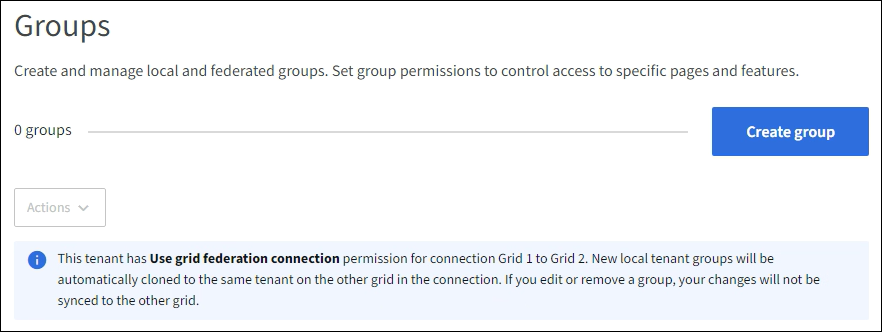

= S3テナントのグループを作成する
:allow-uri-read: 
:icons: font
:imagesdir: ../media/

[role="lead"]
フェデレーテッド グループをインポートするか、ローカル グループを作成することによって、S3 ユーザー グループの権限を管理できます。

.開始する前に
* テナントマネージャーにサインインするには、link:../admin/web-browser-requirements.html["サポートされているウェブブラウザ"] 。
* あなたは、link:tenant-management-permissions.html["ルートアクセス権限"] 。
* フェデレーショングループをインポートする予定の場合は、link:using-identity-federation.html["構成されたID連携"] 、フェデレーション グループは構成された ID ソースにすでに存在します。
* テナントアカウントに*グリッドフェデレーション接続を使用する*権限がある場合は、ワークフローと考慮事項を確認しました。link:grid-federation-account-clone.html["テナントグループとユーザーの複製"] 、テナントのソース グリッドにサインインしています。

== グループ作成ウィザードにアクセスする

最初のステップとして、グループの作成ウィザードにアクセスします。

.手順
. *アクセス管理* > *グループ*を選択します。
. テナント アカウントに *グリッド フェデレーション接続の使用* 権限がある場合は、このグリッドで作成された新しいグループが接続内の他のグリッド上の同じテナントに複製されることを示す青いバナーが表示されることを確認します。このバナーが表示されない場合は、テナントの宛先グリッドにサインインしている可能性があります。
+

. *グループを作成*を選択します。

== グループの種類を選択

ローカル グループを作成したり、フェデレーション グループをインポートしたりできます。

.手順
. ローカル グループを作成するには *ローカル グループ* タブを選択し、以前に構成した ID ソースからグループをインポートするには *フェデレーション グループ* タブを選択します。
+
StorageGRIDシステムでシングル サインオン (SSO) が有効になっている場合、ローカル グループに属するユーザーは、グループの権限に基づいてクライアント アプリケーションを使用してテナントのリソースを管理することはできますが、テナント マネージャにサインインすることはできません。

. グループの名前を入力します。
+
** *ローカル グループ*: 表示名と一意の名前の両方を入力します。表示名は後で編集できます。
+

NOTE: テナント アカウントに *グリッド フェデレーション接続の使用* 権限がある場合、宛先グリッドのテナントに同じ *一意の名前* がすでに存在すると、複製エラーが発生します。

** *フェデレーション グループ*: 一意の名前を入力します。  Active Directoryの場合、一意の名前は `sAMAccountName`属性。  OpenLDAPの場合、一意の名前は `uid`属性。

. *続行*を選択します。

== グループ権限を管理する

グループ権限は、ユーザーがテナント マネージャーおよびテナント管理 API で実行できるタスクを制御します。

.手順
. *アクセス モード* では、次のいずれかを選択します。
+
** *読み取り/書き込み* (デフォルト): ユーザーは Tenant Manager にサインインし、テナント構成を管理できます。
** *読み取り専用*: ユーザーは設定と機能の表示のみが可能です。テナント マネージャーまたはテナント管理 API で変更を加えたり、操作を実行したりすることはできません。ローカルの読み取り専用ユーザーは自分のパスワードを変更できます。
+

NOTE: ユーザーが複数のグループに属しており、いずれかのグループが読み取り専用に設定されている場合、ユーザーは選択したすべての設定と機能に対して読み取り専用アクセス権を持ちます。

. このグループに対して 1 つ以上の権限を選択します。
+
見るlink:../tenant/tenant-management-permissions.html["テナント管理権限"] 。

. *続行*を選択します。

== S3グループポリシーを設定する

グループ ポリシーによって、ユーザーに付与される S3 アクセス権限が決まります。

.手順
. このグループに使用するポリシーを選択します。
+
[cols="1a,2a"]
|===
| グループポリシー | 説明 

 a| 
S3 アクセスなし
 a| 
デフォルト。このグループのユーザーは、バケットポリシーでアクセスが許可されない限り、S3 リソースにアクセスできません。このオプションを選択すると、デフォルトではルートユーザーのみが S3 リソースにアクセスできるようになります。

 a| 
読み取り専用アクセス
 a| 
このグループのユーザーには、S3 リソースへの読み取り専用アクセス権があります。たとえば、このグループのユーザーはオブジェクトを一覧表示したり、オブジェクトのデータ、メタデータ、タグを読み取ったりできます。このオプションを選択すると、読み取り専用グループ ポリシーの JSON 文字列がテキスト ボックスに表示されます。この文字列は編集できません。

 a| 
フル アクセス
 a| 
このグループのユーザーには、バケットを含む S3 リソースへのフルアクセス権が付与されます。このオプションを選択すると、フルアクセス グループ ポリシーの JSON 文字列がテキスト ボックスに表示されます。この文字列は編集できません。

 a| 
ランサムウェア対策
 a| 
このサンプルポリシーは、このテナントのすべてのバケットに適用されます。このグループのユーザーは一般的なアクションを実行できますが、オブジェクトのバージョン管理が有効になっているバケットからオブジェクトを完全に削除することはできません。

*すべてのバケットの管理*権限を持つテナント マネージャー ユーザーは、このグループ ポリシーを上書きできます。すべてのバケットの管理権限を信頼できるユーザーに制限し、可能な場合は多要素認証 (MFA) を使用します。

 a| 
カスタム
 a| 
グループ内のユーザーには、テキスト ボックスで指定した権限が付与されます。

|===
. *カスタム*を選択した場合は、グループ ポリシーを入力します。各グループ ポリシーのサイズ制限は 5,120 バイトです。有効な JSON 形式の文字列を入力する必要があります。
+
言語構文や例を含むグループポリシーの詳細については、以下を参照してください。link:../s3/example-group-policies.html["グループポリシーの例"] 。

. ローカル グループを作成する場合は、[続行] を選択します。フェデレーション グループを作成する場合は、[*グループの作成*] と [*完了*] を選択します。

== ユーザーを追加する（ローカルグループのみ）

ユーザーを追加せずにグループを保存することも、オプションで既存のローカル ユーザーを追加することもできます。

NOTE: テナント アカウントに *グリッド フェデレーション接続の使用* 権限がある場合、ソース グリッドにローカル グループを作成するときに選択したユーザーは、グループが宛先グリッドに複製されるときには含まれません。このため、グループを作成するときにユーザーを選択しないでください。代わりに、ユーザーを作成するときにグループを選択します。

.手順
. 必要に応じて、このグループのローカル ユーザーを 1 人以上選択します。
. *グループの作成*と*完了*を選択します。
+
作成したグループがグループのリストに表示されます。

+
テナント アカウントに *グリッド フェデレーション接続の使用* 権限があり、テナントのソース グリッドにいる場合、新しいグループはテナントの宛先グリッドに複製されます。グループの詳細ページの概要セクションに、*複製ステータス*として*成功*が表示されます。

