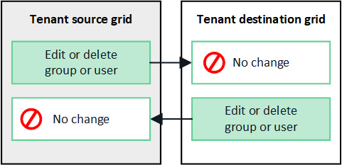

= テナントグループとユーザーの複製
:allow-uri-read: 
:icons: font
:imagesdir: ../media/

[role="lead"]
グリッド フェデレーション接続を使用するようにテナントが作成または編集された場合、そのテナントは 1 つのStorageGRIDシステム (ソース テナント) から別のStorageGRIDシステム (レプリカ テナント) に複製されます。テナントが複製された後、ソース テナントに追加されたグループとユーザーはレプリカ テナントに複製されます。

テナントが最初に作成されたStorageGRIDシステムは、テナントの _ソース グリッド_ です。テナントが複製されるStorageGRIDシステムは、テナントの _宛先グリッド_ です。両方のテナント アカウントは同じアカウント ID、名前、説明、ストレージ クォータ、割り当てられた権限を持ちますが、宛先テナントには最初はルート ユーザー パスワードがありません。詳細については、link:../admin/grid-federation-what-is-account-clone.html["アカウントクローンとは"]そしてlink:../admin/grid-federation-manage-tenants.html["許可されたテナントを管理する"]。

テナントアカウント情報の複製は、link:../admin/grid-federation-what-is-cross-grid-replication.html["クロスグリッドレプリケーション"]バケット オブジェクトの。両方のグリッドに同じテナント グループとユーザーが存在すると、どちらのグリッドでも対応するバケットとオブジェクトにアクセスできるようになります。

== アカウントクローンのテナントワークフロー

テナント アカウントに *グリッド フェデレーション接続の使用* 権限がある場合は、ワークフロー図を参照して、グループ、ユーザー、および S3 アクセス キーのクローンを作成するために実行する手順を確認してください。

image::../media/grid-federation-account-clone-workflow-tm.png[アカウントクローンのテナントのワークフロー。手順については次のテキストで説明します。]

ワークフローの主な手順は次のとおりです。

.image:https://raw.githubusercontent.com/NetAppDocs/common/main/media/number-1.png["1"]テナントにSign in
[role="quick-margin-para"]
ソース グリッド (テナントが最初に作成されたグリッド) のテナント アカウントにSign in。

.image:https://raw.githubusercontent.com/NetAppDocs/common/main/media/number-2.png["2"]オプションでID連携を構成する
[role="quick-margin-para"]
テナント アカウントに、フェデレーション グループとユーザーを使用するための *独自の ID ソースを使用する* 権限がある場合は、ソース テナント アカウントと宛先テナント アカウントの両方に同じ ID ソース (同じ設定) を構成します。両方のグリッドが同じ ID ソースを使用していない限り、フェデレーション グループとユーザーは複製できません。手順については、link:using-identity-federation.html["アイデンティティフェデレーションを使用する"] 。

.image:https://raw.githubusercontent.com/NetAppDocs/common/main/media/number-3.png["三つ"]グループとユーザーを作成する
[role="quick-margin-para"]
グループとユーザーを作成するときは、常にテナントのソース グリッドから開始します。新しいグループを追加すると、 StorageGRIDによってそのグループが宛先グリッドに自動的に複製されます。

[role="quick-margin-list"]
* StorageGRIDシステム全体またはテナントアカウントに対してIDフェデレーションが設定されている場合、link:creating-groups-for-s3-tenant.html["新しいテナントグループを作成する"]アイデンティティ ソースからフェデレーション グループをインポートします。

[role="quick-margin-list"]
* ID連携を使用していない場合は、link:creating-groups-for-s3-tenant.html["新しいローカルグループを作成する"]その後link:managing-local-users.html["ローカルユーザーを作成する"]。

.image:https://raw.githubusercontent.com/NetAppDocs/common/main/media/number-4.png["4"]S3アクセスキーを作成する
[role="quick-margin-para"]
あなたはできるlink:creating-your-own-s3-access-keys.html["独自のアクセスキーを作成する"]またはlink:creating-another-users-s3-access-keys.html["別のユーザーのアクセスキーを作成する"]ソース グリッドまたは宛先グリッドのいずれかで、そのグリッド上のバケットにアクセスします。

.image:https://raw.githubusercontent.com/NetAppDocs/common/main/media/number-5.png["五"]オプションでS3アクセスキーを複製する
[role="quick-margin-para"]
両方のグリッドで同じアクセス キーを使用してバケットにアクセスする必要がある場合は、ソース グリッドでアクセス キーを作成し、Tenant Manager API を使用してそれらのアクセス キーを手動で宛先グリッドに複製します。手順については、link:../tenant/grid-federation-clone-keys-with-api.html["API を使用して S3 アクセスキーを複製する"] 。

== グループ、ユーザー、S3 アクセスキーはどのように複製されますか?

このセクションを確認して、テナント ソース グリッドとテナント デスティネーション グリッド間でグループ、ユーザー、および S3 アクセス キーがどのように複製されるかを理解してください。

=== ソースグリッド上に作成されたローカルグループは複製されます

テナント アカウントが作成され、宛先グリッドに複製された後、 StorageGRID はテナントのソース グリッドに追加したローカル グループをテナントの宛先グリッドに自動的に複製します。

元のグループとそのクローンには、同じアクセス モード、グループ権限、および S3 グループ ポリシーがあります。手順については、link:creating-groups-for-s3-tenant.html["S3テナントのグループを作成する"] 。

image::../media/grid-federation-account-clone.png[ローカル グループがソース グリッドから宛先グリッドに複製される様子を示す画像]

NOTE: ソース グリッドにローカル グループを作成するときに選択したユーザーは、グループが宛先グリッドに複製されるときには含まれません。このため、グループを作成するときにユーザーを選択しないでください。代わりに、ユーザーを作成するときにグループを選択します。

=== ソースグリッド上に作成されたローカルユーザーは複製されます

ソース グリッドに新しいローカル ユーザーを作成すると、 StorageGRIDによってそのユーザーが宛先グリッドに自動的に複製されます。元のユーザーとそのクローンの両方に、同じフルネーム、ユーザー名、および *アクセス拒否* 設定があります。両方のユーザーは同じグループに属しています。手順については、link:managing-local-users.html["ローカルユーザーの管理"] 。

セキュリティ上の理由から、ローカル ユーザーのパスワードは宛先グリッドに複製されません。ローカル ユーザーが宛先グリッド上の Tenant Manager にアクセスする必要がある場合、テナント アカウントのルート ユーザーは、宛先グリッド上のそのユーザーのパスワードを追加する必要があります。手順については、link:managing-local-users.html["ローカルユーザーの管理"] 。

image::../media/grid-federation-local-user-clone.png[ローカルユーザーがソースグリッドから宛先グリッドに複製されることを示す画像]

=== ソースグリッド上に作成されたフェデレーショングループはクローン化されます

アカウントクローンを使用するための要件を想定すると、link:../admin/grid-federation-what-is-account-clone.html#account-clone-sso["シングルサインオン"]そしてlink:../admin/grid-federation-what-is-account-clone.html#account-clone-identity-federation["アイデンティティフェデレーション"]条件が満たされると、ソース グリッドのテナント用に作成 (インポート) したフェデレーション グループは、宛先グリッドのテナントに自動的に複製されます。

両方のグループには、同じアクセス モード、グループ権限、および S3 グループ ポリシーがあります。

ソース テナントに対してフェデレーション グループが作成され、宛先テナントに複製されると、フェデレーション ユーザーはどちらのグリッド上のテナントにもサインインできるようになります。

image::../media/grid-federation-federated-group-clone.png[フェデレーション グループがソース グリッドから宛先グリッドに複製される様子を示す画像]

=== S3アクセスキーは手動で複製できます

StorageGRID は、グリッドごとに異なるキーを持つことでセキュリティが向上するため、S3 アクセス キーを自動的に複製しません。

2 つのグリッド上のアクセス キーを管理するには、次のいずれかを実行します。

* 各グリッドに同じキーを使用する必要がない場合は、link:creating-your-own-s3-access-keys.html["独自のアクセスキーを作成する"]またはlink:creating-another-users-s3-access-keys.html["別のユーザーのアクセスキーを作成する"]各グリッド上。
* 両方のグリッドで同じキーを使用する必要がある場合は、ソースグリッドでキーを作成し、テナントマネージャーAPIを使用して手動でlink:../tenant/grid-federation-clone-keys-with-api.html["キーを複製する"]目的のグリッドへ。

image::../media/grid-federation-s3-access-key.png[S3 アクセスキーをソースグリッドから宛先グリッドにオプションで複製できることを示す画像]

NOTE: フェデレーション ユーザーの S3 アクセス キーを複製すると、ユーザーと S3 アクセス キーの両方が宛先テナントに複製されます。

=== 宛先グリッドに追加されたグループとユーザーは複製されません

クローン作成は、テナントのソース グリッドからテナントの宛先グリッドにのみ行われます。テナントの宛先グリッドにグループとユーザーを作成またはインポートした場合、 StorageGRID はこれらの項目をテナントのソース グリッドに複製しません。

image::../media/grid-federation-account-not-cloned.png[宛先グリッドの詳細がソースグリッドに複製されていないことを示す画像]

=== 編集または削除されたグループ、ユーザー、アクセスキーは複製されません

クローン作成は、新しいグループとユーザーを作成するときにのみ行われます。

どちらかのグリッドでグループ、ユーザー、またはアクセス キーを編集または削除しても、変更内容は他のグリッドに複製されません。

