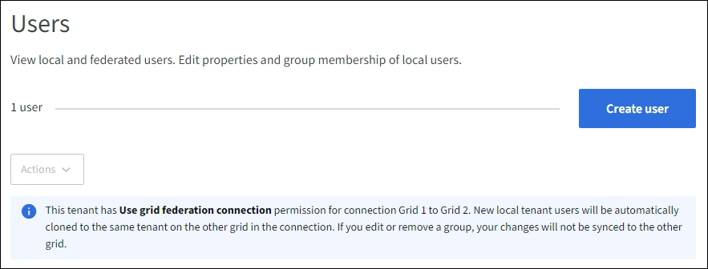

= ローカルユーザーの管理
:allow-uri-read: 
:icons: font
:imagesdir: ../media/

[role="lead"]
ローカル ユーザーを作成してローカル グループに割り当て、これらのユーザーがアクセスできる機能を決定できます。テナント マネージャーには、「root」という名前の定義済みローカル ユーザーが 1 人含まれています。ローカル ユーザーを追加および削除することはできますが、ルート ユーザーを削除することはできません。

NOTE: StorageGRIDシステムでシングル サインオン (SSO) が有効になっている場合、ローカル ユーザーは、グループ権限に基づいてクライアント アプリケーションを使用してテナントのリソースにアクセスすることはできますが、テナント マネージャまたはテナント管理 API にサインインすることはできません。

.開始する前に
* テナントマネージャーにサインインするには、link:../admin/web-browser-requirements.html["サポートされているウェブブラウザ"] 。
* あなたは、link:tenant-management-permissions.html["ルートアクセス権限"] 。
* テナントアカウントに*グリッドフェデレーション接続を使用する*権限がある場合は、ワークフローと考慮事項を確認しました。link:grid-federation-account-clone.html["テナントグループとユーザーの複製"] 、テナントのソース グリッドにサインインしています。

== [[create-user]]ローカルユーザーを作成する

ローカル ユーザーを作成し、そのユーザーを 1 つ以上のローカル グループに割り当てて、アクセス権限を制御できます。

どのグループにも属していない S3 ユーザーには、管理権限も S3 グループ ポリシーも適用されません。これらのユーザーには、バケットポリシーを通じて S3 バケットへのアクセスが許可されている可能性があります。

どのグループにも属していない Swift ユーザーには、管理権限も Swift コンテナへのアクセス権もありません。

=== ユーザー作成ウィザードにアクセスする

.手順
. *アクセス管理* > *ユーザー*を選択します。
+
テナント アカウントに *グリッド フェデレーション接続の使用* 権限がある場合、青いバナーはこれがテナントのソース グリッドであることを示します。このグリッド上に作成したローカル ユーザーは、接続内の他のグリッドに複製されます。

+

. *ユーザーの作成*を選択します。

=== 資格情報を入力してください

.手順
. *ユーザー資格情報の入力*手順では、次のフィールドに入力します。
+
[cols="1a,3a"]
|===
| フィールド | 説明 

 a| 
フルネーム
 a| 
このユーザーのフルネーム。たとえば、人の名と姓、またはアプリケーションの名前などです。

 a| 
ユーザー名
 a| 
このユーザーがサインインに使用する名前。ユーザー名は一意である必要があり、変更できません。

*注意*: テナント アカウントに *グリッド フェデレーション接続の使用* 権限がある場合、宛先グリッドのテナントに同じ *ユーザー名* が既に存在すると、複製エラーが発生します。

 a| 
パスワードとパスワードの確認
 a| 
ユーザーがサインイン時に最初に使用するパスワード。

 a| 
アクセスを拒否
 a| 
このユーザーが 1 つ以上のグループに属している場合でも、テナント アカウントにサインインできないようにするには、[*はい*] を選択します。

たとえば、ユーザーのサインイン機能を一時的に停止するには、「*はい*」を選択します。

|===
. *続行*を選択します。

=== グループに割り当てる

.手順
. ユーザーを 1 つ以上のローカル グループに割り当てて、ユーザーが実行できるタスクを決定します。
+
ユーザーをグループに割り当てることはオプションです。必要に応じて、グループを作成または編集するときにユーザーを選択することもできます。

+
どのグループにも属していないユーザーには管理権限がありません。権限は累積されます。ユーザーは、所属するすべてのグループに対するすべての権限を持ちます。見るlink:tenant-management-permissions.html["テナント管理権限"] 。

. *ユーザーの作成*を選択します。
+
テナント アカウントに *グリッド フェデレーション接続の使用* 権限があり、テナントのソース グリッド上にいる場合、新しいローカル ユーザーはテナントの宛先グリッドに複製されます。ユーザーの詳細ページの概要セクションの *複製ステータス* に *成功* が表示されます。

. *完了*を選択してユーザー ページに戻ります。

== ローカルユーザーの表示または編集

.手順
. *アクセス管理* > *ユーザー*を選択します。
. [ユーザー] ページに提供される情報を確認します。このページには、このテナント アカウントのすべてのローカル ユーザーとフェデレーション ユーザーの基本情報が一覧表示されます。
+
テナント アカウントに *グリッド フェデレーション接続の使用* 権限があり、テナントのソース グリッドでユーザーを表示している場合:

+
** バナー メッセージには、ユーザーを編集または削除した場合、その変更は他のグリッドに同期されないことが示されます。
** 必要に応じて、ユーザーが宛先グリッドのテナントに複製されなかったかどうかを示すバナー メッセージが表示されます。あなたは <<clone-users,失敗したユーザークローンを再試行する>>。

. ユーザーのフルネームを変更する場合:
+
.. ユーザーのチェックボックスを選択します。
.. *アクション* > *フルネームの編集*を選択します。
.. 新しい名前を入力してください。
.. *変更を保存*を選択します。

. 詳細を表示したり、追加の編集を行ったりする場合は、次のいずれかを実行します。
+
** ユーザー名を選択します。
** ユーザーのチェックボックスを選択し、[*アクション*] > [*ユーザーの詳細を表示*] を選択します。

. 各ユーザーに関する次の情報が表示される概要セクションを確認します。
+
** フルネーム
** ユーザー名
** ユーザータイプ
** アクセス拒否
** アクセス モード
** グループ メンバーシップ
** テナント アカウントに *グリッド フェデレーション接続の使用* 権限があり、テナントのソース グリッドでユーザーを表示している場合の追加フィールド:
+
*** クローン作成ステータス（*成功*または*失敗*）
*** このユーザーを編集しても、変更内容は他のグリッドに同期されないことを示す青いバナー。

. 必要に応じてユーザー設定を編集します。見る<<create-user,ローカルユーザーを作成する>>入力内容の詳細については、こちらをご覧ください。
+
.. 概要セクションで、名前または編集アイコンを選択してフルネームを変更します。image:../media/icon_edit_tm.png["編集アイコン"] 。
+
ユーザー名を変更することはできません。

.. *パスワード*タブでユーザーのパスワードを変更し、*変更を保存*を選択します。
.. [アクセス] タブで、ユーザーのサインインを許可する場合は [いいえ] を選択し、サインインを禁止する場合は [はい] を選択します。次に、[変更を保存] を選択します。
.. *アクセスキー*タブで*キーの作成*を選択し、指示に従ってください。link:creating-another-users-s3-access-keys.html["別のユーザーのS3アクセスキーを作成する"] 。
.. *グループ* タブで、*グループの編集* を選択して、ユーザーをグループに追加したり、グループからユーザーを削除したりします。次に、「*変更を保存*」を選択します。

. 変更したセクションごとに*変更を保存*を選択したことを確認します。

== 重複したローカルユーザー

ローカル ユーザーを複製して、新しいユーザーをより迅速に作成できます。

NOTE: テナント アカウントに *グリッド フェデレーション接続の使用* 権限があり、テナントのソース グリッドからユーザーを複製する場合、複製されたユーザーはテナントの宛先グリッドに複製されます。

.手順
. *アクセス管理* > *ユーザー*を選択します。
. 複製するユーザーのチェックボックスを選択します。
. *アクション* > *重複ユーザー*を選択します。
. 見る<<create-user,ローカルユーザーを作成する>>入力内容の詳細については、こちらをご覧ください。
. *ユーザーの作成*を選択します。

== [[clone-users]]ユーザーのクローンを再試行する

失敗したクローンを再試行するには:

. ユーザー名の下に「_(複製失敗)_」と表示されている各ユーザーを選択します。
. *アクション* > *ユーザーの複製*を選択します。
. 複製する各ユーザーの詳細ページから複製操作のステータスを表示します。

詳細については、link:grid-federation-account-clone.html["テナントグループとユーザーの複製"]を参照してください。

== 1人以上のローカルユーザーを削除する

StorageGRIDテナント アカウントにアクセスする必要がなくなった 1 人以上のローカル ユーザーを完全に削除できます。

NOTE: テナント アカウントに *グリッド フェデレーション接続の使用* 権限があり、ローカル ユーザーを削除した場合、 StorageGRID は他のグリッド上の対応するユーザーを削除しません。この情報を同期させておく必要がある場合は、両方のグリッドから同じユーザーを削除する必要があります。

NOTE: フェデレーション ユーザーを削除するには、フェデレーション ID ソースを使用する必要があります。

.手順
. *アクセス管理* > *ユーザー*を選択します。
. 削除する各ユーザーのチェックボックスを選択します。
. *アクション* > *ユーザーの削除* または *アクション* > *ユーザーの削除* を選択します。
+
確認ダイアログボックスが表示されます。

. *ユーザーの削除*または*ユーザーの削除*を選択します。

