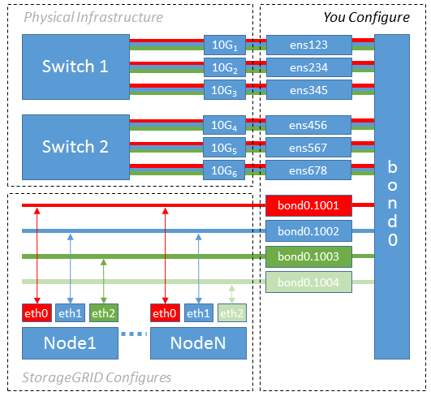

= ホストネットワークを構成する（UbuntuまたはDebian）
:allow-uri-read: 
:icons: font
:imagesdir: ../media/

[role="lead"]
ホスト上で Linux のインストールが完了したら、後で展開するStorageGRIDノードにマッピングするのに適したネットワーク インターフェイスのセットを各ホスト上に準備するために、追加の構成を実行する必要がある場合があります。

.開始する前に
* あなたは、link:../network/index.html["StorageGRIDネットワークガイドライン"] 。
* 以下の情報を確認しましたlink:node-container-migration-requirements.html["ノードコンテナの移行要件"]。
* 仮想ホストを使用している場合は、<<mac_address_cloning_ubuntu,MACアドレスの複製に関する考慮事項と推奨事項>>ホスト ネットワークを構成する前に。

NOTE: VM をホストとして使用している場合は、仮想ネットワーク アダプタとして VMXNET 3 を選択する必要があります。  VMware E1000 ネットワーク アダプタにより、特定の Linux ディストリビューションに展開されたStorageGRIDコンテナで接続の問題が発生しました。

.タスク概要
グリッド ノードは、グリッド ネットワークにアクセスできる必要があり、オプションで管理ネットワークとクライアント ネットワークにもアクセスできる必要があります。このアクセスを提供するには、ホストの物理インターフェイスを各グリッド ノードの仮想インターフェイスに関連付けるマッピングを作成します。ホスト インターフェイスを作成するときは、すべてのホスト間での展開を容易にし、移行を可能にするために、フレンドリ名を使用します。

同じインターフェースをホストと 1 つ以上のノード間で共有できます。たとえば、ホストとノードのメンテナンスを容易にするために、ホスト アクセスとノード管理ネットワーク アクセスに同じインターフェイスを使用できます。ホストと個々のノード間で同じインターフェースを共有できますが、すべて異なる IP アドレスを持つ必要があります。  IP アドレスはノード間またはホストと任意のノード間で共有できません。

同じホスト ネットワーク インターフェイスを使用して、ホスト上のすべてのStorageGRIDノードにグリッド ネットワーク インターフェイスを提供することも、ノードごとに異なるホスト ネットワーク インターフェイスを使用することも、その中間を行うこともできます。ただし、通常は、単一のノードのグリッド ネットワーク インターフェイスと管理ネットワーク インターフェイスの両方に同じホスト ネットワーク インターフェイスを提供したり、1 つのノードのグリッド ネットワーク インターフェイスと別のノードのクライアント ネットワーク インターフェイスに同じホスト ネットワーク インターフェイスを提供したりすることはありません。

このタスクはさまざまな方法で完了できます。たとえば、ホストが仮想マシンであり、ホストごとに 1 つまたは 2 つのStorageGRIDノードを展開している場合は、ハイパーバイザーに適切な数のネットワーク インターフェイスを作成し、1 対 1 のマッピングを使用できます。実稼働環境で使用するためベアメタル ホストに複数のノードを展開する場合は、フォールト トレランスと帯域幅の共有のために、Linux ネットワーク スタックの VLAN および LACP サポートを活用できます。次のセクションでは、これら 2 つの例の詳細なアプローチについて説明します。これらの例のいずれかを使用する必要はありません。ニーズを満たす任意のアプローチを使用できます。

NOTE: ボンドまたはブリッジデバイスをコンテナネットワークインターフェースとして直接使用しないでください。これを行うと、コンテナ名前空間内のボンドおよびブリッジデバイスで MACVLAN を使用する際のカーネルの問題によって発生するノードの起動が妨げられる可能性があります。代わりに、VLAN または仮想イーサネット (veth) ペアなどの非結合デバイスを使用します。ノード構成ファイルでこのデバイスをネットワーク インターフェイスとして指定します。

== MACアドレスの複製に関する考慮事項と推奨事項

.[[Ubuntuのmacアドレスの複製]]
MAC アドレスの複製により、コンテナはホストの MAC アドレスを使用し、ホストは指定したアドレスまたはランダムに生成されたアドレスの MAC アドレスを使用するようになります。無差別モードのネットワーク構成の使用を避けるには、MAC アドレスの複製を使用する必要があります。

=== MACクローニングを有効にする

特定の環境では、管理ネットワーク、グリッド ネットワーク、およびクライアント ネットワークに専用の仮想 NIC を使用できるため、MAC アドレスの複製によってセキュリティを強化できます。コンテナがホスト上の専用 NIC の MAC アドレスを使用するようにすると、プロミスキャス モードのネットワーク構成の使用を回避できます。

NOTE: MAC アドレスの複製は仮想サーバーのインストールで使用することを目的としており、すべての物理アプライアンス構成で正常に機能するとは限りません。

NOTE: MAC クローニング対象のインターフェースがビジー状態であるためにノードの起動に失敗した場合は、ノードを起動する前にリンクを「ダウン」に設定する必要がある場合があります。さらに、仮想環境により、リンクが稼働している間、ネットワーク インターフェイス上の MAC の複製が防止される可能性もあります。インターフェースがビジー状態であるためにノードが MAC アドレスの設定と起動に失敗した場合は、ノードを起動する前にリンクを「ダウン」に設定すると問題が解決する可能性があります。

MAC アドレスの複製はデフォルトで無効になっており、ノード構成キーで設定する必要があります。  StorageGRIDをインストールするときにこれを有効にする必要があります。

各ネットワークには 1 つのキーがあります。

* `ADMIN_NETWORK_TARGET_TYPE_INTERFACE_CLONE_MAC`
* `GRID_NETWORK_TARGET_TYPE_INTERFACE_CLONE_MAC`
* `CLIENT_NETWORK_TARGET_TYPE_INTERFACE_CLONE_MAC`

キーを「true」に設定すると、コンテナはホストの NIC の MAC アドレスを使用します。さらに、ホストは指定されたコンテナ ネットワークの MAC アドレスを使用します。デフォルトではコンテナアドレスはランダムに生成されたアドレスですが、 `_NETWORK_MAC`ノード構成キーの場合は、代わりにそのアドレスが使用されます。ホストとコンテナは常に異なる MAC アドレスを持ちます。

NOTE: ハイパーバイザーでプロミスキャス モードを有効にせずに仮想ホストで MAC クローニングを有効にすると、ホストのインターフェイスを使用する Linux ホスト ネットワークが機能しなくなる可能性があります。

=== MACクローニングのユースケース

MAC クローニングには、考慮すべき 2 つの使用例があります。

* MACクローンが有効になっていない場合： `_CLONE_MAC`ノード構成ファイル内のキーが設定されていないか、「false」に設定されている場合、ホストはホストNICのMACを使用し、コンテナは、MACがノード構成ファイルで指定されていない限り、 StorageGRIDによって生成されたMACを持ちます。 `_NETWORK_MAC`鍵。アドレスが `_NETWORK_MAC`キーを指定すると、コンテナのアドレスは `_NETWORK_MAC`鍵。このキー構成では、プロミスキャス モードを使用する必要があります。
* MACクローニングが有効の場合： `_CLONE_MAC`ノード構成ファイルのキーが「true」に設定されている場合、コンテナはホストNICのMACアドレスを使用し、ホストはStorageGRIDが生成したMACアドレスを使用します（MACアドレスがノード構成ファイルで指定されていない場合）。 `_NETWORK_MAC`鍵。アドレスが `_NETWORK_MAC`キーの場合、ホストは生成されたアドレスではなく指定されたアドレスを使用します。このキー構成では、無差別モードを使用しないでください。

NOTE: MAC アドレスの複製を使用せず、ハイパーバイザーによって割り当てられたもの以外の MAC アドレスのデータをすべてのインターフェイスで受信および送信できるようにする場合は、仮想スイッチおよびポート グループ レベルのセキュリティ プロパティが、無差別モード、MAC アドレスの変更、および偽造送信に対して *承認* に設定されていることを確認します。仮想スイッチに設定された値はポート グループ レベルの値によって上書きされる可能性があるため、両方の場所で設定が同じであることを確認してください。

MACクローニングを有効にするには、link:creating-node-configuration-files.html["ノード構成ファイルの作成手順"] 。

=== MACクローニングの例

インターフェイス ens256 の MAC アドレス 11:22:33:44:55:66 を持つホストと、ノード構成ファイル内の次のキーを使用して MAC クローニングを有効にする例:

* `ADMIN_NETWORK_TARGET = ens256`
* `ADMIN_NETWORK_MAC = b2:9c:02:c2:27:10`
* `ADMIN_NETWORK_TARGET_TYPE_INTERFACE_CLONE_MAC = true`

結果: ens256のホストMACはb2:9c:02:c2:27:10、管理ネットワークMACは11:22:33:44:55:66です。

== 例1: 物理NICまたは仮想NICへの1対1のマッピング

例 1 では、ホスト側の構成をほとんどまたはまったく必要としない単純な物理インターフェイス マッピングについて説明します。

image::../media/rhel_install_vlan_diag_1.gif[VLAN図]

Linux オペレーティング システムは、インストール時または起動時、あるいはインターフェイスがホットアドされたときに、ensXYZ インターフェイスを自動的に作成します。起動後にインターフェースが自動的に起動するように設定されていることを確認する以外に、構成は必要ありません。後の構成プロセスで正しいマッピングを提供できるように、どの ensXYZ がどのStorageGRIDネットワーク (グリッド、管理、またはクライアント) に対応するかを決定する必要があります。

図には複数のStorageGRIDノードが表示されていますが、通常はこの構成は単一ノードの VM に使用されます。

スイッチ 1 が物理スイッチの場合、インターフェイス 10G~1~ から 10G~3~ に接続されているポートをアクセス モードに設定し、適切な VLAN に配置する必要があります。

== 例2: LACP結合によるVLANの伝送

例 2 では、ネットワーク インターフェイスのボンディングと、使用している Linux ディストリビューションでの VLAN インターフェイスの作成に精通していることを前提としています。

.タスク概要
例 2 では、単一のホスト上のすべてのノード間で利用可能なすべてのネットワーク帯域幅の共有を容易にする、汎用的で柔軟な VLAN ベースのスキームについて説明します。この例は、ベアメタル ホストに特に当てはまります。

この例を理解するために、各データセンターにグリッド、管理、クライアント ネットワークの 3 つの個別のサブネットがあると仮定します。サブネットは個別の VLAN (1001、1002、および 1003) 上にあり、LACP 結合トランク ポート (bond0) 上のホストに提示されます。ボンドには、bond0.1001、bond0.1002、bond0.1003 の 3 つの VLAN インターフェースを設定します。

同じホスト上のノード ネットワークに個別の VLAN とサブネットが必要な場合は、ボンドに VLAN インターフェイスを追加し、それらをホストにマップできます (図では bond0.1004 として表示)。

.手順
. StorageGRIDネットワーク接続に使用されるすべての物理ネットワーク インターフェイスを単一の LACP ボンドに集約します。
+
すべてのホスト上の結合に同じ名前を使用します (例: bond0)。

. 標準のVLANインターフェース命名規則を使用して、このボンドを関連する「物理デバイス」として使用するVLANインターフェースを作成します。 `physdev-name.VLAN ID` 。
+
手順 1 と 2 では、ネットワーク リンクのもう一方の端を終端するエッジ スイッチで適切な構成が必要であることに注意してください。エッジ スイッチ ポートも LACP ポート チャネルに集約され、トランクとして設定され、必要なすべての VLAN を通過できるようにする必要があります。

+
このホストごとのネットワーク構成スキームのサンプルインターフェース構成ファイルが提供されています。

.関連情報
link:example-etc-network-interfaces.html["/etc/network/interfacesの例"]
